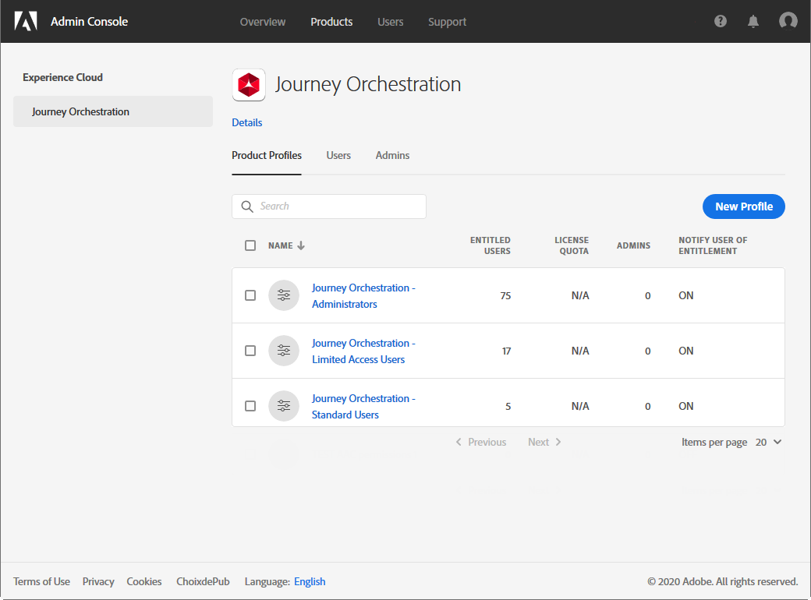

# Gestión de acceso{#concept_rfj_wpt_52b}

## Acerca de la administración de acceso {#about-access-management}

[!DNL Journey Orchestration] permite asignar un conjunto de permisos a los usuarios para definir a qué parte de la interfaz pueden acceder.

Pueden ser administrados por administradores que tengan acceso a la consola de administración. Para obtener más información sobre la Consola de administración, consulte esta [documentación](https://helpx.adobe.com/es/enterprise/managing/user-guide.html).

Para poder acceder a [!DNL Journey Orchestration], un usuario debe:

* parte de un [!DNL Journey Orchestration] elemento **[!UICONTROL product profile]** asociado a [!DNL Journey Orchestration] permisos.
* parte de un [!DNL Adobe Experience Platform]**[!UICONTROL product profile]**. No hay permiso obligatorio para tener. El usuario debe tener el **[!UICONTROL profile management]** permiso para poder crear y editar segmentos de plataforma desde la [!DNL Journey Orchestration] interfaz. Para obtener más información, consulte [esta página](https://docs.adobe.com/content/help/en/experience-platform/access-control/home.html#adobe-admin-console).

En la Consola de administración, puede asignar a los usuarios uno de los siguientes perfiles de producto predeterminados:

* **[!UICONTROL Limited Access User]**:: usuario con acceso de solo lectura a viajes e informes. Este perfil de productos incluye los siguientes permisos:
   * Leer viajes
   * Leer informes

* **[!UICONTROL Administrators]**:: usuario con acceso a los menús de administración con la posibilidad de administrar viajes, eventos e informes. Este perfil de productos incluye los siguientes permisos:
   * Administrar viajes
   * Publicar viajes
   * Administrar eventos, fuentes de datos y acciones
   * Administrar informes

   >[!NOTE]
   >
   >**[!UICONTROL Administrators]** es el único perfil de productos que permite crear, editar y publicar mensajes transaccionales (o plantillas de mensajería) en Adobe Campaign Standard. Este perfil de producto es necesario si utiliza Adobe Campaign Standard para enviar mensajes en sus viajes.

* **[!UICONTROL Standard User]**:: usuario con acceso básico, como administración de viajes. Este perfil de productos incluye los siguientes permisos:
   * Administrar viajes
   * Publicar viajes
   * Administrar informes

También puede crear sus propios perfiles de producto si los perfiles predeterminados no son suficientes para administrar a los usuarios.
Los usuarios siempre deben estar vinculados a un perfil de producto que le permita asignarles permisos de integración específicos como:

* **[!UICONTROL Read journeys]**
* **[!UICONTROL Read reports]**
* **[!UICONTROL Manage events, data sources and actions]**
* **[!UICONTROL Read events, data sources and actions]**
* **[!UICONTROL Manage journeys]**
* **[!UICONTROL Publish journeys]**
* **[!UICONTROL Manage reports]**

A continuación se muestra la compatibilidad entre los permisos y las diferentes funcionalidades [!DNL Journey Orchestration]de la aplicación.

## Creación de un perfil de producto {#create-product-profile}

[!DNL Journey Orchestration] le permite crear sus propios perfiles de productos y asignar un conjunto de permisos y entornos limitados a los usuarios. Con los perfiles del producto, puede autorizar o denegar el acceso a determinadas funcionalidades u objetos de la interfaz.

Para obtener más información sobre cómo crear y administrar entornos limitados, consulte la documentación de [Adobe Experience Platform](https://docs.adobe.com/content/help/en/experience-platform/sandbox/ui/user-guide.html).

Para crear un perfil de producto y asignar un conjunto de permisos y entornos limitados:

1. En el Admin Console, seleccione **[!UICONTROL Journey Orchestration]**. From the **[!UICONTROL Product profile]** tab, click **[!UICONTROL New Profile]**.

   

1. Añada un **[!UICONTROL Profile Name]** y **[!UICONTROL Description]** para el nuevo perfil de productos. Si desea que el perfil **[!UICONTROL Display name]** sea diferente, desmarque **[!UICONTROL Same as Profile Name]** y escriba su **[!UICONTROL Display name]**.

1. En la **[!UICONTROL User Notifications]** categoría, elija si se notificará por correo electrónico a los usuarios cuando se agreguen o eliminen de este perfil de productos.

1. Cuando termine, haga clic en **[!UICONTROL Done]**. Se ha creado el nuevo perfil de productos.

   

1. Seleccione el nuevo perfil de productos para administrar los permisos de inicio. En la **[!UICONTROL Users]** ficha, agregue usuarios al perfil del producto. Para obtener más información, consulte [esta página](../about/access-management.md#assigning-product-profile).

1. Lleve a cabo los mismos pasos que se detallan arriba para agregar **[!UICONTROL Admin]** a su perfil de productos.

1. En la **[!UICONTROL Permissions]** ficha, seleccione una de las dos categorías **[!UICONTROL Sandbox]** o **[!UICONTROL Authoring]** para abrir la **[!UICONTROL Edit Permissions]** página y agregar o quitar permisos para el perfil del producto.

   

1. En la categoría de permisos, elija qué simulador de pruebas desea asignar al perfil del producto. **[!UICONTROL Sandboxes]** En **[!UICONTROL Available Permissions Items]**, haga clic en el icono de signo más (+) para asignar entornos limitados al perfil. For more information on sandboxes, refer to this [section](../about/access-management.md#sandboxes).

   

1. Si es necesario, haga clic en **[!UICONTROL Included Permission Items]** el icono X situado junto a para eliminar los permisos del perfil del producto.

   

1. Desde la categoría de **[!UICONTROL Authoring]** permisos, realice los mismos pasos que se describen arriba para agregar permisos al perfil del producto.
    Para obtener más información sobre los permisos y la compatibilidad entre los permisos y las diferentes funciones [!DNL Journey Orchestration]de, consulte esta [sección](../about/access-management.md#about-access-management).

   

1. Cuando termine, haga clic en **[!UICONTROL Save]**.

El perfil del producto se ha creado y configurado. Los usuarios vinculados a este perfil ahora pueden conectarse a [!DNL Journey Orchestration].

## Asignación de un perfil de producto {#assigning-product-profile}

Los perfiles de producto se asignan a un conjunto de usuarios que comparten los mismos permisos dentro de la organización.
La lista de todos los perfiles de productos listos para usar con permisos asignados se encuentra en esta sección.

Para asignar un perfil de producto para que un usuario tenga acceso [!DNL Journey Orchestration]:

1. En el Admin Console, seleccione **[!UICONTROL Journey Orchestration]**.

   

1. Seleccione el perfil de producto al que estará vinculado su nuevo usuario.

   

1. Haga clic **[!UICONTROL Add user]**.

   También puede agregar el nuevo usuario a un grupo de usuarios para ajustar el conjunto compartido de permisos. Para obtener más información, consulte [esta página](https://helpx.adobe.com/enterprise/using/user-groups.html).

   

1. Escriba la dirección de correo electrónico del nuevo usuario y haga clic en **[!UICONTROL Save]**.

   

El usuario debe recibir un correo electrónico que le redirija a su [!DNL Journey Orchestration] instancia.

## Uso de entornos limitados {#sandboxes}

[!DNL Journey Orchestration] le permite particionar la instancia en entornos virtuales separados, llamados entornos limitados.
Los Simuladores para pruebas se asignan mediante perfiles de producto en la Consola de administración. Para obtener más información sobre cómo asignar entornos limitados, consulte esta [sección](../about/access-management.md#create-product-profile).

[!DNL Journey Orchestration] refleja los entornos limitados de Adobe Experience Platform creados para una organización determinada.
Los entornos limitados de Adobe Experience Platform se pueden crear o restablecer desde la instancia de Adobe Experience Platform. Consulte la guía [del usuario del](https://docs.adobe.com/content/help/en/experience-platform/sandbox/ui/user-guide.html) Simulador para pruebas para conocer los pasos detallados.

Encontrará el control del conmutador de simulador de pruebas en la parte superior izquierda de la pantalla. Para cambiar de un simulador de pruebas a otro, haga clic en el simulador de pruebas activo y seleccione otro simulador de pruebas en la lista desplegable.
