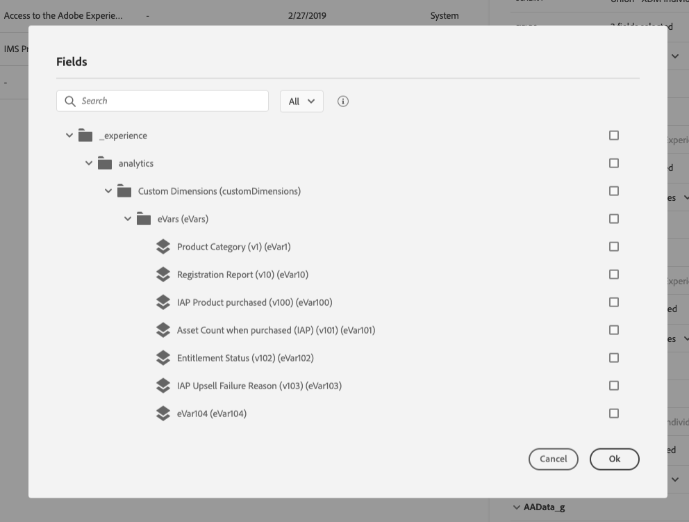

# Interfaz de usuario{#concept_rcq_lqt_52b}

>[!NOTE]
>
>Para sacar el máximo partido a [!DNL Journey Orchestration], recomendamos utilizar Chrome como navegador de Internet. La interfaz se muestra en el idioma definido en IMS. Si el idioma de IMS no es compatible con [!DNL Journey Orchestration], la interfaz se muestra en inglés.
>
>Esta documentación se actualiza con frecuencia para reflejar los cambios recientes en el producto. Sin embargo, algunas capturas de pantalla pueden diferir ligeramente de la interfaz del producto.

## Acceso a [!DNL Journey Orchestration]{#accessing_journey_orchestration}

Para acceder a la interfaz de [!DNL Journey Orchestration], haga clic en el icono **[!UICONTROL App Selector]**, en la parte superior derecha, y luego haga clic en **[!UICONTROL Journey Orchestration]**.

También puede acceder a [!DNL Journey Orchestration]desde la página de inicio de Experience Cloud, en **[!UICONTROL Quick access]**.

## Descubrimiento de la interfaz{#section_jsq_zr1_ffb}

>[!CONTEXTUALHELP]
>id="jo_home"
>title="Acerca de la lista de recorridos"
>abstract="La lista de recorridos le permite realizar vistas de todos sus recorridos a la vez, ver su estado y realizar acciones básicas."
>additional-url="https://images-tv.adobe.com/mpcv3/38af62cb-9390-4bc0-a576-d336849adb97_1574809570.1920x1080at3000_h264.mp4" text="Ver vídeo de demostración"

Los menús superiores le permiten navegar por las diferentes funcionalidades de [!DNL Journey Orchestration]: **[!UICONTROL Home]**(los recorridos),**[!UICONTROL Data Sources]**, **[!UICONTROL Events]**, **[!UICONTROL Actions]**.

Haga clic en , en la esquina superior derecha de la pantalla para mostrar la ayuda contextual. Está disponible en las distintas pantallas de lista de [!DNL Journey Orchestration] (recorridos, eventos, acciones y fuentes de datos). Esto le permite realizar una vista rápida de la funcionalidad actual y acceder a los artículos y vídeos relacionados.

## Búsqueda y filtrado{#section_lgm_hpz_pgb}

En las listas **[!UICONTROL Home]**,**[!UICONTROL Data Sources]**,**[!UICONTROL Events]** y **[!UICONTROL Actions]** , una barra de búsqueda permite buscar un elemento.

Se puede acceder a **[!UICONTROL Filters]** haciendo clic en el icono de filtro en la parte superior izquierda de la lista. El menú filtros permite filtrar los elementos mostrados según diferentes criterios. Puede elegir mostrar únicamente los elementos de un determinado tipo o estado, los que ha creado o los modificados en los últimos 30 días.

En las listas **[!UICONTROL Data Sources]**, **[!UICONTROL Events]** y **[!UICONTROL Actions]** , use **[!UICONTROL Creation filters]** para filtrar la fecha de creación y el usuario. Puede elegir, por ejemplo, mostrar solo los eventos creados en los últimos 30 días.

En la lista recorrido (en **[!UICONTROL Home]**), además de **[!UICONTROL Creation filters]**, también puede filtrar los recorridos mostrados según su estado, tipo y versión (**[!UICONTROL Status and version filters]**). El tipo puede ser: **[!UICONTROL Unitary event]** o **[!UICONTROL Segment qualification]**. También puede elegir mostrar únicamente los recorrido que utilizan un evento, un grupo de campos o una acción en particular (**[!UICONTROL Activity filters]** y **[!UICONTROL Data filters]**). **[!UICONTROL Publication filters]** Permite seleccionar una fecha de publicación o un usuario. Puede elegir, por ejemplo, mostrar solo las versiones más recientes de recorridos en directo que se publicaron ayer. Consulte [esta página](../building-journeys/using-the-journey-designer.md).

>[!NOTE]
>
>Tenga en cuenta que las columnas mostradas se pueden personalizar mediante el botón de configuración en la parte superior derecha de las listas. La personalización se guarda para cada usuario.

Las columnas **[!UICONTROL Last update]** y **[!UICONTROL Last update by]** permiten mostrar cuándo se ha producido la última actualización de los recorridos y qué usuario lo ha hecho.

En los paneles evento, fuente de datos y configuración de acciones, el campo muestra el número de recorridos que utilizan ese evento, grupo de campos o acción en particular. **[!UICONTROL Used in]** Puede hacer clic en **[!UICONTROL View journeys]** para mostrar la lista de los recorridos correspondientes.

En las diferentes listas, puede realizar acciones básicas por cada elemento. Por ejemplo, puede duplicar o eliminar un elemento.

## Navegación por los campos de Adobe Experience Platform {#friendly-names-display}

Al definir la [carga útil de evento](../event/defining-the-payload-fields.md), la [carga útil de grupo de campos](../datasource/field-groups.md) y seleccionar los campos en el [editor de expresiones](../expression/expressionadvanced.md), se muestra el nombre para mostrar además del nombre del campo. Esta información se recupera de la definición de esquema del modelo de datos de Experience.

Si se proporcionan descriptores como &quot;xdm:alternateDisplayInfo&quot; al configurar esquemas, los nombres descriptivos reemplazarán los nombres para mostrar. Resulta especialmente útil cuando se trabaja con &quot;eVars&quot; y campos genéricos. Puede configurar descriptores de nombres prácticos mediante una llamada API. Para obtener más información, consulte la [Guía para desarrolladores de Schema Registry](https://experienceleague.adobe.com/docs/experience-platform/xdm/api/getting-started.html).

Si hay un nombre descriptivo disponible, el campo se mostrará como `<friendly-name>(<name>)`. Si no hay ningún nombre descriptivo disponible, aparecerá el nombre para mostrar, por ejemplo `<display-name>(<name>)`. Si no se define ninguno de ellos, solo se mostrará el nombre técnico del campo `<name>`.

>[!NOTE]
>
>Los nombres descriptivos no se recuperan al seleccionar campos de una unión de esquemas.

## Uso de los distintos métodos abreviados{#section_ksq_zr1_ffb}

Estos son los diferentes métodos abreviados disponibles en la interfaz de [!DNL Journey Orchestration].

_En lista de recorridos, acciones, fuentes de datos o eventos:_

* Pulse **c** para crear un nuevo recorrido, acción, fuente de datos o evento.

_Al configurar una actividad en un recorrido:_

El lienzo se guarda automáticamente. Puede ver el estado de almacenamiento en la parte superior izquierda del lienzo.

* Pulse **escape** para cerrar el panel de configuración y descartar los cambios realizados. Este es el equivalente del botón **[!UICONTROL Cancel]**.
* Pulse **Entrar** o haga clic fuera del panel para cerrar el panel de configuración. Los cambios se guardan. Este es el equivalente del botón **[!UICONTROL Ok]**.
* Si pulsa **Eliminar** o **retroceso**, puede pulsar **Entrar** para confirmar la eliminación.

_En elementos emergentes:_

* Pulse **escape** para cerrarlo (equivalente al botón **[!UICONTROL Cancel]** ).
* Pulse **Entrar** para guardar o confirmar (equivalente al botón **[!UICONTROL Ok]** o **[!UICONTROL Save]** ).

_En el panel de configuración de evento, fuente de datos o acción:_

* Pulse **escape** para cerrar el panel de configuración sin guardar.
* Pulse **Entrar** para guardar las modificaciones y cerrar el panel de configuración.
* Pulse la **pestaña** para saltar entre los distintos campos para configurarlos.

_En el editor de expresiones simple_

* Haga doble clic en un campo, a la izquierda, para agregar una consulta (equivalente a arrastrar y soltar).

_Al explorar los campos XDM:_

* Al marcar un &quot;nodo&quot; se seleccionarán todos los campos del nodo.

_En todas las áreas de texto:_

* Utilice la combinación de **teclas Ctrl/Comando + A** para seleccionar el texto. En la previsualización de carga útil, selecciona la carga útil.

_En una pantalla con una barra de búsqueda:_

* Utilice la combinación de teclas **Ctrl/Comando + F** para seleccionar la barra de búsqueda.

_En el lienzo de un recorrido:_

* Utilice la combinación de **teclas Ctrl/Comando + A** para seleccionar todas las actividades.
* Cuando se seleccionan una o varias actividades, pulse **Eliminar** o **Retroceso** para eliminarlas. A continuación, puede pulsar **Entrar** para confirmar en el elemento emergente de confirmación.
* Haga doble clic en una actividad desde la paleta izquierda para agregarla a la primera posición disponible (de arriba a abajo).

_En un recorrido:_

* Pulse **T** para habilitar/deshabilitar el modo de prueba.
* En un recorrido basado en eventos en el modo de prueba, pulse **E** para almacenar en déclencheur un evento.
* En un recorrido basado en segmentos, cuando la opción **Un perfil a la vez** está seleccionada en modo de prueba, presione **P** para almacenar en déclencheur un evento.
* En el modo de prueba, pulse **L** para mostrar los registros.
