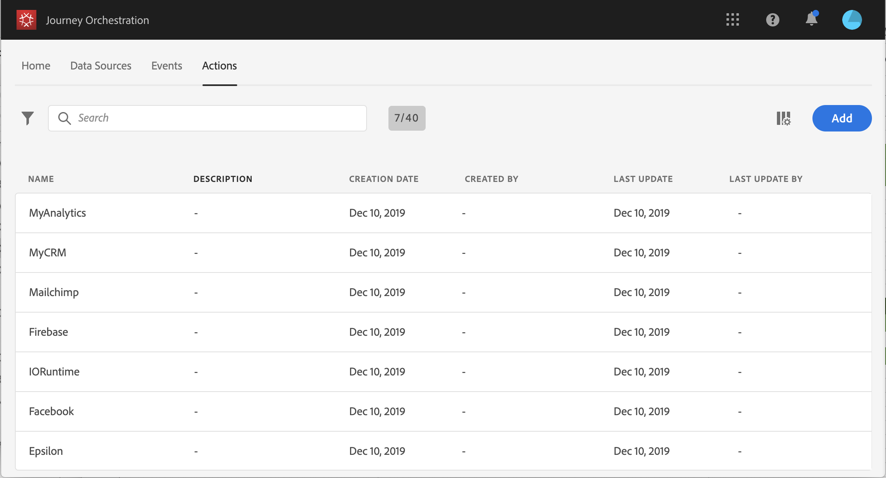

# Acerca de las acciones {#about_actions}

>[!CONTEXTUALHELP]
>id="jo_actions"
>title="Acerca de las acciones"
>abstract="Aquí se define la conexión con el sistema que enviará los mensajes. Las acciones definidas aquí estarán disponibles en la paleta izquierda del recorrido, en la categoría Acción. "

Las acciones son conexiones a través de las cuales se ofrecen experiencias personalizadas en tiempo real a clientes, como notificaciones push, correo electrónico, SMS u otro medio de participación digital de su negocio.

Las acciones personalizadas le permiten configurar la conexión de un sistema de terceros para enviar mensajes o llamadas API. Se puede configurar una acción con cualquier servicio de cualquier proveedor al que se pueda llamar mediante una API REST con carga útil en formato JSON.

The actions are available in the left palette of your journey, in the **[!UICONTROL Action]** category. Consulte [esta página](../building-journeys/about-action-activities.md).

>[!NOTE]
>
>La configuración de las acciones personalizadas siempre la realiza un **usuario técnico**.

En la lista de **acciones**, puede pulsar c para crear un nuevo recorrido, acción, fuente de datos o evento. For more information on shortcuts in [!DNL Journey Orchestration], see [this section](../about/user-interface.md#section_ksq_zr1_ffb).

Para ver la lista de acciones o configurar una nueva acción, haga clic en **[!UICONTROL Actions]** en los menús superiores. Se muestra la lista de acciones. See [this page](../about/user-interface.md) for more information on the interface.

Si tiene Adobe Campaign Standard, debe configurar la acción predeterminada para enviar correos electrónicos, notificaciones push y SMS mediante las funciones de mensajería transaccional de Adobe Campaign Standard. Consulte [esta página](../action/working-with-adobe-campaign.md).

Si utiliza un sistema de terceros para enviar mensajes como Epsilon, Facebook, Adobe.io, Firebase, etc., debe agregar y configurar una acción personalizada. Consulte [esta página](../action/about-custom-action-configuration.md).

Para obtener más información sobre cómo configurar una acción para [!DNL Journey Orchestration] y cómo utilizarla en un recorrido, vea este [vídeo tutorial](https://docs.adobe.com/content/help/es-ES/journey-orchestration-learn/tutorials/configure-actions.html).
