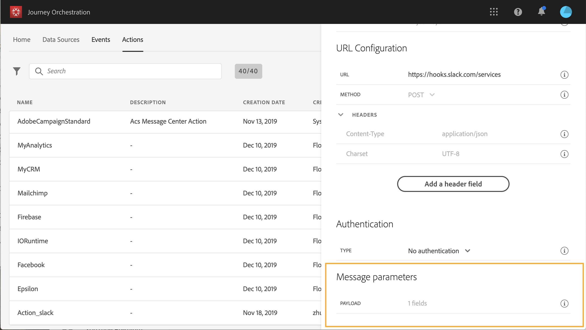

# Definición de los parámetros del mensaje {#concept_wy4_bf1_2gb}

>[!CAUTION]
>
>¿**Busca Adobe Journey Optimizer**? Haga clic [aquí](https://experienceleague.adobe.com/es/docs/journey-optimizer/using/ajo-home){target="_blank"} para obtener la documentación de Journey Optimizer.
>
>
>_Esta documentación hace referencia a materiales de Journey Orchestration heredados que han sido reemplazados por Journey Optimizer. Póngase en contacto con su equipo de cuentas si tiene alguna pregunta sobre el acceso a Journey Orchestration o Journey Optimizer._

En la sección **[!UICONTROL Action parameters]**, pegue un ejemplo de la carga útil JSON para enviarla al servicio externo.

>[!NOTE]
>
>Los nombres de campo en la carga no pueden contener un &quot;&quot;. carácter. No pueden comenzar con el carácter &quot;$&quot;.

Podrá definir el tipo de parámetro (por ejemplo, cadena, entero, etc.).

También puede elegir entre especificar si un parámetro es una constante o una variable:

* Constante significa que el valor del parámetro se define en el panel de configuración de acciones por una persona técnica. El valor siempre será el mismo en todos los recorridos. No variará y el experto en marketing no lo verá al utilizar la acción personalizada en el recorrido. Podría ser, por ejemplo, un ID que espere el sistema de terceros. En ese caso, el campo a la derecha de la constante/variable de alternancia es el valor pasado.
* Variable significa que el valor del parámetro variará. El experto en marketing que utilice esta acción personalizada en un recorrido podrá transferir libremente el valor que desee o especificar dónde recuperar el valor de este parámetro (por ejemplo, desde el evento, desde Adobe Experience Platform, etc.). En ese caso, el campo a la derecha de la constante/variable de alternancia es la etiqueta que el experto en marketing verá en el recorrido para asignar un nombre a este parámetro.

