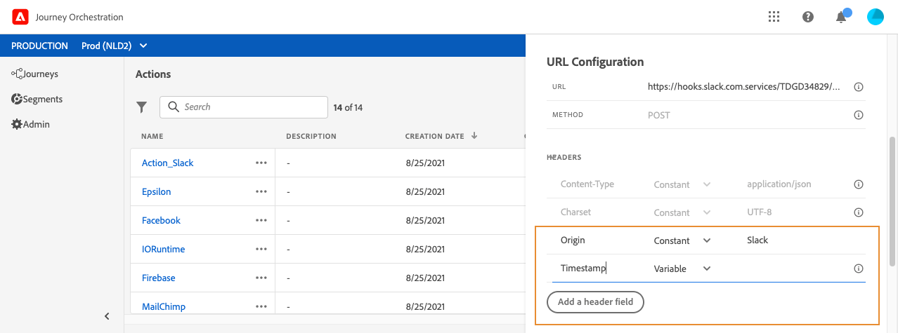

# Configuración de URL {#concept_gbg_1f1_2gb}

>[!CAUTION]
>
>¿**Busca Adobe Journey Optimizer**? Haga clic [aquí](https://experienceleague.adobe.com/es/docs/journey-optimizer/using/ajo-home){target="_blank"} para obtener la documentación de Journey Optimizer.
>
>
>_Esta documentación hace referencia a materiales de Journey Orchestration heredados que han sido reemplazados por Journey Optimizer. Póngase en contacto con su equipo de cuentas si tiene alguna pregunta sobre el acceso a Journey Orchestration o Journey Optimizer._

Al configurar una acción personalizada, debe definir los siguientes **[!UICONTROL URL Configuration]** parámetros:

1. En el campo **[!UICONTROL URL]**, especifique la URL del servicio externo:

   * Si la dirección URL es estática, introduzca la dirección URL en este campo.

   * Si la dirección URL incluye una ruta dinámica, introduzca solo la parte estática de la dirección URL, es decir, el esquema, el host, el puerto y, opcionalmente, una parte estática de la ruta.

     Ejemplo: `https://xxx.yyy.com/somethingstatic/`

     Especifique la ruta dinámica de la URL al agregar la acción personalizada a un recorrido. [Más información](../building-journeys/using-custom-actions.md).

   >[!NOTE]
   >
   >Por motivos de seguridad, le recomendamos encarecidamente que utilice el esquema HTTPS para la dirección URL. No permitimos el uso de direcciones de Adobe que no son públicas ni de direcciones IP.
   >
   >Solo se permiten los puertos predeterminados al definir una acción personalizada: 80 para http y 443 para https.

1. Seleccione la llamada **[!UICONTROL Method]**: puede ser **[!UICONTROL POST]** o **[!UICONTROL PUT]**.
1. En la sección **[!UICONTROL Headers]**, defina los encabezados HTTP del mensaje de solicitud que se va a enviar al servicio externo:
   1. Para agregar un campo de encabezado, haga clic en **[!UICONTROL Add a header field]**.
   1. Introduzca la clave del campo de encabezado.
   1. Para establecer un valor dinámico para el par clave-valor, seleccione **[!UICONTROL Variable]**. De lo contrario, seleccione **[!UICONTROL Constant]**.

      Por ejemplo, para una marca de tiempo, puede establecer un valor dinámico.

   1. Si ha seleccionado **[!UICONTROL Constant]**, introduzca el valor constante.

      Si ha seleccionado **[!UICONTROL Variable]**, debe especificar esta variable al agregar la acción personalizada a un recorrido. [Más información](../building-journeys/using-custom-actions.md).

      

   1. Para eliminar un campo de encabezado, elija el campo de encabezado y haga clic en el icono **[!UICONTROL Delete]**.

   Los campos de encabezado **[!UICONTROL Content-Type]** y **[!UICONTROL Charset]** están establecidos de forma predeterminada. Estos campos no se pueden modificar ni eliminar.

   Después de agregar la acción personalizada a un recorrido, aún puede agregarle campos de encabezado si el recorrido está en estado de borrador. Si no desea que los cambios de configuración afecten al recorrido, duplique la acción personalizada y agregue los campos de encabezado a la nueva acción personalizada.

   >[!NOTE]
   >
   >Los encabezados se validan según las reglas de análisis de campos. [Más información](https://tools.ietf.org/html/rfc7230#section-3.2.4).
