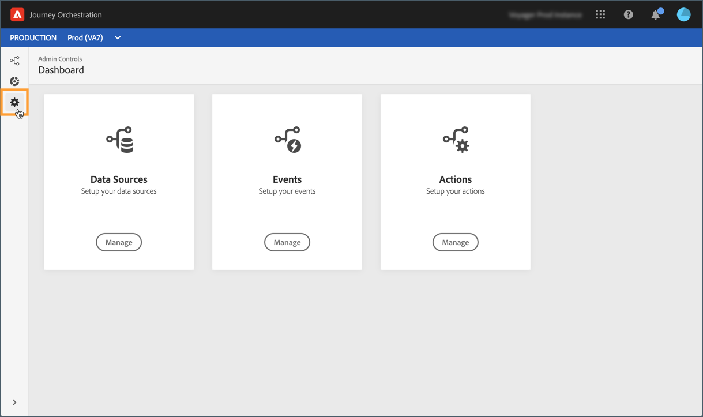

# Descubrimiento de la interfaz de la versión Alpha {#discovering-alpha-interface}

## Acerca de la interfaz de la versión Alpha {#about-alpha-interface}

Navigation within [!DNL Journey Orchestration] menus has been enhanced, in order to provide a consistant interface with Adobe Experience Platform. Los cambios incluyen:

* Los menús se mueven desde la parte superior hacia la izquierda de la interfaz,
* Agrupación de funcionalidades administrativas en un solo panel.

En [esta sección](../about/user-interface.md)se presentan los conceptos globales sobre cómo utilizar y desplazarse por la interfaz (búsqueda y filtrado, exploración por campos de Adobe Experience Platform, accesos directos).

## Acceso a [!DNL Journey Orchestration] las funcionalidades {#accessing-journey-orchestration-functionalities}

La barra de menús situada a la izquierda permite acceder a las diferentes funcionalidades. Haga clic en un icono para acceder al menú correspondiente. Puede hacer clic en la flecha situada en la parte inferior izquierda para expandir o contraer la barra de menús.

Al acceder a [!DNL Journey Orchestration], se muestra el **[!UICONTROL Journeys]** menú, que le permite acceder a los viajes existentes o crear otros nuevos. See [Using the journey designer](../building-journeys/using-the-journey-designer.md).

El **[!UICONTROL Segments]** menú le permite acceder y crear segmentos de Adobe Experience Platform. Consulte [Acerca de los segmentos](../segment/about-segments.md)de Adobe Experience Platform.

El **[!UICONTROL Admin]** menú está disponible para todos los usuarios con derechos de administrador (consulte Administración [de](../about/access-management.md)acceso). Proporciona un panel que le permite configurar fuentes [de](../datasource/about-data-sources.md)datos, [eventos](../event/about-events.md) y [acciones](../action/action.md).

