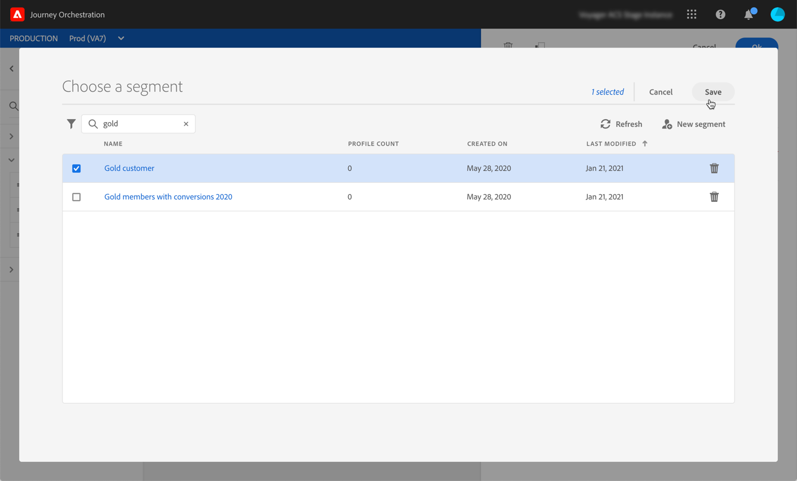

# Leer actividad de segmentos {#segment-trigger-activity}

## Acerca de la actividad Leer segmento {#about-segment-trigger-actvitiy}

>[!NOTE]
>
>Si hay una actividad de acción lista para usar de Adobe Campaign Standard en el lienzo en tiempo de publicación o en tiempo de activación del modo de prueba, el viaje se reducirá a 13 entradas por segundo. De lo contrario, el viaje se reducirá a 1000 eventos por segundo.

La actividad Leer segmento le permite hacer que todas las personas que pertenecen a un segmento de Adobe Experience Platform participen en un viaje. La entrada en un viaje puede realizarse una vez o de forma regular.

Supongamos que tiene un segmento de clientes Gold en Adobe Experience Platform. Con la actividad Leer segmento, puede hacer que todas las personas pertenecientes al segmento de clientes Gold participen en un viaje y que fluyan en viajes individualizados que aprovechen todas las funcionalidades del viaje: condiciones, temporizadores, eventos, acciones.

## Configuring the activity {#configuring-segment-trigger-activity}

>[!NOTE]
>
>Debido a las latencias de exportación de segmentos, no es posible iniciar un viaje basado en segmentos en un intervalo de tiempo más corto que 1 hora.

1. Despliegue la **[!UICONTROL Orchestration]** categoría y suelte una **[!UICONTROL Read Segment]** actividad en el lienzo.

   La actividad debe situarse como el primer paso de un viaje.

1. Añada una **[!UICONTROL Label]** a la actividad (opcional).

1. En el **[!UICONTROL Segment]** campo, elija el segmento de Adobe Experience Platform que entrará en el viaje y, a continuación, haga clic en **[!UICONTROL Save]**.

   >[!NOTE]
   >
   >Tenga en cuenta que puede personalizar las columnas que se muestran en la lista y ordenarlas.

   

   Una vez agregado el segmento, el **[!UICONTROL Copy]** botón le permite copiar su nombre y su ID:

   `{"name":"Gold customers,”id":"8597c5dc-70e3-4b05-8fb9-7e938f5c07a3"}`

   

1. En el **[!UICONTROL Namespace]** campo, elija la Área de nombres que desee utilizar para identificar a los individuos. For more on namespaces, refer to [this section](../event/selecting-the-namespace.md).

   >[!NOTE]
   >
   >Las personas que pertenecen a un segmento que no tiene la identidad seleccionada (Área de nombres) entre sus distintas identidades no pueden entrar en el viaje.

1. La **[!UICONTROL Read Segment]** actividad le permite especificar la hora a la que el segmento entrará en el viaje. Para ello, haga clic en el **[!UICONTROL Edit journey schedule]** vínculo para acceder a las propiedades del viaje y, a continuación, configure el **[!UICONTROL Scheduler type]** campo.

   

   De forma predeterminada, los segmentos introducen el viaje **[!UICONTROL As soon as possible]**, es decir, 1 hora después de la publicación del viaje. Si desea que el segmento introduzca el viaje en una fecha/hora específica o de forma recurrente, seleccione el valor deseado en la lista.

   >[!NOTE]
   >
   >Tenga en cuenta que la **[!UICONTROL Schedule]** sección solo está disponible cuando se ha colocado una **[!UICONTROL Read Segment]** actividad en el lienzo.

   

## Prueba y publicación del viaje {#testing-publishing}

La **[!UICONTROL Read Segment]** actividad le permite probar el viaje en un perfil unitario o en 100 perfiles de prueba aleatorios seleccionados entre los perfiles cualificados para el segmento.

Para ello, active el modo de prueba y, a continuación, seleccione la opción que desee en el panel izquierdo.

Luego puede configurar el modo de prueba como de costumbre. En [esta sección](../building-journeys/testing-the-journey.md)se describen los pasos detallados para probar un viaje.

Tenga en cuenta que probar el viaje con hasta 100 perfiles a la vez no permite rastrear el progreso de los individuos en el viaje utilizando el flujo visual.

Una vez realizadas las pruebas, puede publicar el viaje (consulte [Publicación del viaje](../building-journeys/publishing-the-journey.md)). Las personas que pertenezcan al segmento entrarán en el viaje en la fecha y hora especificadas en la sección de propiedades **[!UICONTROL Scheduler]** del viaje.

>[!IMPORTANT]
>
>Tenga en cuenta que los segmentos de Adobe Experience Platform se calculan una vez al día (segmentos **por lotes** ) o en tiempo real (segmentos **transmitidos** ).
>
>Si el segmento seleccionado se transmite por flujo continuo, los individuos pertenecientes a este segmento potencialmente entrarán en el viaje en tiempo real. Si el segmento es por lotes, las personas que acaban de cumplir los requisitos para este segmento posiblemente entrarán en el viaje cuando el cálculo del segmento se ejecute en el Adobe Experience Platform.
