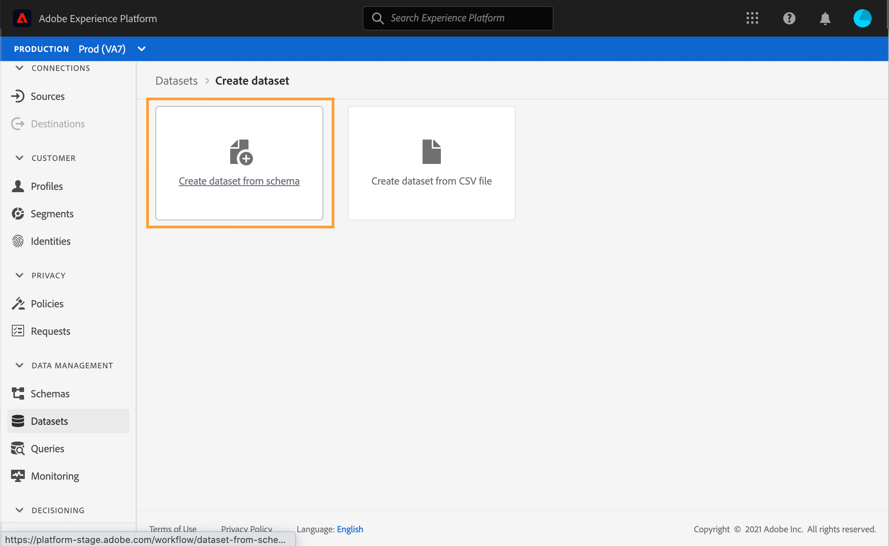
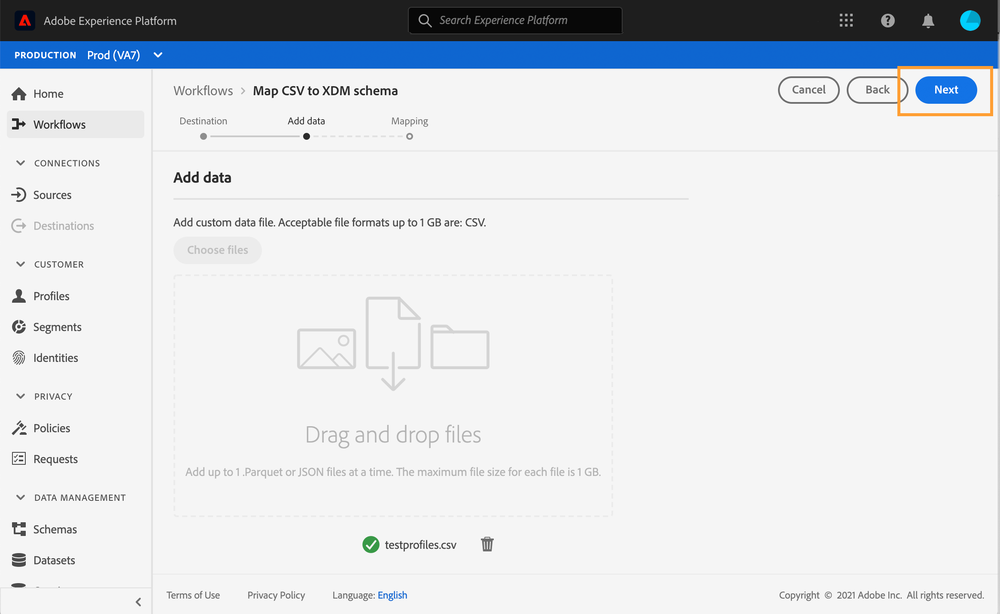

# Creación de perfiles de prueba {#create-test-profiles}

Los perfiles de prueba son obligatorios cuando se utiliza el modo de prueba en un recorrido. Para aprender a utilizar el modo de prueba, consulte [esta sección](../building-journeys/testing-the-journey.md).

Existen diferentes formas de crear un perfil de prueba en Adobe Experience Platform. En esta documentación, nos centramos en dos métodos: carga de [archivo csv](../building-journeys/creating-test-profiles.md#create-test-profiles-csv) y [Llamadas de API](../building-journeys/creating-test-profiles.md#create-test-profiles-api). También puede cargar un archivo json en un conjunto de datos; consulte la [Documentación de ingesta de datos](https://experienceleague.adobe.com/docs/experience-platform/ingestion/tutorials/ingest-batch-data.html#add-data-to-dataset).

Estos métodos de importación también permiten actualizar atributos de perfil. De este modo, puede convertir un perfil existente en un perfil de prueba. Utilice simplemente un archivo similar o una llamada de API y solo incluya el campo &quot;testProfile&quot; con el valor &quot;true&quot;.

La creación de un perfil de prueba es similar a la creación de perfiles normales en Adobe Experience Platform. Para obtener más información, consulte [Documentación del perfil del cliente en tiempo real](https://experienceleague.adobe.com/docs/experience-platform/profile/home.html?lang=es).

## Requisitos previos{#test-profile-prerequisites}

Para poder crear perfiles, primero debe crear un esquema y un conjunto de datos en Adobe Experience Platform.

Primero, debe **crear un esquema**. Siga estos pasos:

1. En Adobe Experience Platform, haga clic en **[!UICONTROL Schemas]**, en el menú de la izquierda.
   
1. Haga clic en **[!UICONTROL Create schema]**, en la parte superior derecha, seleccione un tipo de esquema, por ejemplo **[!UICONTROL XDM Individual Profile]**.
   
1. Elija un nombre para el esquema.
1. En la sección **[!UICONTROL Mixins]**, haga clic en **[!UICONTROL Add]**.
   
1. Seleccione las mezclas adecuadas. Asegúrese de agregar la variable **[!UICONTROL Profile test details]** mixin. Haga clic en **[!UICONTROL Add mixin]**.
   
La lista de mezclas se muestra en la pantalla de información general del esquema.

   
1. En la lista de campos, haga clic en el campo que desee definir como identidad principal.
   
1. En el **[!UICONTROL Field properties]** panel derecho, compruebe el **[!UICONTROL Identity]** y **[!UICONTROL Primary Identity]** y seleccione un área de nombres. Si desea que la identidad principal sea una dirección de correo electrónico, elija la **[!UICONTROL Email]** espacio de nombres. Haga clic en **[!UICONTROL Apply]**.
   
1. Seleccione el esquema y habilite el **[!UICONTROL Profile]** en la **[!UICONTROL Schema properties]**.
   
1. Haga clic en **[!UICONTROL Save]**.

>[!NOTE]
>
>Para obtener más información sobre la creación de esquemas, consulte la [Documentación XDM](https://experienceleague.adobe.com/docs/experience-platform/xdm/ui/resources/schemas.html#prerequisites).

A continuación, debe **crear el conjunto de datos** en el que se importarán los perfiles. Siga estos pasos:

1. En Adobe Experience Platform, haga clic en **[!UICONTROL Datasets]**, en el menú de la izquierda, haga clic en **[!UICONTROL Create dataset]**.
   
1. Choose **[!UICONTROL Create dataset from schema]**.
   
1. Seleccione el esquema creado anteriormente y haga clic en **[!UICONTROL Next]**.
   
1. Elija un nombre y haga clic en **[!UICONTROL Finish]**.
   
1. Active la variable **[!UICONTROL Profile]** .
   

>[!NOTE]
>
> Para obtener más información sobre la creación de conjuntos de datos, consulte la [Documentación del servicio de catálogo](https://experienceleague.adobe.com/docs/experience-platform/catalog/datasets/user-guide.html#getting-started).

## Creación de un perfil de prueba mediante un archivo csv{#create-test-profiles-csv}

En Adobe Experience Platform, puede crear perfiles cargando un archivo csv que contenga los distintos campos de perfil en el conjunto de datos. Este es el método más sencillo.

1. Cree un archivo csv simple usando un programa de hojas de cálculo.
1. Agregue una columna para cada campo necesario. Asegúrese de agregar el campo de identidad principal (&quot;personID&quot; en nuestro ejemplo anterior) y el campo &quot;testProfile&quot; establecido en &quot;true&quot;.
   
1. Añada una línea por perfil y rellene los valores de cada campo.
   
1. Guarde la hoja de cálculo como archivo csv. Asegúrese de que las comas se utilizan como separadores.
1. En Adobe Experience Platform, haga clic en **[!UICONTROL Workflows]**, en el menú de la izquierda.
   
1. Choose **[!UICONTROL Map CSV to XDM schema]** y haga clic en **[!UICONTROL Launch]**.
   
1. Seleccione el conjunto de datos en el que desea importar los perfiles. Haga clic en **[!UICONTROL Next]**.
   
1. Haga clic en **[!UICONTROL Choose files]** y seleccione el archivo csv. Cuando se cargue el archivo, haga clic en **[!UICONTROL Next]**.
   
1. Asigne los campos csv de origen a los campos de esquema y haga clic en **[!UICONTROL Finish]**.
   
1. Se inicia la importación de datos. El estado se moverá de **[!UICONTROL Processing]** a **[!UICONTROL Success]**. Haga clic en **[!UICONTROL Preview data set]**, en la parte superior derecha.
   
1. Compruebe que los perfiles de prueba se hayan añadido correctamente.
   

Se añaden los perfiles de prueba, que ahora se pueden utilizar al probar un recorrido. Consulte [esta sección](../building-journeys/testing-the-journey.md).
>[!NOTE]
>
> Para obtener más información sobre las importaciones de csv, consulte la [Documentación de ingesta de datos](https://experienceleague.adobe.com/docs/experience-platform/ingestion/tutorials/map-a-csv-file.html#tutorials).

## Creación de perfiles de prueba mediante llamadas a API{#create-test-profiles-api}

También puede crear perfiles de prueba mediante llamadas a la API. Consulte esta [página](https://experienceleague.adobe.com/docs/experience-platform/profile/home.html?lang=es).

Debe utilizar un esquema de perfil que contenga la mezcla &quot;Detalles de la prueba del perfil&quot;. El indicador testProfile forma parte de esta mezcla.

Al crear un perfil, asegúrese de pasar el valor: testProfile = true.

Tenga en cuenta que también puede actualizar un perfil existente para cambiar su indicador testProfile a &quot;true&quot;.

Este es un ejemplo de una llamada a la API para crear un perfil de prueba:

```
curl -X POST \
'https://dcs.adobedc.net/collection/xxxxxxxxxxxxxx' \
-H 'Cache-Control: no-cache' \
-H 'Content-Type: application/json' \
-H 'Postman-Token: xxxxx' \
-H 'cache-control: no-cache' \
-H 'x-api-key: xxxxx' \
-H 'x-gw-ims-org-id: xxxxx' \
-d '{
"header": {
"msgType": "xdmEntityCreate",
"msgId": "xxxxx",
"msgVersion": "xxxxx",
"xactionid":"xxxxx",
"datasetId": "xxxxx",
"imsOrgId": "xxxxx",
"source": {
"name": "Postman"
},
"schemaRef": {
"id": "https://example.adobe.com/mobile/schemas/xxxxx",
"contentType": "application/vnd.adobe.xed-full+json;version=1"
}
},
"body": {
"xdmMeta": {
"schemaRef": {
"contentType": "application/vnd.adobe.xed-full+json;version=1"
}
},
"xdmEntity": {
"_id": "xxxxx",
"_mobile":{
"ECID": "xxxxx"
},
"testProfile":true
}
}
}'
```
