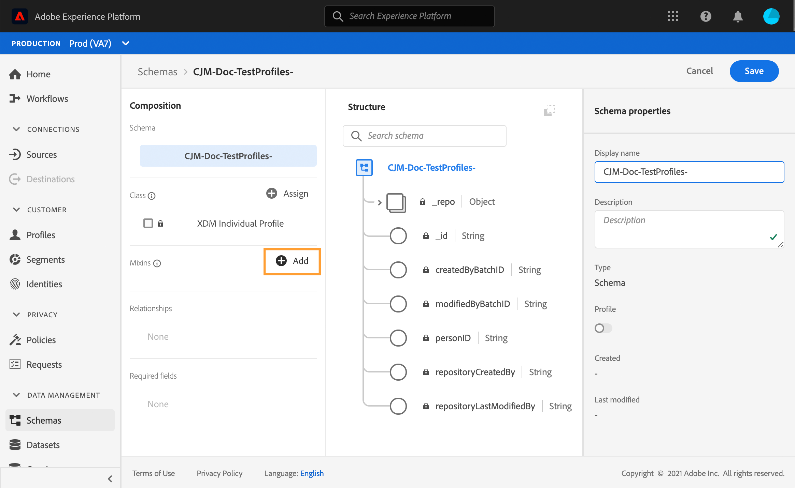

# Crear perfiles de prueba {#create-test-profiles}


Los perfiles de prueba son obligatorios cuando se utiliza el modo de prueba en un recorrido. Puede convertir un [perfil existente](../building-journeys/creating-test-profiles.md#turning-profile-into-test) en un perfil de prueba o [crear un perfil de prueba](../building-journeys/creating-test-profiles.md#create-test-profiles-csv). Para aprender a utilizar el modo de prueba, consulte [esta sección](../building-journeys/testing-the-journey.md).

Existen diferentes formas de crear un perfil de prueba en Adobe Experience Platform. En esta documentación, nos centramos en dos métodos: carga de un [archivo csv](../building-journeys/creating-test-profiles.md#create-test-profiles-csv) y uso de [llamadas API](../building-journeys/creating-test-profiles.md#create-test-profiles-api). También puede cargar un archivo json en un conjunto de datos, consulte la [Documentación de ingesta de datos](https://experienceleague.adobe.com/docs/experience-platform/ingestion/tutorials/ingest-batch-data.html#add-data-to-dataset)

La creación de un perfil de prueba es similar a la creación de perfiles normales en Adobe Experience Platform. Para obtener más información, consulte la [Documentación del perfil del cliente en tiempo real](https://experienceleague.adobe.com/docs/experience-platform/profile/home.html).

## Requisitos previos{#test-profile-prerequisites}

Para poder crear perfiles, primero debe crear un esquema y un conjunto de datos en Adobe Experience Platform.

En primer lugar, debe **crear un esquema**. Siga estos pasos:

1. En Adobe Experience Platform, haga clic en **Esquemas** en el menú de la izquierda.
   
1. Haga clic en **Create schema** en la parte superior derecha y, a continuación, seleccione un tipo de esquema, por ejemplo **XDM Individual Profile**.
   
1. Elija un nombre para el esquema.
1. En la sección **Mixins**, haga clic en **Add**.
   
1. Seleccione las mezclas adecuadas. Asegúrese de añadir la mezcla **Profile test details**. Haga clic en **Agregar mezcla**.
   
La lista de mezclas se muestra en la pantalla de información general del esquema.

   
1. En la lista de campos, haga clic en el campo que desee definir como identidad principal.
   
1. En el panel derecho **Field properties**, marque las opciones **Identity** y **Primary Identity** y seleccione un área de nombres. Si desea que la identidad principal sea una dirección de correo electrónico, elija el espacio de nombres **Email**. Haga clic en **Aplicar**.
   
1. Seleccione el esquema y habilite la opción **Profile** en **Schema properties**.
   
1. Haga clic en **Save**.

>[!NOTE]
>
>Para obtener más información sobre la creación de esquemas, consulte la [documentación de XDM](https://experienceleague.adobe.com/docs/experience-platform/xdm/ui/resources/schemas.html#prerequisites).

A continuación, debe **crear el conjunto de datos** en el que se importarán los perfiles. Siga estos pasos:

1. En Adobe Experience Platform, haga clic en **Conjuntos de datos** en el menú de la izquierda y, a continuación, haga clic en **Crear conjunto de datos**.
   
1. Elija **Crear conjunto de datos a partir del esquema**.
   
1. Seleccione el esquema creado anteriormente y haga clic en **Next**.
   
1. Elija un nombre y haga clic en **Finish**.
   
1. Active la opción **Perfil**.
   

>[!NOTE]
>
> Para obtener más información sobre la creación de conjuntos de datos, consulte la [documentación del Servicio de catálogo](https://experienceleague.adobe.com/docs/experience-platform/catalog/datasets/user-guide.html#getting-started).

## Convertir un perfil en un perfil de prueba{#turning-profile-into-test}

Puede convertir un perfil existente en un perfil de prueba. En Adobe Experience Platform, puede actualizar los atributos de perfil del mismo modo que cuando crea un perfil.

Una forma más sencilla de hacerlo es usar una actividad de acción **Update profile** en un recorrido y cambiar el campo booleano testProfile de falso a verdadero.

El recorrido se compondrá de una actividad **Read segment** y una actividad **Update profile**. Primero debe crear un segmento dirigido a los perfiles que desea convertir en perfiles de prueba.

>[!NOTE]
>
> Dado que se va a actualizar el campo **testProfile**, los perfiles seleccionados deben incluir este campo. El esquema relacionado debe tener la mezcla **Profile test details**. Consulte [esta sección](../building-journeys/creating-test-profiles.md#test-profiles-prerequisites).

1. En Administración de Recorrido del cliente, haga clic en **Segmentos** en el menú de la izquierda y, a continuación, en **Crear segmento**, en la parte superior derecha.
   
1. Defina un nombre para el segmento y genere el segmento: elija los campos y los valores para dirigirse a los perfiles que desee.
   
1. Haga clic en **Save** y compruebe que el segmento tenga correctamente en cuenta los perfiles.
   

   >[!NOTE]
   >
   > El cálculo de segmentos puede tardar algún tiempo. Obtenga más información sobre los segmentos en [esta sección](../segment/about-segments.md).

1. Ahora cree un nuevo recorrido y comience con una actividad de organización **Read segment**.
1. Elija el segmento creado anteriormente y el área de nombres que utilizan sus perfiles.
   
1. Agregue una actividad de acción **Update profile**.
1. Seleccione el esquema, el campo **testProfiles**, el conjunto de datos y establezca el valor en &quot;true&quot;.
   
1. Agregue una actividad **End** y haga clic en **Publish**.
   
1. En Adobe Experience Platform, compruebe que los perfiles se hayan actualizado correctamente.
   

   >[!NOTE]
   >
   > Para obtener más información sobre la actividad **Update profile**, consulte [esta sección](../building-journeys/update-profiles.md).

## Creación de un perfil de prueba mediante un archivo csv{#create-test-profiles-csv}

En Adobe Experience Platform, puede crear perfiles cargando un archivo csv que contenga los distintos campos de perfil en el conjunto de datos. Este es el método más sencillo.

1. Cree un archivo csv simple usando un programa de hojas de cálculo.
1. Agregue una columna para cada campo necesario. Asegúrese de agregar el campo de identidad principal (&quot;personID&quot; en nuestro ejemplo anterior) y el campo &quot;testProfile&quot; establecido en &quot;true&quot;.
   
1. Añada una línea por perfil y rellene los valores de cada campo.
   
1. Guarde la hoja de cálculo como archivo csv. Asegúrese de que las comas se utilizan como separadores.
1. En Adobe Experience Platform, haga clic en **Flujos de trabajo** en el menú de la izquierda.
   
1. Elija **Asignar CSV al esquema XDM** y haga clic en **Iniciar**.
   
1. Seleccione el conjunto de datos en el que desea importar los perfiles. Haga clic en **Next**.
   
1. Haga clic en **Choose files** y seleccione su archivo csv. Cuando se cargue el archivo, haga clic en **Siguiente**.
   
1. Asigne los campos csv de origen a los campos de esquema y haga clic en **Finish**.
   
1. Se inicia la importación de datos. El estado pasará de **Processing** a **Success**. Haga clic en **Preview data set** en la parte superior derecha.
   
1. Compruebe que los perfiles de prueba se hayan añadido correctamente.
   

Se añaden los perfiles de prueba, que ahora se pueden utilizar al probar un recorrido. Consulte [esta sección](../building-journeys/testing-the-journey.md).
>[!NOTE]
>
> Para obtener más información sobre las importaciones de csv, consulte la [Documentación de ingesta de datos](https://experienceleague.adobe.com/docs/experience-platform/ingestion/tutorials/map-a-csv-file.html#tutorials).

## Creación de perfiles de prueba mediante llamadas a API{#create-test-profiles-api}

También puede crear perfiles de prueba mediante llamadas a la API. Consulte esta [página](https://docs.adobe.com/content/help/es-ES/experience-platform/profile/home.html).

Debe utilizar un esquema de perfil que contenga la mezcla &quot;Detalles de la prueba del perfil&quot;. El indicador testProfile forma parte de esta mezcla.

Al crear un perfil, asegúrese de pasar el valor: testProfile = true.

Tenga en cuenta que también puede actualizar un perfil existente para cambiar su indicador testProfile a &quot;true&quot;.

Este es un ejemplo de una llamada a la API para crear un perfil de prueba:

```
curl -X POST \
'https://dcs.adobedc.net/collection/xxxxxxxxxxxxxx' \
-H 'Cache-Control: no-cache' \
-H 'Content-Type: application/json' \
-H 'Postman-Token: xxxxx' \
-H 'cache-control: no-cache' \
-H 'x-api-key: xxxxx' \
-H 'x-gw-ims-org-id: xxxxx' \
-d '{
"header": {
"msgType": "xdmEntityCreate",
"msgId": "xxxxx",
"msgVersion": "xxxxx",
"xactionid":"xxxxx",
"datasetId": "xxxxx",
"imsOrgId": "xxxxx",
"source": {
"name": "Postman"
},
"schemaRef": {
"id": "https://example.adobe.com/mobile/schemas/xxxxx",
"contentType": "application/vnd.adobe.xed-full+json;version=1"
}
},
"body": {
"xdmMeta": {
"schemaRef": {
"contentType": "application/vnd.adobe.xed-full+json;version=1"
}
},
"xdmEntity": {
"_id": "xxxxx",
"_mobile":{
"ECID": "xxxxx"
},
"testProfile":true
}
}
}'
```

