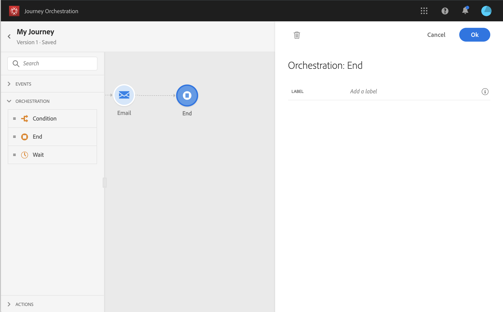

# Actividad final{#section_vqp_4ft_dgb}

La **[!UICONTROL End]** actividad permite marcar el final de cada sendero del viaje. No es obligatorio, pero se recomienda para la claridad visual. De hecho, si el viaje tiene varias actividades finales, le recomendamos que agregue una etiqueta a cada extremo para facilitar la lectura de los informes. Consulte [esta página](../reporting/about-journey-reports.md).

