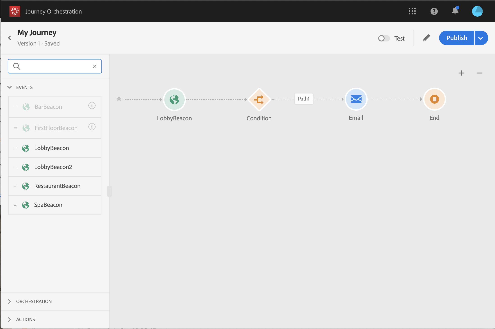

# Creación de un viaje {#concept_gq5_sqt_52b}

Este paso lo realiza el usuario **** comercial. Aquí es donde crea sus viajes. Combine las diferentes actividades de evento, orquestación y acción para crear los escenarios de varios pasos entre canales.

La interfaz de viaje permite arrastrar y soltar fácilmente las actividades de la paleta en el lienzo. También puede hacer doble clic en una actividad para agregarla al lienzo en el siguiente paso disponible. Cada actividad tiene una función y un lugar específicos en el proceso. Las actividades se secuencian. Cuando finaliza una actividad, el flujo continúa y procesa la siguiente actividad, etc.

Solo se permite un espacio de nombres por viaje. Al soltar el primer evento, los eventos con diferentes espacios de nombres aparecerán atenuados. Si el primer evento no tiene un espacio de nombres, todos los eventos con un espacio de nombres aparecerán atenuados. Consulte . Además, los grupos de campos de la plataforma de experiencia aparecen atenuados si el viaje tiene eventos sin espacio de nombres. Y finalmente, si se utilizan varios eventos en el mismo viaje, deben utilizar el mismo espacio de nombres.

## Quick start {#creating_journey}

Estos son los pasos principales para crear y publicar un viaje.

1. En el menú superior, haga clic en la **[!UICONTROL Home]**ficha.

   Se muestra la lista de viajes. Consulte  para obtener más información sobre la interfaz.

   

1. Haga clic **[!UICONTROL Create]**para crear un nuevo viaje.

   

1. Edite las propiedades del viaje en el panel de configuración que se muestra en el lado derecho. Consulte .

   

1. Comience por arrastrar y soltar una actividad de evento desde la paleta en el lienzo. También puede hacer doble clic en una actividad para agregarla al lienzo.

   

1. Arrastre y suelte las demás actividades y configúrelas. See ,  and .

   

1. Su viaje se guarda automáticamente. Pruebe su viaje y publíquelo. Consulte  y .

   

## Finalización de un viaje{#ending_a_journey}

Existen dos maneras de terminar un viaje:

* La persona llega a la última actividad de una ruta. Esta última actividad puede ser una actividad final u otra actividad. No existe la obligación de finalizar una ruta con una actividad final. Consulte .
* La persona llega a una actividad de condición (o a una actividad de espera con una condición) y no cumple ninguna de las condiciones.

La persona puede volver a entrar en el viaje si se permite la reentrada. Consulte .

