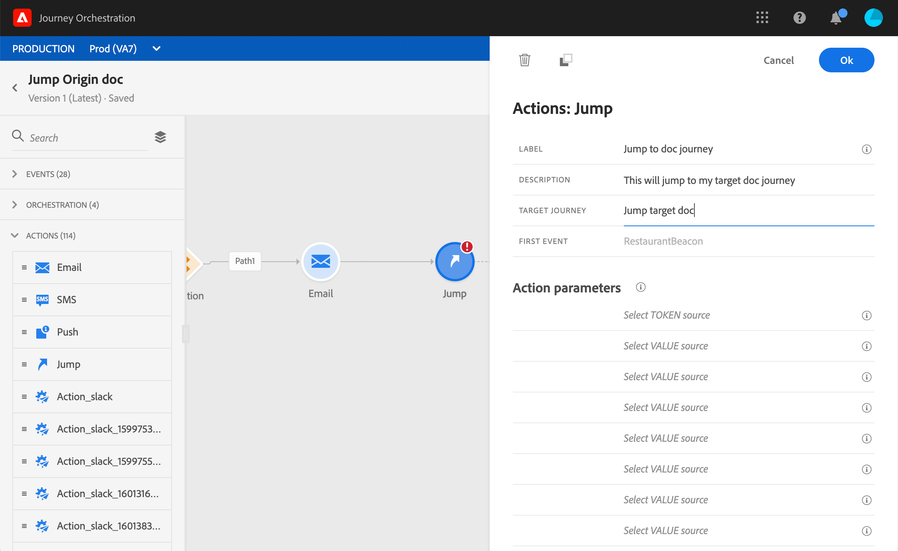

# Saltar de un recorrido a otro {#jump}

La actividad **[!UICONTROL Jump]** permite insertar individuos de un recorrido a otro. Esta función le permite:

* simplificar el diseño de recorridos muy complejos dividiéndolos en varios
* generar recorridos basados en patrones de recorrido comunes y reutilizables

En el recorrido de origen, simplemente añada una actividad **[!UICONTROL Jump]** y seleccione un recorrido de destino. Cuando el individuo introduce el paso **[!UICONTROL Jump]**, se envía un evento interno al primer evento del recorrido de destino. Si la acción **[!UICONTROL Jump]** se realiza correctamente, el individuo continúa progresando en el recorrido. El comportamiento es similar al de otras acciones.

En el recorrido de destino, el primer evento activado internamente por la actividad **[!UICONTROL Jump]** hará que el flujo individual en el recorrido sea variable.

>[!NOTE]
>
>Consulte también el tutorial en vídeo [aquí](https://experienceleague.adobe.com/docs/journey-orchestration-learn/tutorials/building-a-journey/jumping-to-another-journey.html?lang=es)

## Ciclo de vida

Supongamos que ha agregado una actividad **[!UICONTROL Jump]** en un recorrido A a un recorrido B. El Recorrido A es el **recorrido de origen** y el recorrido B, el **recorrido de destino**.
Estos son los diferentes pasos del proceso de ejecución:

**El recorrido** se activa desde un evento externo:

1. El recorrido A recibe un evento externo relacionado con una persona.
1. El individuo llega al paso **[!UICONTROL Jump]**.
1. El individuo se empuja al Recorrido B y pasa a los siguientes pasos del Recorrido A, después del paso **[!UICONTROL Jump]**.

En el recorrido B, el primer evento se activa internamente, a través de la actividad **[!UICONTROL Jump]** del recorrido A:

1. El recorrido B recibió un evento interno del Recorrido A.
1. El individuo empieza a fluir en el Recorrido B.

>[!NOTE]
>
>El recorrido B también se puede activar mediante un evento externo.

## Prácticas recomendadas y limitaciones

### Creación

* La actividad **[!UICONTROL Jump]** solo está disponible en recorridos que utilizan un área de nombres.
* Solo puede saltar a un recorrido que utilice el mismo espacio de nombres que el recorrido de origen.
* No puede saltar a un recorrido que comience con un evento **Segment qualification**.
* No puede tener una actividad **[!UICONTROL Jump]** y un evento **Segment qualification** en el mismo recorrido.
* Puede incluir tantas actividades **[!UICONTROL Jump]** como necesite en un recorrido. Después de **[!UICONTROL Jump]**, puede agregar cualquier actividad necesaria.
* Puede tener tantos niveles de salto como sea necesario. Por ejemplo, el Recorrido A salta al recorrido B, que salta al recorrido C, etc.
* El recorrido de destino también puede incluir tantas actividades **[!UICONTROL Jump]** como sea necesario.
* No se admiten patrones de bucle. No hay forma de vincular dos o más recorridos, lo que crearía un bucle infinito. La pantalla de configuración de actividad **[!UICONTROL Jump]** impide que haga esto.

### Ejecución

* Cuando se ejecuta la actividad **[!UICONTROL Jump]**, se activa la última versión del recorrido de destino.
* Como de costumbre, un individuo único solo puede estar presente una vez en un mismo recorrido. Como resultado, si el individuo empujado desde el recorrido de origen ya está en el recorrido de destino, el individuo no ingresará al recorrido de destino. No se notificará ningún error en la actividad **[!UICONTROL Jump]** porque es un comportamiento normal.

## Configuración de la actividad Jump

1. Diseñe el **recorrido de origen**.

   

1. En cualquier paso del recorrido, añada una actividad **[!UICONTROL Jump]** desde la categoría **[!UICONTROL ACTIONS]**. Añada una etiqueta y una descripción.

   

1. Haga clic dentro del campo **Target recorrido**.
La lista muestra todas las versiones de recorrido en borrador, activas o en modo de prueba. Los recorridos que utilizan un área de nombres diferente o que comienzan con un evento **Segment qualification** no están disponibles. Los recorridos de destino que podrían crear un patrón de bucle también se filtran.

   

   >[!NOTE]
   >
   >Puede hacer clic en el icono **Abrir recorrido de destino**, en el lado derecho, para abrir el recorrido de destino en una nueva pestaña.

1. Seleccione el recorrido de destino al que desee ir.
El campo **First event** se rellena previamente con el nombre del primer evento del recorrido de destino. Si el recorrido de destino incluye varios eventos, el **[!UICONTROL Jump]** solo se permite en el primer evento.

   

1. La sección **Action parameters** muestra todos los campos del evento de destino. Del mismo modo que para otros tipos de acciones, asigne cada campo con campos del evento de origen o del origen de datos. Esta información se pasa al recorrido de destino durante la ejecución.
1. Agregue las siguientes actividades para finalizar el recorrido de origen.

   

   >[!NOTE]
   >
   >La identidad del individuo se asigna automáticamente. Esta información no está visible en la interfaz de .

La actividad **[!UICONTROL Jump]** está configurada. Tan pronto como el recorrido esté activo o en modo de prueba, las personas que alcancen el paso **[!UICONTROL Jump]** se transferirán del recorrido de destino al de .

Cuando se configura una actividad **[!UICONTROL Jump]** en un recorrido, se agrega automáticamente un icono de entrada **[!UICONTROL Jump]** al principio del recorrido de destino. Esto le ayuda a identificar que el recorrido se puede activar externamente pero también internamente desde una actividad **[!UICONTROL Jump]**.

## Resolución de problemas

Cuando se publica el recorrido o en modo de prueba, se producen errores si:
* el recorrido de destino ya no existe
* el recorrido de destino es borrador, cerrado o detenido
* si el primer evento del recorrido de destino ha cambiado y la asignación está dañada

