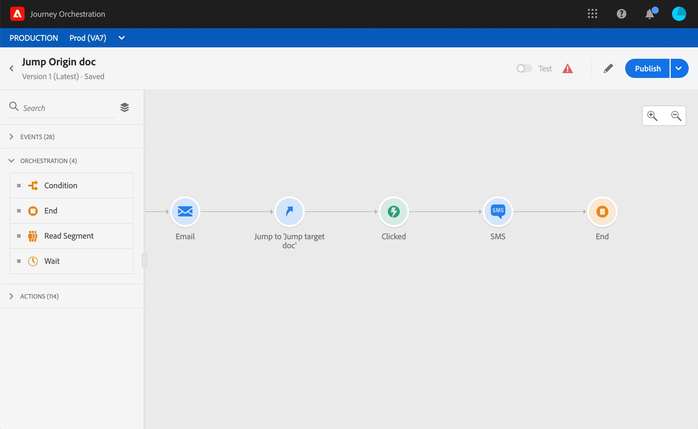

# Saltar de un viaje a otro {#jump}

La actividad de acción **Jump** le permite llevar a los individuos de un viaje a otro. Esta función le permite:

* simplificar el diseño de viajes muy complejos dividiéndolos en varios
* construir viajes basados en patrones de viaje comunes y reutilizables

En el viaje en origen, simplemente agregue un **salto** y seleccione un viaje en destinatario. Cuando el individuo entra en el paso de salto, se envía un evento interno al primer evento del viaje de destinatario. Si la acción de salto es exitosa, el individuo continúa avanzando en el viaje. El comportamiento es similar al de otras acciones.

En el viaje en destinatario, el primer evento desencadenado internamente por el salto hará el flujo individual en el viaje.

## Ciclo de vida

Supongamos que ha añadido un salto en un viaje A a un viaje B. El viaje A es el **viaje en origen** y el viaje B, el **viaje en destinatario**.
Estos son los diferentes pasos del proceso de ejecución:

**Viaje** Ais activado desde un evento externo:

1. El Viaje A recibe un evento externo relacionado con un individuo.
1. El individuo llega al paso de salto.
1. El individuo es empujado al Viaje B, y continúa hacia los siguientes pasos en el Viaje A, después del salto.

En el viaje B, el primer evento se desencadena internamente, a través del salto desde el viaje A:

1. El Viaje B recibió un evento interno del Viaje A.
1. Los inicios individuales que fluyen en el Viaje B.

>[!NOTE]
>
>El viaje B también se puede activar mediante un evento externo.

## Notas importantes

### Creación

* El salto solo está disponible en viajes que utilizan una Área de nombres.
* Sólo se puede saltar a un viaje que utilice la misma Área de nombres que el viaje en origen.
* No puede saltar a un viaje que inicio con un evento **de calificación de segmentos**.
* No puede tener un salto y un evento de **calificación de segmento** en el mismo viaje.
* Puede incluir tantos saltos como necesite en un viaje. Después de un salto, puede agregar cualquier actividad necesaria.
* Puede tener tantos niveles de salto como sea necesario. Por ejemplo, Viaje A le lleva al viaje B, que le lleva al viaje C, etc.
* El viaje en destinatario también puede incluir tantos saltos como sea necesario.
* No se admiten patrones de bucle. No hay forma de vincular dos o más viajes que puedan crear un bucle infinito. La pantalla de configuración de la actividad **Jump** evita que haga esto.

### Ejecución

* Cuando se ejecuta el salto, se activa la última versión del viaje de destinatario.
* Como de costumbre, un individuo único sólo puede estar presente una vez en el mismo viaje. Como resultado, si el individuo empujado del viaje en origen ya está en el viaje en destinatario, entonces el individuo no entrará en el viaje en destinatario. No se notificará ningún error en el salto porque se trata de un comportamiento normal.

## Configuración del salto

1. Diseñe su viaje de origen.

   

1. En cualquier paso del viaje, agregue una actividad **Jump** desde la categoría **Action**. Añada una etiqueta y una descripción.

   

1. Haga clic dentro del campo **Destinatario de viaje**.
La lista muestra todas las versiones del viaje que están en modo borrador, activo o de prueba. Los viajes que utilizan una Área de nombres diferente o ese inicio con un evento **de calificación de segmentos** no están disponibles. Los viajes de destinatario que podrían crear un patrón de bucle también se filtran.

   

   >[!NOTE]
   >
   >Puede hacer clic en el icono **Abrir viaje en destinatario**, en el lado derecho, para abrir el viaje en destinatario en una pestaña nueva.

1. Seleccione el viaje en destinatario al que desea ir.
El campo **Primer evento** se rellena con el nombre del primer evento del viaje de destinatario. Si el viaje en destinatario incluye varios eventos, el salto solo se permite en el primer evento.

   

1. La sección **Parámetros de acción** muestra todos los campos del evento de destinatario. Del mismo modo que para otros tipos de acciones, asigne cada campo a campos del evento de origen o del origen de datos. Esta información se pasará al destinatario durante el tiempo de ejecución.
1. Añada las siguientes actividades para finalizar su viaje de origen.

   

   >[!NOTE]
   >
   >La identidad del individuo se asigna automáticamente. Esta información no está visible en la interfaz.

Se ha configurado el salto. Tan pronto como su viaje esté en vivo o en modo de prueba, los individuos que alcancen el salto serán empujados desde el viaje en destinatario.

Cuando se configura un salto en un viaje, se agrega automáticamente un icono de entrada de salto al comienzo del viaje en destinatario. Esto le ayuda a identificar que el viaje se puede activar externamente pero también internamente desde un salto.

## Resolución de problemas

Cuando se publica el viaje o en modo de prueba, se producen errores si:
* el viaje en destinatario ya no existe
* el viaje en destinatario se desplaza, se cierra o se detiene
* si el primer evento del viaje en destinatario ha cambiado y se ha roto la asignación

