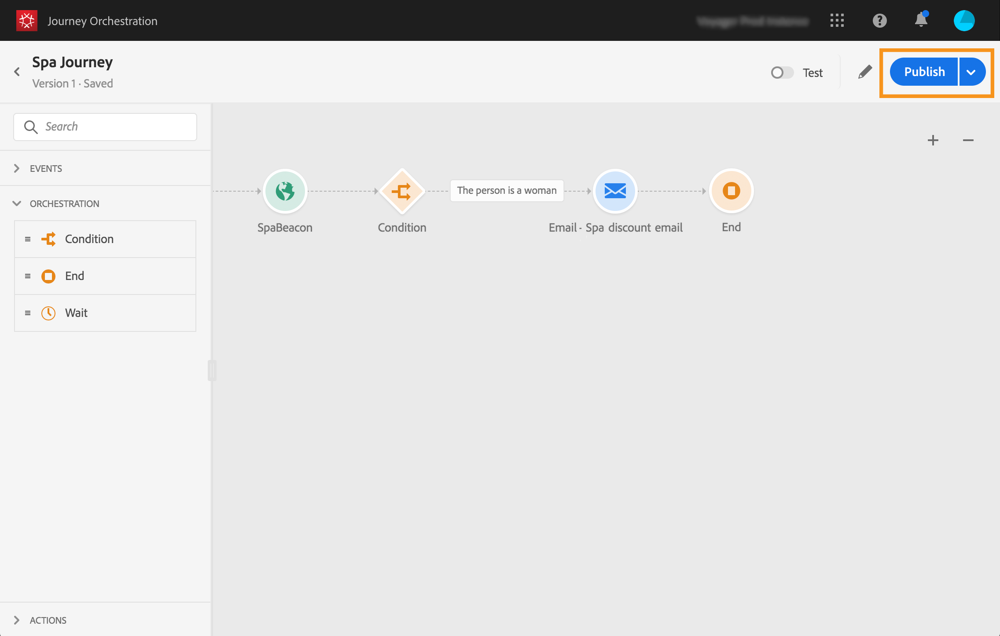

# Publicación del recorrido{#concept_mtc_lrt_52b}

>[!CAUTION]
>
>**Busca Adobe Journey Optimizer**? Haga clic [aquí](https://experienceleague.adobe.com/es/docs/journey-optimizer/using/ajo-home){target="_blank"} para obtener la documentación de Journey Optimizer.
>
>
>_Esta documentación hace referencia a materiales Journey Orchestration heredados que han sido reemplazados por Journey Optimizer. Póngase en contacto con el equipo de su cuenta si tiene preguntas sobre su acceso a Journey Orchestration o Journey Optimizer._

Puede publicar un recorrido después de probar su validez.

Si necesita realizar modificaciones en un recorrido publicado, debe crear una nueva versión del recorrido. Ver [esta página](../building-journeys/journey-versions.md). Cuando un recorrido es de solo lectura, solo puede modificar las etiquetas y descripciones de la actividad, el nombre del recorrido y la descripción del recorrido.

Si detiene un recorrido, se detendrá de forma permanente. Todas las personas que entran en el recorrido serán detenidas permanentemente y el recorrido dejará de permitir nuevas entradas. Si necesita volver a utilizar el recorrido, debe duplicarlo y publicarlo.

1. Antes de publicar el recorrido, compruebe que sea válido y que no haya ningún error. No podrá publicar un recorrido con errores. Ver [esta sección](../about/troubleshooting.md#section_h3q_kqk_fhb). También se recomienda probar el recorrido antes de la publicación. Consulte [esta página](../building-journeys/testing-the-journey.md).
1. Para publicar el recorrido, haga clic en la opción **[!UICONTROL Publish]**, que se encuentra en el menú desplegable superior derecho.

   

Cuando se publica el recorrido, está en modo de solo lectura.
