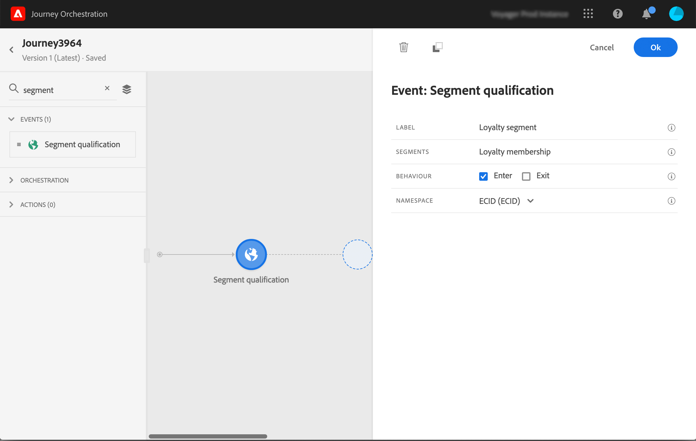

# Eventos de calificación de segmentos {#segment-qualification}

## Acerca de los eventos de calificación de segmentos{#about-segment-qualification}

Esta actividad permite que su viaje escuche las entradas y salidas de perfiles en segmentos de Adobe Experience Platform para hacer que los individuos entren o avancen en un viaje. For more information on segment creation, refer to this [section](../segment/about-segments.md).

Supongamos que tiene un segmento &quot;cliente plateado&quot;. Con esta actividad, puede hacer que todos los nuevos clientes plateados entren en un viaje y les envíen una serie de mensajes personalizados.

Este tipo de evento se puede posicionar como el primer paso o más tarde en el viaje.

Si el segmento se transmite con la opción Audiencias de alta frecuencia de Adobe Experience Platform, las entradas y salidas se escuchan en tiempo real. Si el segmento no se transmite, las entradas y salidas se tienen en cuenta en el momento del cálculo del segmento.

1. Despliegue la **[!UICONTROL Events]** categoría y suelte una **[!UICONTROL Segment qualification]** actividad en el lienzo.

   

1. Añada un **[!UICONTROL Label]** a la actividad. Este paso es opcional.

1. Haga clic en el **[!UICONTROL Segment]** campo y seleccione los segmentos que desee aprovechar.

   >[!NOTE]
   >
   >Tenga en cuenta que puede personalizar las columnas que se muestran en la lista y ordenarlas.

   

   Una vez agregado el segmento, el **[!UICONTROL Copy]** botón le permite copiar su nombre y su ID:

   `{"name":"Loyalty membership“,”id":"8597c5dc-70e3-4b05-8fb9-7e938f5c07a3"}`

   

1. En el **[!UICONTROL Behavior]** campo, elija si desea escuchar las entradas, salidas o ambos segmentos.

1. Seleccione una Área de nombres. Esto solo es necesario si el evento está posicionado como el primer paso del viaje.

   

La carga útil contiene la siguiente información de contexto, que puede utilizar en condiciones y acciones:

* el comportamiento (entrada, salida)
* la marca de tiempo de la cualificación
* la identificación del segmento

Al utilizar el editor de expresiones en una condición o acción que sigue a una **[!UICONTROL Segment qualification]** actividad, tiene acceso al **[!UICONTROL SegmentQualification]** nodo. Puede elegir entre **[!UICONTROL Last qualification time]** y **[!UICONTROL status]** (entrar o salir).

Consulte actividad [de condición](../building-journeys/condition-activity.md#about_condition).

## Prácticas recomendadas {#best-practices-segments}

La **[!UICONTROL Segment Qualification]** actividad permite la entrada inmediata en los viajes de personas calificadas o descalificadas de un segmento de Adobe Experience Platform.

La velocidad de recepción de esta información es alta. Las mediciones realizadas muestran una velocidad de 10 000 eventos recibidos por segundos. Como resultado, hay que asegurarse de comprender cómo pueden producirse los picos de entrada, cómo evitarlos y cómo preparar el viaje para ellos.

### Segmentos por lotes{#batch-speed-segment-qualification}

Al utilizar la cualificación de segmentos para un segmento por lotes, tenga en cuenta que se producirá un pico de entrada en el momento del cálculo diario. El tamaño del pico dependerá del número de individuos que ingresan (o salen) el segmento diariamente.

Además, si el segmento por lotes se acaba de crear y se utiliza inmediatamente en un viaje, el primer lote de cálculo podría hacer que un gran número de personas entrara en el viaje.

### Segmentos de flujo continuo{#streamed-speed-segment-qualification}

Al utilizar la cualificación de segmentos para segmentos transmitidos, hay menos riesgo de obtener grandes picos de entradas y salidas debido a la evaluación continua del segmento. Sin embargo, si la definición del segmento lleva a que un gran volumen de clientes califique al mismo tiempo, también podría haber un pico.

### Cómo evitar las sobrecargas{#overloads-speed-segment-qualification}

Estas son algunas de las prácticas recomendadas que ayudarán a evitar la sobrecarga de sistemas en los viajes (fuentes de datos, acciones personalizadas, acciones de Adobe Campaign Standard).

No utilice, en una **[!UICONTROL Segment Qualification]** actividad, un segmento por lotes inmediatamente después de su creación. Evitará el primer pico de cálculo. Tenga en cuenta que habrá una advertencia amarilla en el lienzo del viaje si está a punto de usar un segmento que nunca se ha calculado.

Establezca una regla de límite para las fuentes de datos y las acciones utilizadas en los viajes para evitar sobrecargarlas (consulte esta [sección](../api/capping.md)). Tenga en cuenta que la regla de límite no tiene reintentos. Si necesita volver a intentarlo, debe utilizar una ruta alternativa en el viaje marcando la casilla **[!UICONTROL Add an alternative path in case of a timeout or an error]** en condiciones o acciones.

Antes de usar el segmento en un viaje de producción, evalúe siempre primero el volumen de personas que cumplen los requisitos para este segmento todos los días. Para ello, puede consultar la sección **[!UICONTROL Segments]** del Adobe Experience Platform y mirar el gráfico de la derecha.

