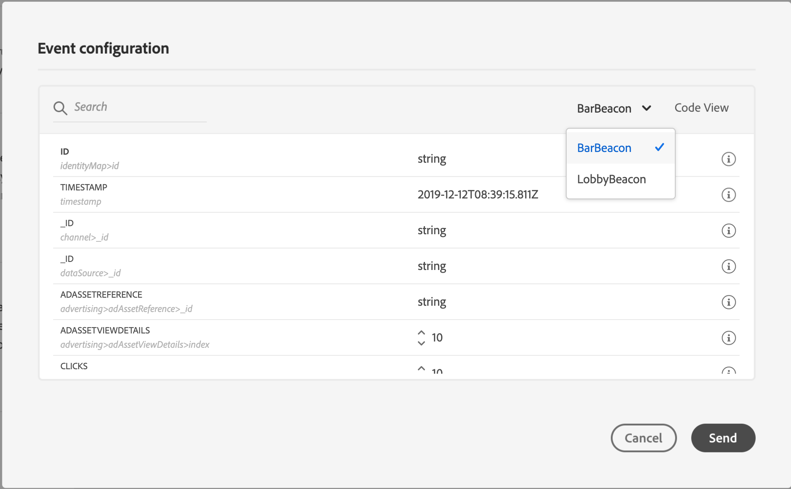

# Prueba del recorrido{#testing_the_journey}

Antes de poder probar el recorrido, debe resolver todos los errores si los hay. Consulte [esta sección](../about/troubleshooting.md#section_h3q_kqk_fhb).

Puede probar el recorrido antes de su publicación mediante perfiles de prueba. Esto le permite analizar el flujo de las personas en el recorrido y solucionar los problemas antes de la publicación.

Solo los perfiles de prueba pueden introducir un recorrido en el modo de prueba. Puede [crear un nuevo perfil de prueba](../building-journeys/testing-the-journey.md#create-test-profile) o [convertir un perfil existente en un perfil de prueba](../building-journeys/testing-the-journey.md#turning-profile-into-test).

Para utilizar el modo de prueba, siga estos pasos:

1. Antes de probar el recorrido, compruebe que sea válido y que no haya ningún error. No podrá iniciar una prueba de un recorrido con errores. Consulte [esta sección](../about/troubleshooting.md#section_h3q_kqk_fhb). Se muestra un símbolo de advertencia cuando hay errores.

1. Para activar el modo de prueba, haga clic en el botón **[!UICONTROL Test]** situado en la esquina superior derecha.

   

1. Utilice el parámetro **[!UICONTROL Wait time]**, en la esquina inferior izquierda, para definir el tiempo que cada actividad de espera y el tiempo de espera del evento durarán en el modo de prueba. El tiempo predeterminado es de 10 segundos para las esperas y los tiempos de espera de los eventos. Esto garantizará que los resultados de la prueba se obtengan rápidamente. Este parámetro solo aparece si ha soltado una o más actividades de espera en el recorrido.

   

   >[!NOTE]
   >
   >Cuando se utiliza un evento de reacción en un recorrido, el tiempo de espera predeterminado y el valor mínimo es de 40 segundos. Consulte [esta sección](../building-journeys/reaction-events.md)

1. Haga clic en **[!UICONTROL Trigger an event]** para configurar y enviar eventos al recorrido.

   

1. Configure los diferentes campos esperados. En el campo **Profile Identifier**, introduzca el valor del campo utilizado para identificar el perfil de prueba. Puede ser la dirección de correo electrónico, por ejemplo. Asegúrese de enviar eventos relacionados con perfiles de prueba. Consulte [Activación de los eventos](#firing_events).

   

1. Una vez recibidos los eventos, haga clic en el botón **[!UICONTROL Show log]** para ver el resultado de la prueba y verificarlo. Consulte [Visualización de los registros](#viewing_logs).

   

1. Si hay algún error, desactive el modo de prueba, modifique el recorrido y pruebe de nuevo. Cuando la prueba sea concluyente, puede publicar el recorrido. Consulte [esta página](../building-journeys/publishing-the-journey.md).

## Notas importantes {#important_notes}

* Se proporciona una interfaz para activar eventos en el recorrido probado, pero los eventos también se pueden enviar desde sistemas de terceros como Postman.
* Solo las personas marcadas como &quot;perfiles de prueba&quot; en el servicio Perfil del cliente en tiempo real podrán entrar en el recorrido probado. Consulte [esta sección](../building-journeys/testing-the-journey.md#create-test-profile).
* El modo de prueba solo está disponible en recorridos de borrador que utilizan un área de nombres. El modo de prueba debe comprobar si una persona que entra en el recorrido es un perfil de prueba o no y, por lo tanto, debe poder llegar a Adobe Experience Platform.
* El número máximo de perfiles de prueba que pueden introducir un recorrido durante una sesión de prueba es de 100.
* Al desactivar el modo de prueba, se vacían los recorridos de todas las personas que lo hayan introducido en el pasado o que estén actualmente en él. También borra los informes.
* Puede habilitar/deshabilitar el modo de prueba tantas veces como sea necesario.
* No puede modificar el recorrido cuando se activa el modo de prueba. En el modo de prueba, puede publicar directamente el recorrido; no es necesario desactivar el modo de prueba antes.

## Convertir un perfil en un perfil de prueba{#turning-profile-into-test}

Puede convertir un perfil existente en un perfil de prueba. En Adobe Experience Platform, puede actualizar los atributos de perfil mediante llamadas a la API, pero no se pueden realizar a través de la interfaz.

La forma más sencilla de hacerlo es usar una actividad de acción **Update profile** y cambiar el campo booleano del perfil de prueba de falso a verdadero. Consulte [esta sección](../building-journeys/update-profiles.md#using-the-test-mode).

## Creación de un perfil de prueba{#create-test-profile}

Si desea crear un nuevo perfil de prueba, el procedimiento es el mismo que al crear un perfil en Adobe Experience Platform. Se realiza mediante llamadas API. Consulte esta [página](https://docs.adobe.com/content/help/es-ES/experience-platform/profile/home.html)

Debe utilizar un esquema de perfil que contenga la mezcla &quot;detalles de prueba del perfil&quot;. El indicador testProfile forma parte de esta mezcla.

Al crear un perfil, asegúrese de pasar el valor: testProfile = true.

Tenga en cuenta que también puede actualizar un perfil existente para cambiar su indicador testProfile a &quot;true&quot;.

Este es un ejemplo de una llamada a la API para crear un perfil de prueba:

```
curl -X POST \
'https://dcs.adobedc.net/collection/xxxxxxxxxxxxxx' \
-H 'Cache-Control: no-cache' \
-H 'Content-Type: application/json' \
-H 'Postman-Token: xxxxx' \
-H 'cache-control: no-cache' \
-H 'x-api-key: xxxxx' \
-H 'x-gw-ims-org-id: xxxxx' \
-d '{
"header": {
"msgType": "xdmEntityCreate",
"msgId": "xxxxx",
"msgVersion": "xxxxx",
"xactionid":"xxxxx",
"datasetId": "xxxxx",
"imsOrgId": "xxxxx",
"source": {
"name": "Postman"
},
"schemaRef": {
"id": "https://example.adobe.com/mobile/schemas/xxxxx",
"contentType": "application/vnd.adobe.xed-full+json;version=1"
}
},
"body": {
"xdmMeta": {
"schemaRef": {
"contentType": "application/vnd.adobe.xed-full+json;version=1"
}
},
"xdmEntity": {
"_id": "xxxxx",
"_mobile":{
"ECID": "xxxxx"
},
"testProfile":true
}
}
}'
```

## Activación de eventos {#firing_events}

El botón **[!UICONTROL Trigger an event]** permite configurar un evento que hará que una persona entre en el recorrido.

>[!NOTE]
>
>Cuando se déclencheur un evento en el modo de prueba, se genera un evento real, lo que significa que también afectará a otros recorridos que estén escuchando este evento.

Como requisito previo, debe saber qué perfiles están marcados como perfiles de prueba en Adobe Experience Platform. De hecho, el modo de prueba solo permite estos perfiles en el recorrido y el evento debe contener un ID. El ID esperado depende de la configuración del evento. Puede ser un ECID o una dirección de correo electrónico, por ejemplo. El valor de esta clave debe añadirse en el campo **Identificador de perfil**.

Si el recorrido contiene varios eventos, utilice la lista desplegable para seleccionar un evento. A continuación, para cada evento, configure los campos pasados y la ejecución del envío del evento. La interfaz le ayuda a pasar la información correcta en la carga útil de evento y a asegurarse de que el tipo de información es correcto. El modo de prueba guarda los últimos parámetros utilizados en una sesión de prueba para su uso posterior.



La interfaz le permite pasar parámetros de evento simples. Si desea pasar colecciones u otros objetos avanzados en el evento, puede hacer clic en **[!UICONTROL Code View]** para ver todo el código de la carga útil y modificarlo. Por ejemplo, puede copiar y pegar la información de evento preparada por un usuario técnico.


Un usuario técnico también puede utilizar esta interfaz para componer cargas útiles de evento y eventos de déclencheur sin tener que utilizar una herramienta de terceros.

Al hacer clic en el botón **[!UICONTROL Send]**, se inicia la prueba. La progresión del individuo en el recorrido se representa mediante un flujo visual. La ruta se vuelve progresivamente verde a medida que el individuo se mueve por el recorrido. Si se produce un error, se muestra un símbolo de advertencia en el paso correspondiente. Puede colocar el cursor en él para mostrar más información sobre el error y acceder a todos los detalles (cuando esté disponible).


Cuando selecciona un perfil de prueba diferente en la pantalla de configuración de evento y vuelve a ejecutar la prueba, el flujo visual se borra y muestra la ruta del nuevo individuo.

Al abrir un recorrido en la prueba, la ruta mostrada corresponde a la última prueba ejecutada.

El flujo visual funciona tanto si el evento se activa mediante la interfaz como externamente (por ejemplo, mediante Postman).

## Modo de prueba para recorridos basados en reglas {#test-rule-based}

El modo de prueba también está disponible para los recorridos que utilizan un evento basado en reglas. Para obtener más información sobre los eventos basados en reglas, consulte [esta página](../event/about-events.md).

Al activar un evento, la pantalla **Event configuration** permite definir los parámetros de evento que se van a pasar en la prueba. Para ver la condición de ID de evento, haga clic en el icono de información de objeto en la esquina superior derecha. También hay disponible información sobre herramientas junto a cada campo que forma parte de la evaluación de reglas.


Para obtener más información sobre cómo utilizar el modo de prueba, consulte [esta página](../building-journeys/testing-the-journey.md).

## Visualización de los registros {#viewing_logs}

El botón **[!UICONTROL Show log]** permite ver los resultados de la prueba. Esta página muestra la información actual del recorrido en formato JSON. Un botón permite copiar nodos completos. Debe actualizar manualmente la página para actualizar los resultados de prueba del recorrido.


>[!NOTE]
>
>En los registros de prueba, en caso de error al llamar a un sistema de terceros (fuente de datos o acción), se muestran el código de error y la respuesta de error.

Se muestra el número de personas (técnicamente, se denominan instancias) que están actualmente dentro del recorrido. A continuación se muestra información útil que se muestra para cada individuo:

* _Id_: el ID interno de la persona en el recorrido. Esto se puede utilizar con fines de depuración.
* _currentstep_: el paso en el que se encuentra el individuo en el recorrido. Recomendamos añadir etiquetas a las actividades para identificarlas con mayor facilidad.
* _currentstep_  > fase: el estado del recorrido del individuo (en ejecución, terminado, error o tiempo de espera agotado). Consulte a continuación para obtener más información.
* _currentstep_  >  _extraInfo_: descripción del error y otra información contextual.
* _currentstep_  >  _fetchErrors_: información sobre los errores de recuperación de datos que se produjeron durante este paso.
* _externalKeys_: el valor de la fórmula clave definida en el evento.
* _enrichedData_: los datos que el recorrido ha recuperado si el recorrido utiliza fuentes de datos.
* _transitionHistory_: la lista de pasos que siguió el individuo. En el caso de los eventos, se muestra la carga útil .
* _actionExecutionErrors_ : información sobre los errores que se han producido.

Estos son los diferentes estados del recorrido de un individuo:

* _En ejecución_: la persona está actualmente en el recorrido.
* _Finalizado_: el individuo está al final del recorrido.
* _Error_: el individuo se detiene en el recorrido debido a un error.
* _Tiempo de espera agotado_: el individuo es detenido en el recorrido debido a un paso que tomó demasiado tiempo.

Cuando se activa un evento mediante el modo de prueba, se genera automáticamente un conjunto de datos con el nombre del origen.

Cuando se activa un evento mediante el modo de prueba, se genera automáticamente un conjunto de datos con el nombre del origen.

El modo de prueba crea automáticamente un evento de experiencia y lo envía a Adobe Experience Platform. El nombre de la fuente para este evento de experiencia es &quot;Eventos de prueba de Journey Orchestration&quot;.

En el caso de varios eventos activados desde varios recorridos

Existe un escenario en el que se envían varios eventos desde varios recorridos que tendrán esquemas diferentes. ¿Puede un esquema asignarse a 1 conjunto de datos? Si no es así, tendremos varios conjuntos de datos necesarios.

La creación automática y la asignación de nombres a estos conjuntos de datos se realizan si no se incluye un conjunto de datos de destino en el evento de experiencia. Por eso vemos el &quot;Conjunto de datos creado automáticamente para voyager&quot; hoy.

El nombre de nuestra fuente impulsa la creación automática. Si tenemos varios eventos, debemos concatenarlos y hacerlos ser &quot;Evento de prueba de Journey Orchestration - NOMBRE DEL ESQUEMA&quot;. Esto cambiará automáticamente a &quot;Conjunto de datos generado automáticamente para el evento de prueba de Journey Orchestration - NOMBRE DEL ESQUEMA&quot;.

