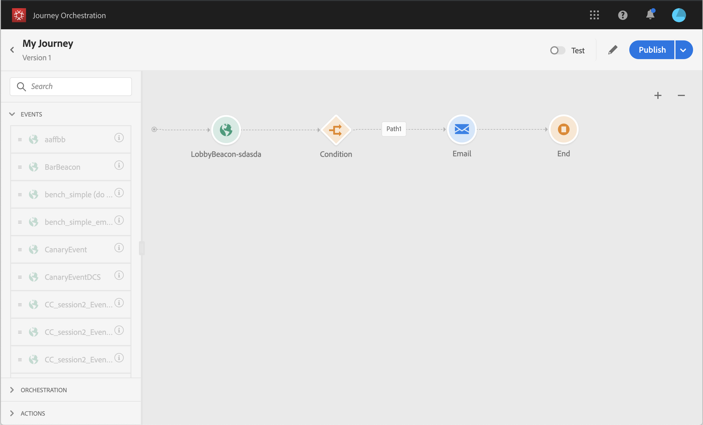

# Prueba del recorrido{#testing_the_journey}

Antes de poder probar el viaje, debe resolver todos los errores, si los hay. Consulte .

Usted tiene la posibilidad de probar su viaje antes de su publicación, utilizando perfiles de prueba. Esto le permite analizar cómo fluyen los individuos en el viaje y solucionar los problemas antes de la publicación.

Para utilizar el modo de prueba, siga estos pasos:

1. Antes de probar el viaje, verifique que sea válido y que no haya ningún error. No podrá iniciar una prueba de un viaje con errores. Consulte . Se muestra un símbolo de advertencia cuando hay errores.

1. Para activar el modo de prueba, haga clic en el **[!UICONTROL Test]** botón de alternancia, situado en la esquina superior derecha.

   

1. Utilice el parámetro de tiempo de **espera en la prueba** , en la esquina inferior izquierda, para definir el tiempo que durará cada actividad de espera en el modo de prueba. El valor del tiempo predeterminado es de 10 segundos. Esto garantizará que los resultados de la prueba se obtengan rápidamente. Este parámetro solo aparece si ha soltado una o más actividades de espera en el viaje.

   

1. Haga clic en **[!UICONTROL Trigger an event]** para configurar y enviar eventos al viaje. Asegúrese de enviar eventos relacionados con los perfiles de prueba. Consulte [Disparando sus eventos](#firing_events).

   

1. Una vez recibidos los eventos, haga clic en el **[!UICONTROL Show log]** botón para vista del resultado de la prueba y verificarlo. Consulte [Visualización de registros](#viewing_logs).

   

1. Si hay algún error, desactive el modo de prueba, modifique el viaje y pruébelo de nuevo. Cuando la prueba sea concluyente, puede publicar el viaje. Consulte .

## Notas importantes {#important_notes}

* Se proporciona una interfaz para activar eventos en el viaje probado, pero también se pueden enviar eventos mediante sistemas de terceros como Postman.
* Sólo los individuos marcados como &quot;perfiles de prueba&quot; en el servicio de Perfil de clientes en tiempo real podrán participar en el viaje comprobado. El proceso para crear un perfil de prueba es el mismo que el proceso para crear un Perfil en la plataforma de datos. Solo tiene que asegurarse de que el indicador de perfil de prueba sea verdadero. Puede utilizar la sección Segmentos de la interfaz de la plataforma de datos para crear un segmento de perfiles de prueba en la plataforma de datos y ver una lista no exhaustiva. La lista exhaustiva no se puede mostrar por ahora.
* El modo de prueba solo está disponible en los desplazamientos de borrador que utilizan una Área de nombres. De hecho, el modo de prueba debe comprobar si una persona que entra en el viaje es un perfil de prueba o no y, por lo tanto, debe poder llegar a la plataforma de datos.
* El número máximo de perfiles de prueba que pueden entrar en un viaje durante una sesión de prueba es de 100.
* Al desactivar el modo de prueba, se vacía el trayecto de todas las personas que lo hayan introducido en el pasado o que se encuentren en él.
* Puede habilitar/deshabilitar el modo de prueba tantas veces como sea necesario.
* No se puede modificar el viaje cuando se activa el modo de prueba. En el modo de prueba, puede publicar directamente el viaje, sin necesidad de desactivar antes el modo de prueba.

## Disparando sus eventos {#firing_events}

El **[!UICONTROL Trigger an event]** botón permite configurar un evento que hará que una persona entre en el viaje.

Como requisito previo, debe saber qué perfiles están marcados como perfiles de prueba en la plataforma de datos. De hecho, el modo de prueba sólo permite estos perfiles en el viaje y el evento debe contener una identificación. El ID esperado depende de la configuración de evento. Puede ser un ECID, por ejemplo.

Si el viaje contiene varios eventos, utilice la lista desplegable para seleccionar un evento. A continuación, configure para cada evento los campos pasados y la ejecución del envío de eventos. La interfaz le ayuda a pasar la información correcta en la carga útil de evento y a asegurarse de que el tipo de información es correcto. El modo de prueba guarda los últimos parámetros utilizados en una sesión de prueba para su uso posterior.

La interfaz le permite pasar parámetros de evento sencillos. Si desea pasar colecciones u otros objetos avanzados en el evento, puede hacer clic en **[!UICONTROL Code View]** para ver el código completo de la carga útil y modificarlo. Por ejemplo, puede copiar y pegar la información de evento preparada por un usuario técnico.

Un usuario técnico también puede utilizar esta interfaz para componer cargas de evento y activar eventos sin tener que utilizar una herramienta de terceros.

Al hacer clic en el botón **Enviar** , se inicia la prueba. La progresión del individuo en el viaje se representa mediante un flujo visual. El camino se vuelve progresivamente verde a medida que el individuo se mueve a lo largo del viaje. Si se produce un error, se muestra un símbolo de advertencia en el paso correspondiente. Puede colocar el cursor sobre él para mostrar más información sobre el error y acceder a todos los detalles (cuando esté disponible).

Cuando selecciona un perfil de prueba diferente en la pantalla de configuración de evento y vuelve a ejecutar la prueba, el flujo visual se borra y muestra la ruta del nuevo individuo.

Al abrir un viaje en la prueba, la ruta mostrada corresponde a la última prueba ejecutada.

El flujo visual funciona tanto si el evento se activa a través de la interfaz como externamente (por ejemplo, mediante Postman).

## Visualización de los registros {#viewing_logs}

El **[!UICONTROL Show log]** botón permite realizar vistas de los resultados de la prueba. Esta página muestra la información actual del viaje en formato JSON. Un botón permite copiar nodos completos. Debe actualizar manualmente la página para actualizar los resultados de la prueba del viaje.

>[!NOTE]
>
>En los registros de prueba, en caso de error al llamar a un sistema de terceros (fuente de datos o acción), se muestran el código de error y la respuesta de error.

Se muestra el número de individuos (técnicamente, se denominan instancias) que se encuentran dentro del viaje. Esta es una información útil que se muestra para cada individuo:

* _Id_: el ID interno del individuo en el viaje. Esto se puede utilizar con fines de depuración.
* _currentstep_: el paso en el que se encuentra el individuo en el viaje. Le recomendamos que agregue etiquetas a sus actividades para identificarlas más fácilmente.
* _currentstep_ > fase: el estado del viaje del individuo (en ejecución, terminado, error o tiempo de espera agotado). Consulte a continuación para obtener más información.
* _currentstep_ > _extraInfo_: descripción del error y otra información contextual.
* _currentstep_ > _fetchErrors_: información sobre los errores de recuperación de datos que se produjeron durante este paso.
* _externalKeys_: el valor de la fórmula clave definida en el evento.
* _richData_: los datos que el viaje ha recuperado si utiliza fuentes de datos.
* _transiciónHistory_: la lista de los pasos que siguió el individuo. Para eventos, se muestra la carga útil.
* _actionExecutionErrors_ : información sobre los errores que se produjeron.

Estos son los diferentes estados del viaje de una persona:

* _Ejecutando_: la persona está en el viaje.
* _Finalizó_: la persona está al final del viaje.
* _Error_: el individuo se detiene en el viaje debido a un error.
* _Se agotó_ el tiempo de espera: el individuo es detenido en el viaje debido a un paso que tomó demasiado tiempo.
