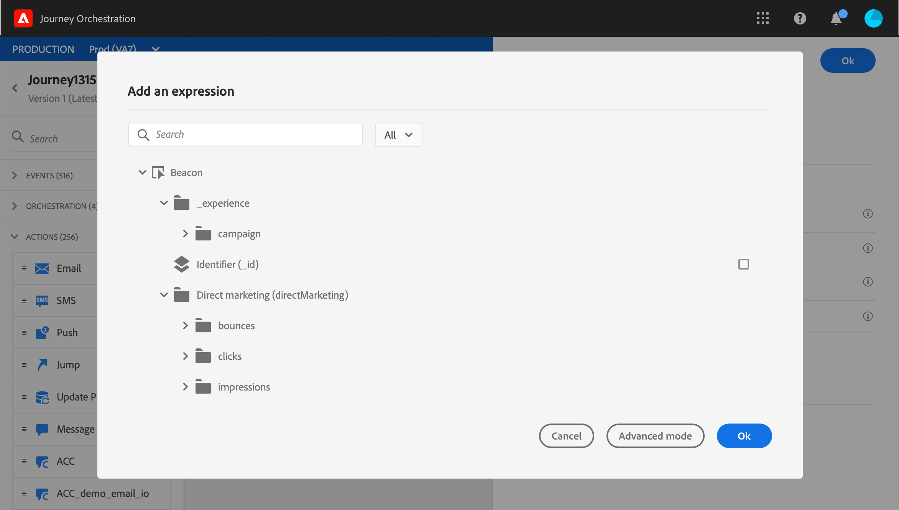

# Actualización de perfil {#update-profile}

El **[!UICONTROL Update profile]** la actividad de acción permite actualizar un perfil de Adobe Experience Platform existente con información proveniente del evento, una fuente de datos o con un valor específico.

## Notas importantes

* El **Actualizar perfil** la acción solo se puede utilizar en recorridos que comiencen por un evento que tenga un área de nombres.
* La acción solo actualiza los campos existentes, no crea nuevos campos de perfil.
* No puede usar el **Actualizar perfil** acción para generar eventos de experiencia, por ejemplo una compra.
* Al igual que cualquier otra acción, puede definir una ruta alternativa en caso de error o tiempo de espera y no puede colocar dos acciones en paralelo.
* La solicitud de actualización enviada a Platform será rápida, pero no inmediata/en un segundo. Tardará normalmente unos segundos, pero a veces más sin garantía. Como resultado, por ejemplo, si una acción utiliza &quot;campo 1&quot; actualizado por una acción Actualizar perfil colocada justo antes, no debería esperar que &quot;campo 1&quot; se actualice en la acción.
* En el modo de prueba, la actualización de perfil no se simula. La actualización se realizará en el perfil de prueba.
* El **Actualizar perfil** La actividad no admite campos XDM definidos como una enumeración.

## Uso de la actualización de perfiles

1. Diseñe su recorrido empezando con un evento. Consulte esta [sección](../building-journeys/journey.md).

1. En el **Acción** de la paleta, suelte el **Actualizar perfil** actividad en el lienzo.

   

1. Seleccione un esquema de la lista.

1. Haga clic en **Campos** para seleccionar el campo que desea actualizar. Solo se puede seleccionar un campo.

   

1. Seleccione un conjunto de datos de la lista.

   >[!NOTE]
   >
   >El **Actualizar perfil** esta acción actualiza los datos de perfil en tiempo real, pero no actualiza los conjuntos de datos. La selección del conjunto de datos es necesaria, ya que el perfil es un registro relacionado con un conjunto de datos.

1. Haga clic en **Valor** para definir el valor que desea utilizar:

   * Con el editor de expresiones simple, puede seleccionar un campo de una fuente de datos o del evento entrante.

      

   * Si desea definir un valor específico o aprovechar funciones avanzadas, haga clic en **Modo avanzado**.

      

El **Actualizar perfil** ahora está configurado.

