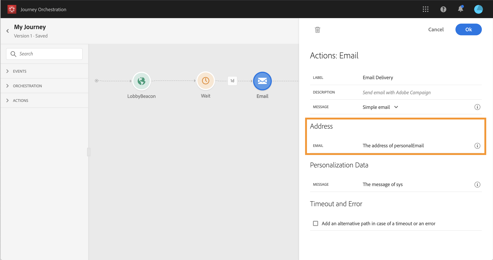
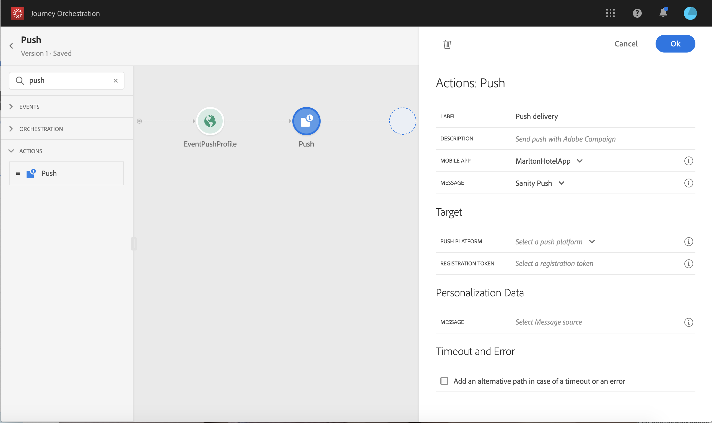

# Uso de acciones de Adobe Campaign {#using_campaign_action}

Si tiene Adobe Campaign Standard, se encuentran disponibles las siguientes actividades de acción integradas: **[!UICONTROL Email]**,**[!UICONTROL Push]** y **[!UICONTROL SMS]**.

>[!NOTE]
>
>Para ello, debe configurar la acción integrada. Consulte [](../action/working-with-adobe-campaign.md).

Para cada uno de estos canales, seleccione una **plantilla** de mensajería transaccional estándar de Adobe Campaign. De hecho, la orquestación de viajes no es una solución que envíe mensajes. Para los canales integrados de correo electrónico, SMS y push, confiamos en la mensajería transaccional para ejecutar el envío de mensajes. Significa que si desea utilizar una plantilla de mensaje determinada en sus viajes, debe publicarla en Adobe Campaign Standard. Consulte esta [página](https://docs.adobe.com/content/help/en/campaign-standard/using/communication-channels/transactional-messaging/about-transactional-messaging.html) para obtener información sobre cómo utilizar esta función.


Puede utilizar un evento (también conocido como plantilla de mensajería transaccional en tiempo real) o una plantilla de perfil.

>[!NOTE]
>
>Cuando enviamos mensajes transaccionales en tiempo real (rtEvent) o cuando enrutamos mensajes con un sistema de terceros gracias a una acción personalizada, se requiere una configuración específica para la gestión de fatiga, lista negra o cancelación de suscripciones. Por ejemplo, si un atributo &quot;blacklist&quot; o &quot;unsubscription&quot; se almacena en la Plataforma o en un sistema de terceros, se deberá agregar una condición antes de que el mensaje se envíe para comprobar esta condición.

Cuando selecciona una plantilla, todos los campos esperados en la carga útil del mensaje se muestran en el panel de configuración de la actividad debajo **[!UICONTROL Address]**y**[!UICONTROL Personalization Data]**. Debe asignar cada uno de estos campos al campo que desee utilizar, ya sea desde el evento o desde el origen de datos. También puede utilizar el editor de expresiones avanzado para pasar un valor manualmente, para manipular los datos de la información recuperada (por ejemplo, convertir una cadena en mayúsculas) o para utilizar funciones como &quot;if, then, else&quot;. Consulte [](../expression/expressionadvanced.md).


## Correo electrónico y SMS {#section_asc_51g_nhb}

Para **[!UICONTROL Email]**y**[!UICONTROL SMS]**, los parámetros son idénticos.

>[!NOTE]
>
>En el caso del correo electrónico, si utiliza una plantilla transaccional de perfiles, Campaign Standard gestiona el mecanismo de cancelación de suscripciones de forma predeterminada. Simplemente agregue un bloque de **[!UICONTROL Unsubscription link]**contenido en la plantilla ([más](https://docs.adobe.com/content/help/en/campaign-standard/using/communication-channels/transactional-messaging/about-transactional-messaging.html)información). Si está utilizando una plantilla basada en eventos (rtEvent), debe agregar, en el mensaje, un vínculo que pase el correo electrónico de la persona en el parámetro de URL y que señale a una página de aterrizaje sin suscripción. Debe crear esta página de aterrizaje y asegurarse de que la decisión de cancelar la suscripción de la persona se transmite a Adobe.

Primero, debe elegir una plantilla de mensajería transaccional. Consulte [](../building-journeys/about-action-activities.md).

Hay dos categorías disponibles: **[!UICONTROL Address]**y**[!UICONTROL Personalization Data]**.

Puede definir fácilmente dónde recuperar el **[!UICONTROL Address]**o el**[!UICONTROL Personalization Data]** mediante la interfaz. Puede navegar por los eventos y los campos del origen de datos disponibles. También puede utilizar el editor de expresiones avanzadas para casos de uso más avanzados, como el uso de un origen de datos que requiera pasar parámetros o realizar manipulaciones. Consulte [](../expression/expressionadvanced.md).

**[!UICONTROL Address]**

>[!NOTE]
>
>Esta categoría solo está visible si selecciona un mensaje transaccional de &quot;evento&quot;. Para los mensajes de &quot;perfil&quot;, el sistema recupera automáticamente el campo de Adobe Campaign Standard **[!UICONTROL Address]**.

Estos son los campos que el sistema necesita para saber dónde enviar el mensaje. Para una plantilla de correo electrónico, es la dirección de correo electrónico. Para un SMS, es el número de teléfono móvil.



**[!UICONTROL Personalization Data]**

>[!NOTE]
>
>No se puede pasar una colección en los datos de personalización. Si el mensaje de correo electrónico transaccional o SMS espera recibir colecciones, no funcionará. Tenga en cuenta también que los datos de personalización tienen un formato esperado (ejemplo: cadena, decimal, etc.). Debe tener cuidado de respetar estos formatos esperados.

Estos son los campos esperados por el mensaje de Adobe Campaign Standard. Estos campos pueden utilizarse para personalizar el mensaje, aplicar formato condicional o elegir una variante de mensaje específica.


## Insertar {#section_im3_hvf_nhb}

Antes de usar la actividad push, la aplicación móvil debe configurarse junto con Campaign Standard para enviar notificaciones push. Utilice este [artículo](https://helpx.adobe.com/campaign/kb/integrate-mobile-sdk.html) para realizar los pasos de implementación necesarios para dispositivos móviles.

En primer lugar, debe elegir una aplicación móvil en la lista desplegable y un mensaje transaccional. Consulte [](../building-journeys/about-action-activities.md).



Hay dos categorías disponibles: **[!UICONTROL Target]**y**[!UICONTROL Personalization Data]**.

**[!UICONTROL Target]**

>[!NOTE]
>
>Esta categoría solo está visible si selecciona un mensaje de evento. Para los mensajes de perfil, el sistema recupera automáticamente los **[!UICONTROL Target]**campos mediante la conciliación realizada por Adobe Campaign Standard.

En esta sección, debe definir el **[!UICONTROL Push platform]**. La lista desplegable le permite seleccionar**[!UICONTROL Apple Push Notification Server]** (iOS) o **[!UICONTROL Firebase Cloud Messaging]**(Android). También puede seleccionar un campo específico de un evento o de un origen de datos, o definir una expresión avanzada.

También debe definir el **[!UICONTROL Registration Token]**. La expresión depende de cómo se defina el token en la carga útil del evento o en otra información de orquestación de viajes. Puede ser un campo simple o una expresión más compleja en caso de que el token se defina en una colección, por ejemplo:

```
@{Event_push._experience.campaign.message.profileSnapshot.pushNotificationTokens.first().token}
```

**[!UICONTROL Personalization Data]**

>[!NOTE]
>
>No se puede pasar una colección en los datos de personalización. Si la notificación push transaccional espera colecciones, no funcionará. Tenga en cuenta también que los datos de personalización tienen un formato esperado (ejemplo: cadena, decimal, etc.). Debe tener cuidado de respetar estos formatos esperados.

Estos son los campos esperados por la plantilla de transacción utilizada en el mensaje de Adobe Campaign Standard. Estos campos se pueden utilizar para personalizar el mensaje, aplicar formato condicional o elegir una variante de mensaje específica.
