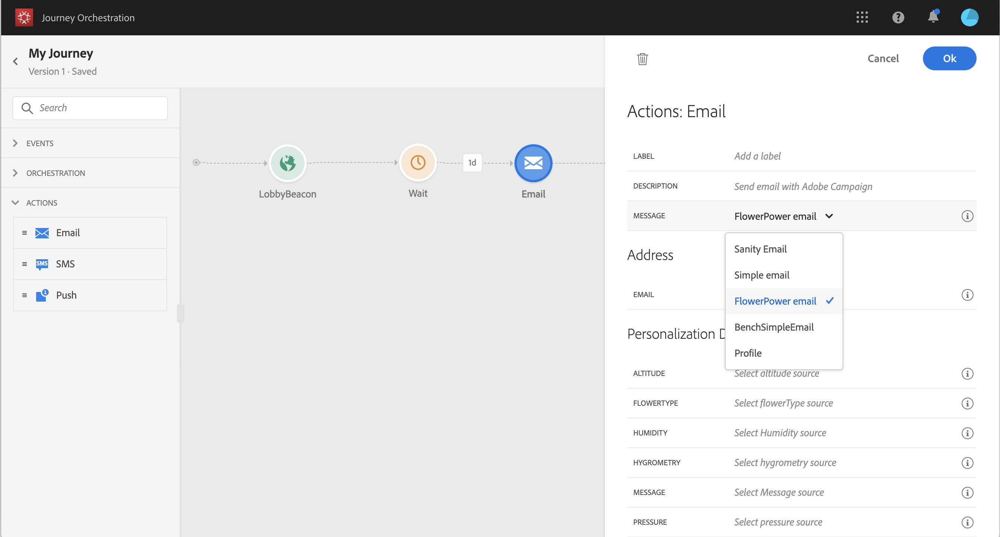

# Uso de Adobe Campaign Standard {#using_campaign_action}

Si tiene Adobe Campaign Standard, están disponibles las siguientes actividades de acción integradas: **[!UICONTROL Email]**, **[!UICONTROL Push]** y **[!UICONTROL SMS]**.

>[!NOTE]
>
>Para ello, debe configurar la acción integrada . Consulte [esta página](../action/working-with-adobe-campaign.md).

Para cada uno de estos canales, se selecciona una mensajería transaccional de Adobe Campaign Standard **plantilla**. De hecho, [!DNL Journey Orchestration] no es una solución de envío de mensajes. Para los canales integrados de correo electrónico, SMS y push, confiamos en la mensajería transaccional para ejecutar el envío de mensajes. Significa que si desea utilizar una plantilla de mensaje determinada en sus recorridos, debe publicarla en Adobe Campaign Standard. Consulte [esta página](https://experienceleague.adobe.com/docs/campaign-standard/using/communication-channels/transactional-messaging/getting-started-with-transactional-msg.html?lang=es) para aprender a utilizar esta función.

>[!NOTE]
>
>El mensaje transaccional del Campaign Standard y su evento asociado deben publicarse para poder utilizarlo en el Journey Orchestration. Si el evento se publica pero el mensaje no lo es, no será visible en la interfaz del Journey Orchestration. Si el mensaje se publica pero su evento asociado no lo es, será visible en la interfaz del Journey Orchestration, pero no se podrá utilizar.



Puede utilizar un evento (también conocido como en tiempo real) o una plantilla de mensajería transaccional de perfil.

>[!NOTE]
>
>Cuando enviamos mensajes transaccionales en tiempo real (rtEvent) o cuando enrutamos mensajes con un sistema de terceros gracias a una acción personalizada, se requiere una configuración específica para la gestión de la fatiga, la lista de bloqueados o la baja. Por ejemplo, si se almacena un atributo &quot;unsubscribe&quot; en Adobe Experience Platform o en un sistema de terceros, se debe añadir una condición antes del envío del mensaje para comprobar esta condición.

Al seleccionar una plantilla, todos los campos esperados en la carga útil del mensaje se muestran en el panel de configuración de la actividad debajo de **[!UICONTROL Address]** y **[!UICONTROL Personalization Data]**. Debe asignar cada uno de estos campos al campo que desee utilizar, ya sea desde el evento o desde el origen de datos. También puede utilizar el editor de expresiones avanzadas para pasar un valor manualmente, realizar manipulación de datos en la información recuperada (por ejemplo, convertir una cadena en mayúsculas) o utilizar funciones como &quot;if, then, else&quot;. Consulte [esta página](../expression/expressionadvanced.md).


## Correo electrónico y SMS {#section_asc_51g_nhb}

Para **[!UICONTROL Email]** y **[!UICONTROL SMS]**, los parámetros son idénticos.

>[!NOTE]
>
>Por correo electrónico, si utiliza una plantilla transaccional de perfiles, el Campaign Standard gestiona de forma predeterminada el mecanismo de baja. Simplemente agregue un **[!UICONTROL Unsubscription link]** bloque de contenido de la plantilla ([más información](https://experienceleague.adobe.com/docs/campaign-standard/using/communication-channels/transactional-messaging/getting-started-with-transactional-msg.html)). Si utiliza una plantilla basada en eventos (rtEvent), debe añadir, en el mensaje, un vínculo que pase el correo electrónico de la persona en el parámetro URL y señale a una página de aterrizaje de baja. Debe crear esta página de aterrizaje y asegurarse de que la decisión de la persona de cancelar la suscripción se transmita al Adobe.

En primer lugar, debe elegir una plantilla de mensajería transaccional. Consulte [esta página](../building-journeys/about-action-activities.md).

Hay dos categorías disponibles: **[!UICONTROL Address]** y **[!UICONTROL Personalization Data]**.

Puede definir fácilmente dónde recuperar la variable **[!UICONTROL Address]** o **[!UICONTROL Personalization Data]** mediante la interfaz de . Puede navegar por eventos y campos de fuente de datos disponibles. También puede utilizar el editor de expresiones avanzadas para casos de uso más avanzados, como el uso de un origen de datos que requiera pasar parámetros o realizar manipulaciones. Consulte [esta página](../expression/expressionadvanced.md).

**[!UICONTROL Address]**

>[!NOTE]
>
>Esta categoría solo está visible si selecciona un mensaje transaccional de &quot;evento&quot;. Para los mensajes de &quot;perfil&quot;, la variable **[!UICONTROL Address]** el sistema recupera automáticamente el campo de Adobe Campaign Standard.

Estos son los campos que el sistema necesita para saber dónde enviar el mensaje. Para una plantilla de correo electrónico, es la dirección de correo electrónico. Para un SMS, es el número de teléfono móvil.


**[!UICONTROL Personalization Data]**

>[!NOTE]
>
>No se puede pasar una colección en datos de personalización. Si el correo electrónico transaccional o SMS espera colecciones, no funcionará. Tenga en cuenta también que los datos de personalización tienen un formato esperado (por ejemplo: string, decimal, etc.). Debe tener cuidado de respetar estos formatos esperados.

Estos son los campos esperados por el mensaje de Adobe Campaign Standard. Estos campos se pueden utilizar para personalizar el mensaje, aplicar formato condicional o elegir una variante de mensaje específica.


## Push {#section_im3_hvf_nhb}

Antes de utilizar la actividad push, la aplicación móvil debe configurarse junto con el Campaign Standard para enviar notificaciones push. Utilice esta [article](https://helpx.adobe.com/es/campaign/kb/integrate-mobile-sdk.html) para realizar los pasos de implementación necesarios para mobile.

En primer lugar, debe elegir una aplicación móvil en la lista desplegable y un mensaje transaccional. Consulte [esta página](../building-journeys/about-action-activities.md).


Hay dos categorías disponibles: **[!UICONTROL Target]** y **[!UICONTROL Personalization Data]**.

**[!UICONTROL Target]**

>[!NOTE]
>
>Esta categoría solo está visible si selecciona un mensaje de evento. Para los mensajes de perfil, la variable **[!UICONTROL Target]** el sistema recupera automáticamente los campos mediante la reconciliación realizada por Adobe Campaign Standard.

En esta sección, debe definir la variable **[!UICONTROL Push platform]**. La lista desplegable le permite seleccionar **[!UICONTROL Apple Push Notification Server]** (iOS) o **[!UICONTROL Firebase Cloud Messaging]** (Android). También puede seleccionar un campo específico de un evento o de un origen de datos, o definir una expresión avanzada.

También debe definir la variable **[!UICONTROL Registration Token]**. La expresión depende de cómo se defina el token en la carga útil de evento o en otros [!DNL Journey Orchestration] información. Puede ser un campo simple o una expresión más compleja en caso de que el token se defina en una colección, por ejemplo:

```
@{Event_push._experience.campaign.message.profileSnapshot.pushNotificationTokens.first().token}
```

**[!UICONTROL Personalization Data]**

>[!NOTE]
>
>No se puede pasar una colección en datos de personalización. Si la notificación push transaccional espera colecciones, no funcionará. Tenga en cuenta también que los datos de personalización tienen un formato esperado (por ejemplo: string, decimal, etc.). Debe tener cuidado de respetar estos formatos esperados.

Estos son los campos esperados por la plantilla transaccional utilizada en el mensaje de Adobe Campaign Standard. Estos campos se pueden utilizar para personalizar el mensaje, aplicar formato condicional o elegir una variante de mensaje específica.
