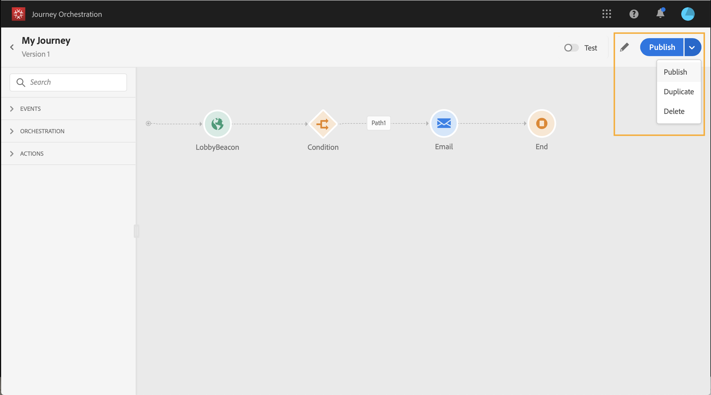
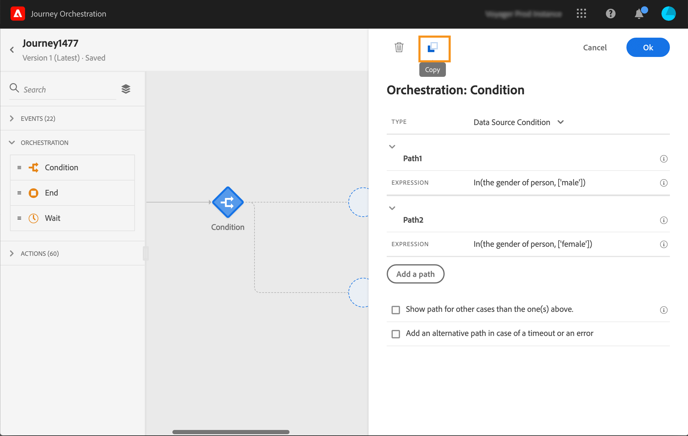

# Uso del diseñador de recorridos {#concept_m1g_5qt_52b}

>[!CAUTION]
>
>**Busca Adobe Journey Optimizer**? Haga clic [aquí](https://experienceleague.adobe.com/es/docs/journey-optimizer/using/ajo-home){target="_blank"} para obtener la documentación de Journey Optimizer.
>
>
>_Esta documentación hace referencia a materiales Journey Orchestration heredados que han sido reemplazados por Journey Optimizer. Póngase en contacto con el equipo de su cuenta si tiene preguntas sobre su acceso a Journey Orchestration o Journey Optimizer._

El menú Inicio de recorrido le permite ver la **lista de recorridos**. Cree un nuevo recorrido o haga clic en uno existente para abrir la **interfaz del diseñador de recorridos**. El diseñador se compone de las siguientes zonas: la paleta, el lienzo y el panel de configuración de actividad.

## La lista de recorrido {#journey_list}

La **lista de recorridos** le permite ver todos sus recorridos a la vez, ver su estado y realizar acciones básicas. Puede duplicar, detener o eliminar recorridos. Según el recorrido, es posible que algunas acciones no estén disponibles. Por ejemplo, no se puede eliminar ni reiniciar un recorrido cerrado. Puede crear una nueva versión a partir de ella, duplicarla o detenerla. También puede utilizar la barra de búsqueda para buscar un recorrido.

Se puede acceder a **[!UICONTROL Filters]** haciendo clic en el icono de filtro en la parte superior izquierda de la lista. El menú filters permite filtrar los recorridos mostrados según diferentes criterios (estado, los que ha creado, los modificados en los últimos 30 días, solo las últimas versiones, etc.). También puede elegir mostrar únicamente los recorridos que utilizan un evento, un grupo de campos o una acción en particular. Se pueden configurar las columnas mostradas en la lista. Todos los filtros y columnas se guardan por usuario.

Todas las versiones de los recorridos aparecen en la lista con el número de versión. Consulte [esta página](../building-journeys/journey-versions.md).

>[!NOTE]
>
>Para abrir el lienzo de un recorrido en una ficha de explorador diferente, mantén presionada la tecla **Control** o **Comando** y haz clic en el recorrido.

## La paleta {#palette}

La **paleta** se encuentra en el lado izquierdo de la pantalla. Todas las actividades disponibles se clasifican en varias categorías: **[!UICONTROL Events]**, **[!UICONTROL Orchestration]** y **[!UICONTROL Actions]**. Puede expandir o contraer las diferentes categorías haciendo clic en su nombre. Para utilizar una actividad en el recorrido, arrástrela y suéltela desde la paleta al lienzo. También puede hacer doble clic en una actividad de la paleta para agregarla al lienzo en el siguiente paso disponible. Debe configurar cada actividad agregada desde la paleta antes de publicar el recorrido. Si suelta una actividad en el lienzo y no termina su configuración, permanecerá en el lienzo, pero una advertencia roja indicará que la configuración no ha finalizado para esta actividad.

>[!NOTE]
>
>Tenga en cuenta que hay reglas al configurar un recorrido. La configuración no permitida se descartará. Por ejemplo, no se pueden colocar acciones en paralelo, vincular una actividad a un paso anterior para crear un bucle, iniciar un recorrido con algo distinto a un evento, etc.

El icono **[!UICONTROL Filter items]** de la esquina superior izquierda le permite mostrar los siguientes filtros:

* **Mostrar solo los elementos disponibles**: oculta o muestra los elementos no disponibles en la paleta, por ejemplo los eventos que utilizan un área de nombres diferente a la utilizada en el recorrido. De forma predeterminada, los elementos no disponibles están ocultos. Si decide mostrarlos, aparecerán atenuados. No obstante, no es posible mostrarlos.

* **Mostrar solo los elementos recientes**: este filtro le permite mostrar solo los últimos cinco eventos y acciones utilizados, además de los predeterminados. Esto es específico de cada usuario. De forma predeterminada, se muestran todos los elementos.

También puede utilizar el campo **[!UICONTROL Search]**. Solo se filtran los eventos y las acciones.

## El lienzo {#canvas}

**canvas** es la zona central del diseñador de recorridos. Es en esta zona donde puede soltar sus actividades y configurarlas. Haga clic en una actividad del lienzo para configurarla. Se abrirá el panel de configuración de actividad en el lado derecho. Puede acercar y alejar el zoom utilizando los botones &quot;+&quot; y &quot;-&quot; de la parte superior derecha. En el lienzo, todas las actividades le permiten agregar un paso siguiente después de ellas, excepto **[!UICONTROL End]** actividades (vea [esta página](../building-journeys/end-activity.md)).

## El panel de configuración de actividad {#configuration_pane}

El **panel de configuración de actividad** aparece al hacer clic en una actividad de la paleta. Rellene los campos obligatorios. Haga clic en el icono **[!UICONTROL Delete]** para eliminar la actividad. Haga clic en **[!UICONTROL Cancel]** para cancelar las modificaciones o en **[!UICONTROL Ok]** para confirmar. Para eliminar actividades, también puede seleccionar una actividad (o varias) y pulsar la tecla de retroceso. Si pulsa la tecla Esc, se cerrará el panel de configuración de actividad.

En el lienzo, las actividades de acción y evento se representan mediante un icono con el nombre del evento o acción debajo de. En el panel de configuración de la actividad, puede utilizar el campo **[!UICONTROL Label]** para agregar un sufijo al nombre de la actividad. Estas etiquetas le ayudarán a contextualizar el uso de eventos y acciones, especialmente cuando utiliza el mismo evento o acción varias veces en el recorrido. También podrá ver las etiquetas que agregó en el informe [!DNL Journey Orchestration]. También puede definir etiquetas para las actividades de condición.

De forma predeterminada, los campos de solo lectura están ocultos. Para mostrar campos de solo lectura, haga clic en el icono **Mostrar campos de solo lectura** en la parte superior izquierda del panel de configuración de la actividad. Esta configuración se aplica a todas las actividades de todos los recorridos.

## Las acciones de la barra superior {#top_actions}

Según el estado del recorrido, puede realizar distintas acciones en el recorrido mediante los botones disponibles en la esquina superior derecha: **[!UICONTROL Publish]**, **[!UICONTROL Duplicate]**, **[!UICONTROL Delete]**, **[!UICONTROL Journey properties]**, **[!UICONTROL Test]**. Estos botones aparecen cuando no se ha seleccionado ninguna actividad. Algunos botones aparecerán en contexto. El botón de registro del modo de prueba aparece cuando se activa el modo de prueba (consulte [esta página](../building-journeys/testing-the-journey.md)). El botón de creación de informes aparece cuando el recorrido está activo, detenido o cerrado.

## El uso de rutas en el lienzo {#paths}

Varias actividades (**[!UICONTROL Condition]**, **[!UICONTROL Action]** actividades) le permiten definir una acción de reserva en caso de error o tiempo de espera. En el panel de configuración de la actividad, marque la casilla: **[!UICONTROL Add an alternative path in case of a timeout or an error]**. Después de la actividad se añade otra ruta. La duración del tiempo de espera se define en las propiedades del recorrido (vea [esta página](../building-journeys/changing-properties.md) por un usuario administrador. Por ejemplo, si un correo electrónico tarda demasiado en enviarse o está en proceso de error, puede decidir enviar un SMS.

Varias actividades (evento, acción, espera) permiten agregar varias rutas después de ellas. Para ello, coloque el cursor en la actividad y haga clic en el símbolo &quot;+&quot;. Solo se pueden configurar actividades de evento y espera en paralelo. Si se configuran varios eventos en paralelo, la ruta elegida será la del primer evento que se produzca.

Al escuchar un evento, le recomendamos que no espere al evento indefinidamente. No es obligatorio, solo es una práctica recomendada. Si desea escuchar uno o varios eventos solo durante un tiempo determinado, colocará uno o varios eventos y una actividad de espera en paralelo. Consulte [esta sección](../building-journeys/event-activities.md#section_vxv_h25_pgb).

Para eliminar la ruta, coloque el cursor sobre ella y haga clic en el icono **[!UICONTROL Delete arrow]**.

En el lienzo, cuando se desconectan dos actividades, se muestra una advertencia. Coloque el cursor en el icono de advertencia para mostrar el mensaje de error. Para solucionar el problema, simplemente mueva la actividad desconectada y conéctela a la actividad anterior.

## Copiar y pegar actividades {#copy-paste}

Puede copiar una o varias actividades de un recorrido y pegarlas en el mismo recorrido o en uno diferente. Esto le permite ahorrar tiempo si desea reutilizar numerosas actividades que ya se han configurado en un recorrido anterior.

**Notas importantes**

* Puede copiar/pegar en diferentes pestañas y navegadores. Solo puede copiar/pegar actividades dentro de la misma instancia.
* No puede copiar/pegar un evento si el recorrido de destino tiene un evento que utiliza un área de nombres diferente.
* Las actividades pegadas pueden hacer referencia a datos que no existen en el recorrido de destino, por ejemplo, si copia o pega en diferentes zonas protegidas. Compruebe siempre la existencia de errores y realice los ajustes necesarios.
* Tenga en cuenta que no puede deshacer una acción. Para eliminar las actividades pegadas, deberá seleccionarlas y eliminarlas. Por lo tanto, asegúrese de seleccionar solo las actividades que necesita antes de copiarlas.
* Puede copiar actividades de cualquier recorrido, incluso las que estén en solo lectura.
* Puede seleccionar cualquier actividad, incluso las que no estén vinculadas. Las actividades vinculadas permanecerán vinculadas después de pegarse.

Estos son los pasos para copiar/pegar actividades:

1. Abra un recorrido.
1. Seleccione las actividades que desee copiar moviendo el ratón mientras hace clic en. También puede hacer clic en cada actividad mientras presiona la tecla **Ctrl/Comando**. Use **Ctrl/Comando + A** si desea seleccionar todas las actividades.
   
1. Presione **Ctrl/Comando + C**.
Si solo desea copiar una actividad, puede hacer clic en ella y usar el icono **Copiar** en la parte superior izquierda del panel de configuración de la actividad.
   
1. En cualquier recorrido, presione **Ctrl/Comando + V** para pegar las actividades sin vincularlas a un nodo existente. Las actividades pegadas se colocan en el mismo orden. Después de pegarlas, las actividades permanecen seleccionadas para que pueda moverlas fácilmente. También puede colocar el cursor en un marcador de posición vacío y presionar **Ctrl/Comando + V**. Las actividades pegadas se vincularán al nodo.
   
