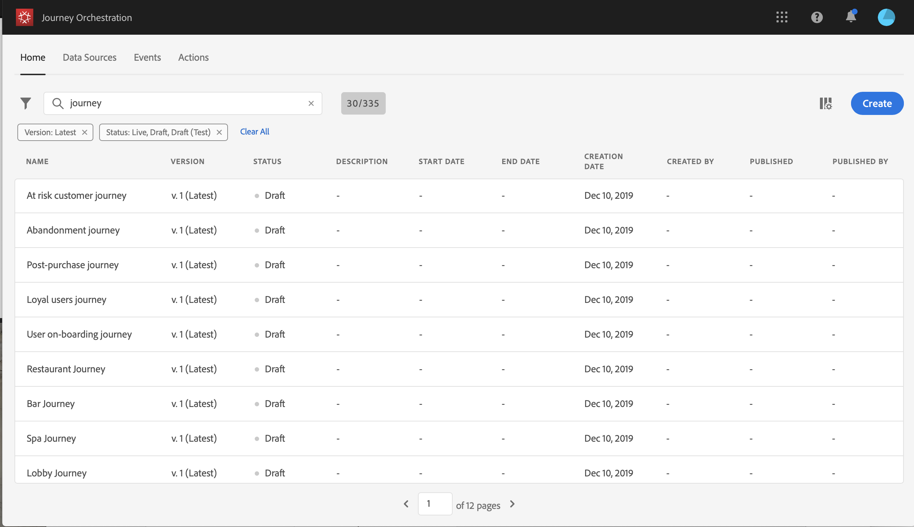

# Uso del diseñador de viajes {#concept_m1g_5qt_52b}

El menú Inicio del viaje le permite ver la **lista de viajes**. Cree un nuevo viaje o haga clic en uno existente para abrir la interfaz **del diseñador del** viaje. El diseñador se compone de las siguientes zonas: la paleta, el lienzo y el panel de configuración de la actividad.

## La lista de viajes {#journey_list}

La lista **de** viajes le permite ver todos sus viajes a la vez, ver su estado y realizar acciones básicas. Puede duplicar, detener o eliminar sus viajes. Según el viaje, es posible que algunas acciones no estén disponibles. Por ejemplo, no se puede detener ni eliminar un viaje terminado. También puede utilizar la barra de búsqueda para buscar un viaje.

Se **[!UICONTROL Filters]** puede acceder al mismo haciendo clic en el icono de filtro en la parte superior izquierda de la lista. El menú de filtros le permite filtrar los viajes mostrados según diferentes criterios (estado, los creados, los modificados en los últimos 30 días, versiones más recientes, etc.). También puede elegir mostrar únicamente los viajes que utilizan un evento, un grupo de campos o una acción concretos. Se pueden configurar las columnas que se muestran en la lista. Todos los filtros y columnas se guardan por usuario.

Todas las versiones de sus viajes aparecen en la lista con el número de versión. Consulte .

>[!NOTE]
>
>Para abrir el lienzo de un viaje en otra ficha del navegador, mantenga pulsada la tecla **Control** o **Comando** y haga clic en el viaje.

## La paleta {#palette}

La **paleta** se encuentra en el lado izquierdo de la pantalla. Todas las actividades disponibles se clasifican en varias categorías: **[!UICONTROL Events]**, **[!UICONTROL Orchestration]** y **[!UICONTROL Actions]**. Puede expandir o contraer las diferentes categorías haciendo clic en su nombre. Para utilizar una actividad en el viaje, arrástrela y suéltela desde la paleta en el lienzo. También puede hacer doble clic en una actividad de la paleta para agregarla al lienzo, en el siguiente paso disponible. Debe configurar cada actividad agregada desde la paleta antes de publicar el viaje. Si suelta una actividad en el lienzo y no termina su configuración, permanecerá en el lienzo, pero una advertencia roja indicará que la configuración no ha finalizado para esta actividad.

>[!NOTE]
>
>Tenga en cuenta que existen reglas al configurar un viaje. Se descartará la configuración no permitida. Por ejemplo, no puede colocar acciones en paralelo, vincular una actividad a un paso anterior para crear un bucle, iniciar un viaje con algo distinto a un evento, etc.

El icono **Mostrar elementos** desactivados en la esquina superior izquierda permite ocultar o mostrar elementos no disponibles en la paleta, por ejemplo, los eventos que utilizan un espacio de nombres diferente de los utilizados en el viaje. De forma predeterminada, los elementos no disponibles están ocultos. Si elige mostrarlos, aparecerán atenuados.

Al utilizar el campo **Buscar** , se muestra el número de resultados para cada categoría de actividad de lienzo.

## El lienzo {#canvas}

El **lienzo** es la zona central del diseñador de viajes. Es en esta zona donde puede soltar sus actividades y configurarlas. Haga clic en una actividad del lienzo para configurarla. Esto abre el panel de configuración de la actividad en el lado derecho. Puede acercar y alejar con los botones &quot;+&quot; y &quot;-&quot; de la parte superior derecha. En el lienzo, todas las actividades permiten agregar un paso siguiente después de ellas, excepto **[!UICONTROL End]** las actividades (consulte ).

## Panel de configuración de actividades {#configuration_pane}

El panel **de configuración de** actividad aparece al hacer clic en una actividad de la paleta. Rellene los campos obligatorios. Haga clic en el **[!UICONTROL Delete]** icono para eliminar la actividad. Haga clic en **[!UICONTROL Cancel]** para cancelar las modificaciones o **[!UICONTROL Ok]** confirmar. Para eliminar actividades, también puede seleccionar una actividad (o varias) y pulsar la tecla de retroceso. Al pulsar la tecla de escape se cerrará el panel de configuración de la actividad.

En el lienzo, la acción y las actividades del evento se representan mediante un icono con el nombre del evento o de la acción que se muestra debajo. En el panel de configuración de la actividad, puede utilizar el **[!UICONTROL Label]** campo para agregar un sufijo al nombre de la actividad. Estas etiquetas le ayudarán a contextualizar el uso de eventos y acciones, especialmente cuando utiliza el mismo evento o acción varias veces en el viaje. También podrá ver las etiquetas agregadas en los informes de orquestación de viajes.

## Acciones de la barra superior {#top_actions}

Según el estado del viaje, puede realizar diferentes acciones en el viaje con los botones disponibles en la esquina superior derecha: **[!UICONTROL Publish]**, **[!UICONTROL Duplicate]**, **[!UICONTROL Delete]**, **[!UICONTROL Journey properties]**, **[!UICONTROL Test]**.. Estos botones aparecen cuando no hay actividad seleccionada. Algunos botones aparecerán contextualmente. El botón de registro del modo de prueba aparece cuando se activa el modo de prueba (consulte ). El botón de informe aparece cuando el viaje está activo, detenido o terminado.

## Uso de rutas en el lienzo {#paths}

Varias actividades (**[!UICONTROL Condition]**, **[!UICONTROL Action]** actividades) permiten definir una acción de reserva en caso de error o de tiempo de espera. En el panel de configuración de la actividad, marque la casilla: **[!UICONTROL Add an alternative path in case of a timeout or an error]**. Después de la actividad se agrega otra ruta. La duración del tiempo de espera se define en las propiedades del viaje (consulte  por un usuario administrador. Por ejemplo, si un correo electrónico tarda demasiado en enviarse o se produce un error, puede decidir enviar un mensaje de texto.

Varias actividades (evento, acción, espera) permiten agregar varias rutas después de ellas. Para ello, coloque el cursor en la actividad y haga clic en el símbolo &quot;+&quot;. Solo las actividades de evento y espera se pueden establecer en paralelo. Si se configuran varios eventos en paralelo, la ruta elegida será la del primer evento que se produzca.

Al escuchar un evento, le recomendamos que no lo espere indefinidamente. No es obligatorio, sino una práctica recomendada. Si desea escuchar uno o varios eventos solo durante un tiempo determinado, colocará uno o varios eventos y una actividad de espera en paralelo. Consulte .

Para eliminar la ruta, coloque el cursor sobre ella y haga clic en el **[!UICONTROL Delete arrow]** icono .

En el lienzo, cuando se desconectan dos actividades, se muestra una advertencia. Coloque el cursor en el icono de advertencia para mostrar el mensaje de error. Para solucionar el problema, simplemente mueva la actividad desconectada y conéctela a la actividad anterior.

