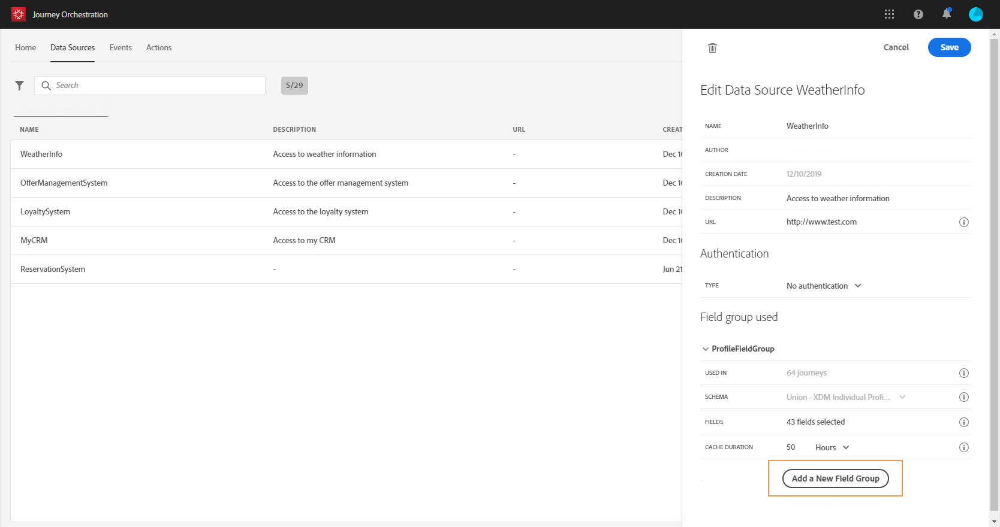

# Fuentes de datos de Adobe Experience Platform {#concept_zrb_nqt_52b}

El origen de datos de Adobe Experience Platform define la conexión al servicio de Perfil al cliente en tiempo real. Esta fuente de datos está integrada y preconfigurada. No se puede eliminar. Esta fuente de datos está diseñada para recuperar y utilizar datos del servicio de Perfil del cliente en tiempo real (por ejemplo, para comprobar si la persona que ha realizado un viaje es una mujer). Permite utilizar datos de Perfil y datos de Eventos de experiencia. Para obtener más información sobre el servicio de Perfil del cliente en tiempo real, consulte esta [página](https://docs.adobe.com/content/help/es-ES/experience-platform/profile/home.html).

>[!NOTE]
>
>Puede recuperar los 1000 últimos eventos de experiencia creados hace menos de un año.

Para permitir la conexión al servicio de Perfil de clientes en tiempo real, debemos utilizar una clave para identificar a una persona y una Área de nombres que contextualice la clave. Como resultado, solo puede utilizar esta fuente de datos si su inicio de viajes contiene un evento que contiene una clave y una Área de nombres. Consulte [esta página](../building-journeys/journey.md).

Puede editar el grupo de campos preconfigurado llamado &quot;ProfileFieldGroup&quot;, agregar otros nuevos y eliminar los que no se utilizan en ningún borrador o en los viajes activos. Consulte [esta página](../datasource/field-groups.md).

Estos son los pasos principales para agregar grupos de campos al origen de datos integrado.

1. En la lista de fuentes de datos, seleccione la fuente de datos integrada de Adobe Experience Platform.

   Se abre el panel de configuración de la fuente de datos en el lado derecho de la pantalla.

   

1. Haga clic en **[!UICONTROL Add a New Field Group]** para definir una nueva serie de campos para recuperar. Consulte [esta página](../datasource/field-groups.md).

   

1. Seleccione un esquema en la lista desplegable **[!UICONTROL Schema]**. Este campo lista esquemas de Perfil y Eventos de experiencias disponibles en Adobe Experience Platform. La creación de esquemas no se realiza en [!DNL Journey Orchestration]. Se realiza en el Adobe Experience Platform.
1. Seleccione los campos que desee utilizar.
1. Defina la duración de la caché.
1. Haga clic en **[!UICONTROL Save]**.

Cuando coloque el cursor en el nombre de un grupo de campos, verá dos iconos a la derecha. Permiten eliminar y duplicado el grupo de campos. Tenga en cuenta que el icono **[!UICONTROL Delete]** sólo está disponible si el grupo de campos no se utiliza en ningún viaje en directo o en borrador (la información se muestra en el campo **[!UICONTROL Used in]**).
