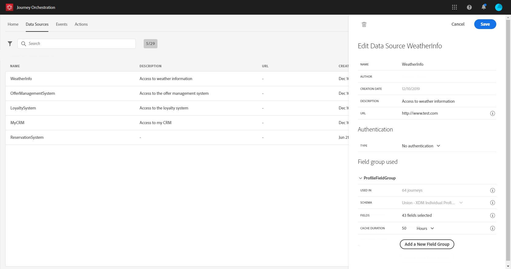

# Fuente de datos de Adobe Experience Platform {#concept_zrb_nqt_52b}

>[!CAUTION]
>
>¿**Busca Adobe Journey Optimizer**? Haga clic [aquí](https://experienceleague.adobe.com/es/docs/journey-optimizer/using/ajo-home){target="_blank"} para obtener la documentación de Journey Optimizer.
>
>
>_Esta documentación hace referencia a materiales de Journey Orchestration heredados que han sido reemplazados por Journey Optimizer. Póngase en contacto con su equipo de cuentas si tiene alguna pregunta sobre el acceso a Journey Orchestration o Journey Optimizer._

La fuente de datos de Adobe Experience Platform define la conexión al servicio Perfil del cliente en tiempo real. Esta fuente de datos está integrada y preconfigurada. No se puede eliminar. Esta fuente de datos está diseñada para recuperar y utilizar datos del servicio Perfil del cliente en tiempo real (por ejemplo, comprobar si la persona que ha introducido un recorrido es una mujer). Permite utilizar información del perfil y datos de los eventos de experiencia. Para obtener más información sobre el servicio Perfil del cliente en tiempo real, consulte esta [página](https://experienceleague.adobe.com/docs/experience-platform/profile/home.html?lang=es).

>[!NOTE]
>
>Puede recuperar los 1000 eventos de experiencia más recientes creados hace menos de un año.

Para permitir la conexión al servicio Perfil del cliente en tiempo real, debemos utilizar una clave para identificar a una persona y un área de nombres que contextualice la clave. Como resultado, solo puede utilizar este origen de datos si los recorridos comienzan con un evento que contiene una clave y un área de nombres. Consulte [esta página](../building-journeys/journey.md).

Puede editar el grupo de campos preconfigurado denominado &quot;ProfileFieldGroup&quot;, añadir otros nuevos y eliminar los que no se utilizan en ningún recorrido en borrador o activo. Consulte [esta página](../datasource/field-groups.md).

Estos son los pasos principales para agregar grupos de campos a la fuente de datos integrada.

1. En la lista de fuentes de datos, seleccione la fuente de datos integrada de Adobe Experience Platform.

   Se abre el panel de configuración de la fuente de datos en el lado derecho de la pantalla.

   

1. Haga clic en **[!UICONTROL Add a New Field Group]** para definir una nueva serie de campos que recuperar. Consulte [esta página](../datasource/field-groups.md).

   

1. Seleccione un esquema de la lista desplegable **[!UICONTROL Schema]**. Este campo enumera los esquemas de Perfil y Eventos de experiencia disponibles en Adobe Experience Platform. No se creó el esquema en [!DNL Journey Orchestration]. Se realiza en el Adobe Experience Platform.
1. Seleccione los campos que desee utilizar.
1. Haga clic en **[!UICONTROL Save]**.

Cuando coloque el cursor en el nombre de un grupo de campos, verá dos iconos a la derecha. Permiten eliminar y duplicar el grupo de campos. Tenga en cuenta que el icono **[!UICONTROL Delete]** solo está disponible si el grupo de campos no se utiliza en ningún recorrido activo o borrador (la información se muestra en el campo **[!UICONTROL Used in]**).
