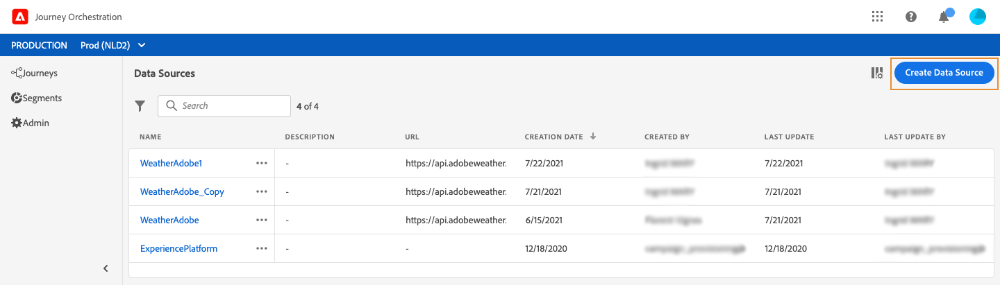
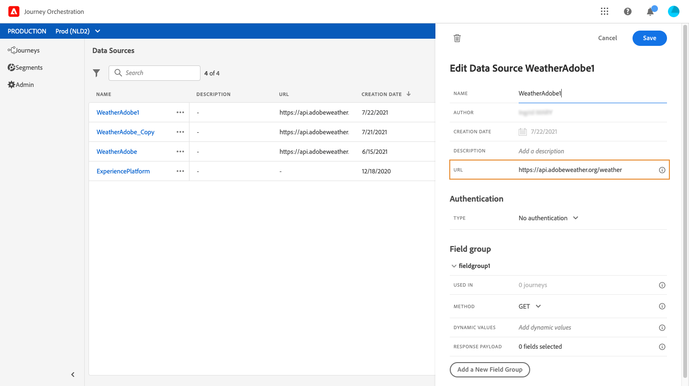

# Fuentes de datos externas {#concept_t2s_kqt_52b}

Las fuentes de datos externas permiten definir una conexión a sistemas de terceros, por ejemplo, si utiliza un sistema de reserva de hoteles para comprobar si la persona ha registrado una habitación. A diferencia de la fuente de datos integrada de Adobe Experience Platform, puede crear tantas fuentes de datos externas como necesite.

Las API de REST que utilizan POST o GET y arrojan JSON son compatibles. Se admiten los modos de autenticación básica y personalizada de la clave de API.

Veamos el ejemplo de un servicio de API meteorológica que quiero usar para personalizar el comportamiento de mi recorrido según los datos del tiempo real.

Estos son dos ejemplos de llamada API:

* _https://api.adobeweather.org/weather?city=London,uk&amp;appid=1234_
* _https://api.adobeweather.org/weather?lat=35&amp;lon=139&amp;appid=1234_

La llamada se compone de una dirección URL principal (_https://api.adobeweather.org/weather_), dos conjuntos de parámetros (&quot;ciudad&quot; para la ciudad y &quot;lat/long&quot; para la latitud y longitud) y la clave de API (appid).

Estos son los pasos principales para crear y configurar una nueva fuente de datos externa:

1. En la lista de fuentes de datos, haga clic en **[!UICONTROL Create data source]** para crear una nueva fuente de datos externa.

   

   Se abre el panel de configuración de la fuente de datos en el lado derecho de la pantalla.

   

1. Escriba un nombre para la fuente de datos.

   >[!NOTE]
   >
   >No utilice espacios ni caracteres especiales. No utilice más de 30 caracteres.

1. Añada una descripción a la fuente de datos. Este paso es opcional.
1. Añada la dirección URL del servicio externo. En nuestro ejemplo: _https://api.adobeweather.org/weather_.

   >[!CAUTION]
   >
   >Recomendamos encarecidamente utilizar HTTPS por motivos de seguridad. Además, tenga en cuenta que no permitimos el uso de direcciones de Adobe que no están disponibles para el público ni de direcciones IP.

   

1. Configure la autenticación según la configuración del servicio externo: **[!UICONTROL No authentication]**, **[!UICONTROL Basic]**, **[!UICONTROL Custom]** o **[!UICONTROL API key]**. Para obtener más información sobre el modo de autenticación personalizada, consulte [esta sección](../datasource/external-data-sources.md#section_wjp_nl5_nhb). En nuestro ejemplo, elegimos:


   * **[!UICONTROL Type]**: &quot;clave de API&quot;
   * **[!UICONTROL Value]**: &quot;1234&quot; (el valor de nuestra clave de API)
   * **[!UICONTROL Name]**: &quot;appid&quot; (el nombre del parámetro de clave de API)
   * **[!UICONTROL Location]**: &quot;parámetro de consulta&quot; (la clave de API se encuentra en la dirección URL)

   

1. Añada un nuevo grupo de campos a cada conjunto de parámetros de API haciendo clic en **[!UICONTROL Add a New Field Group]**. No utilice espacios ni caracteres especiales en el nombre del grupo de campos. En nuestro ejemplo, necesitamos crear dos grupos de campos, uno para cada conjunto de parámetros (city y long/lat).

Para el conjunto de parámetros &quot;long/lat&quot;, creamos un grupo de campos con la siguiente información:

* **[!UICONTROL Used in]**: muestra el número de recorridos que utilizan un grupo de campos. Puede hacer clic en el icono **[!UICONTROL View journeys]** para mostrar la lista de recorridos mediante este grupo de campos.
* **[!UICONTROL Method]**: seleccione el método POST o GET. En nuestro caso, seleccionamos el método GET.
* **[!UICONTROL Response Payload]**: haga clic dentro de **[!UICONTROL Payload]** y pegue un ejemplo de la carga útil devuelta por la llamada. Para nuestro ejemplo, hemos utilizado una carga útil encontrada en un sitio web de la API meteorológica. Compruebe que los tipos de campo son correctos. Cada vez que se llama a la API, el sistema recupera todos los campos incluidos en el ejemplo de carga útil. Tenga en cuenta que puede hacer clic en **[!UICONTROL Paste a new payload]** si desea cambiar la carga útil que se mueve actualmente.
* **[!UICONTROL Dynamic Values]**: introduzca los diferentes parámetros separados por coma, &quot;long,lat&quot; en nuestro ejemplo. Dado que los valores de parámetro dependen del contexto de ejecución, se definirán en los recorridos. Consulte [esta página](../expression/expressionadvanced.md).
* **[!UICONTROL Sent Payload]**: este campo no aparece en nuestro ejemplo. Solo está disponible si selecciona el método POST. Pegue la carga útil que se enviará al sistema de terceros.

En el caso de una llamada GET que requiera parámetros, introduzca los parámetros en **[!UICONTROL Dynamic Values]** y se añadirán automáticamente al final de la llamada. En caso de una llamada POST, debe hacer esto:

* Enumerar los parámetros que mover en tiempo de llamada en **[!UICONTROL Dynamic Values]** (en el ejemplo siguiente: &quot;identificador&quot;).
* Especificarlos también con la misma sintaxis en el cuerpo de la carga útil enviada. Para ello, debe agregar: &quot;param&quot;: &quot;nombre del parámetro&quot; (en el ejemplo siguiente: &quot;identificador&quot;). Siga esta sintaxis:

   ```
   {"id":{"param":"identifier"}}
   ```


Haga clic en **[!UICONTROL Save]**.

La fuente de datos ahora está configurada y lista para utilizarse en sus recorridos, por ejemplo en sus condiciones o para personalizar un correo electrónico. Si la temperatura es superior a 30 °C, puede decidir enviar una comunicación específica.

## Modo de autenticación personalizado{#section_wjp_nl5_nhb}

>[!CONTEXTUALHELP]
>id="jo_authentication_payload"
>title="Acerca de la autenticación personalizada"
>abstract="El modo de autenticación personalizada se utiliza en la autenticación compleja para llamar a protocolos de ajuste de API como OAuth2. La ejecución de la acción es un proceso de dos pasos. En primer lugar, se realiza una llamada al punto final para generar el token de acceso. A continuación, el token de acceso se inserta en la petición HTTP de la acción."

Este modo de autenticación se utiliza para la autenticación compleja, utilizada frecuentemente para llamar a protocolos de ajuste de API como OAuth2, para recuperar un token de acceso que se va a insertar en la petición HTTP real de la acción.

Al configurar la autenticación personalizada, puede hacer clic en el botón a continuación para comprobar si la carga de autenticación personalizada está configurada correctamente.


Si la prueba se realiza correctamente, el botón se vuelve verde.


Con esta autenticación, la ejecución de la acción es un proceso de dos pasos:

1. Llame al extremo para generar el token de acceso.
1. Llame a la API de REST mediante la inyección adecuada del token de acceso.

Esta autenticación consta de dos partes.

Definición del extremo al que se va a llamar para generar el token de acceso:

* extremo: dirección URL que se utilizará para generar el extremo
* método de la petición HTTP en el extremo (GET o POST)
* encabezados: pares clave/de valor que se insertarán como encabezados en esta llamada, si es necesario
* cuerpo: describe el cuerpo de la llamada si el método es POST. Apoyamos una estructura de cuerpo limitada, definida en bodyParams (pares clave/de valor). bodyType describe el formato y la codificación del cuerpo en la llamada:
   * &#39;form&#39;: lo que significa que el tipo de contenido será application/x-www-form-urlencoded (charset UTF-8) y que los pares clave/valor se serializarán tal cual: key1=value1&amp;key2=value2&amp;...
   * &#39;json&#39;: lo que significa que el tipo de contenido será application/json (charset UTF-8) y que los pares de valor clave se serializarán como un objeto json tal y como está: _{ &quot;key1&quot;: &quot;value1&quot;, &quot;key2&quot;: &quot;value2&quot;, ...}_

Definición de la forma en que se debe insertar el token de acceso en la petición HTTP de la acción:

* authorizationType: define cómo se debe insertar el token de acceso generado en la llamada HTTP para la acción. Los valores posibles son:

   * bearer: indica que el token de acceso debe inyectarse en el encabezado Autorización, como: _Autorización: Bearer &lt;token de acceso>_
   * header: indica que el token de acceso debe insertarse como encabezado, el nombre del encabezado definido por la propiedad tokenTarget. Por ejemplo, si el tokenTarget es myHeader, el token de acceso se insertará como un encabezado como: _myHeader: &lt;token de acceso>_
   * queryParam: indica que el token de acceso debe insertarse como queryParam, el nombre del parámetro de consulta definido por la propiedad tokenTarget. Por ejemplo, si tokenTarget es myQueryParam, la dirección URL de la llamada de acción será: _&lt;url>?myQueryParam=&lt;token de acceso>_

* tokenInResponse: indica cómo extraer el token de acceso de la llamada de autenticación. Esta propiedad puede ser:
   * &#39;response&#39;: indica que la respuesta HTTP es el token de acceso
   * un selector en un json (suponiendo que la respuesta es un json, no se admiten otros formatos como XML). El formato de este selector es _json://&lt;ruta a la propiedad token de acceso>_. Por ejemplo, si la respuesta de la llamada es: _{ &quot;access_token&quot;: &quot;theToken&quot;, &quot;timestamp&quot;: 12323445656 }_, tokenInResponse será: _json: //access_token_

El formato de esta autenticación es:

```
{
    "type": "customAuthorization",
    "authorizationType": "<value in 'bearer', 'header' or 'queryParam'>",
    (optional, mandatory if authorizationType is 'header' or 'queryParam') "tokenTarget": "<name of the header or queryParam if the authorizationType is 'header' or 'queryParam'>",
    "endpoint": "<URL of the authentication endpoint>",
    "method": "<HTTP method to call the authentication endpoint, in 'GET' or 'POST'>",
    (optional) "headers": {
        "<header name>": "<header value>",
        ...
    },
    (optional, mandatory if method is 'POST') "body": {
        "bodyType": "<'form'or 'json'>,
        "bodyParams": {
            "param1": value1,
            ...

        }
    },
    "tokenInResponse": "<'response' or json selector in format 'json://<field path to access token>'"
}
```

Puede cambiar la duración de caché del token para una fuente de datos de autenticación personalizada. A continuación se muestra un ejemplo de una carga útil de autenticación personalizada. La duración de caché se define en el parámetro &quot;cacheDuration&quot;. Especifica la duración de retención del token generado en la caché. La unidad puede ser milisegundos, segundos, minutos, horas, días, meses, años.

```
"authentication": {
    "type":"customAuthorization",
    "authorizationType":"Bearer",
    "endpoint":"http://localhost:${port}/epsilon/oauth2/access_token",
    "method":"POST",
    "headers": {
        "Authorization":"Basic EncodeBase64(${epsilonClientId}:${epsilonClientSecret})"
        },
    "body": {
        "bodyType":"form",
        "bodyParams": {
             "scope":"cn mail givenname uid employeeNumber",
             "grant_type":"password",
             "username":"${epsilonUserName}",
             "password":"${epsilonUserPassword}"
             }
        },
    "tokenInResponse":"json://access_token",
    "cacheDuration":
             { "duration":5, "timeUnit":"seconds" }
    }
```

>[!NOTE]
>
>La duración de la caché ayuda a evitar demasiadas llamadas a los extremos de autenticación. La retención del token de autenticación se almacena en caché en los servicios, no hay persistencia. Si se reinicia un servicio, se inicia con una caché limpia. La duración de la caché de forma predeterminada es de 1 hora. En la carga útil de autenticación personalizada, se puede adaptar especificando otra duración de retención.
