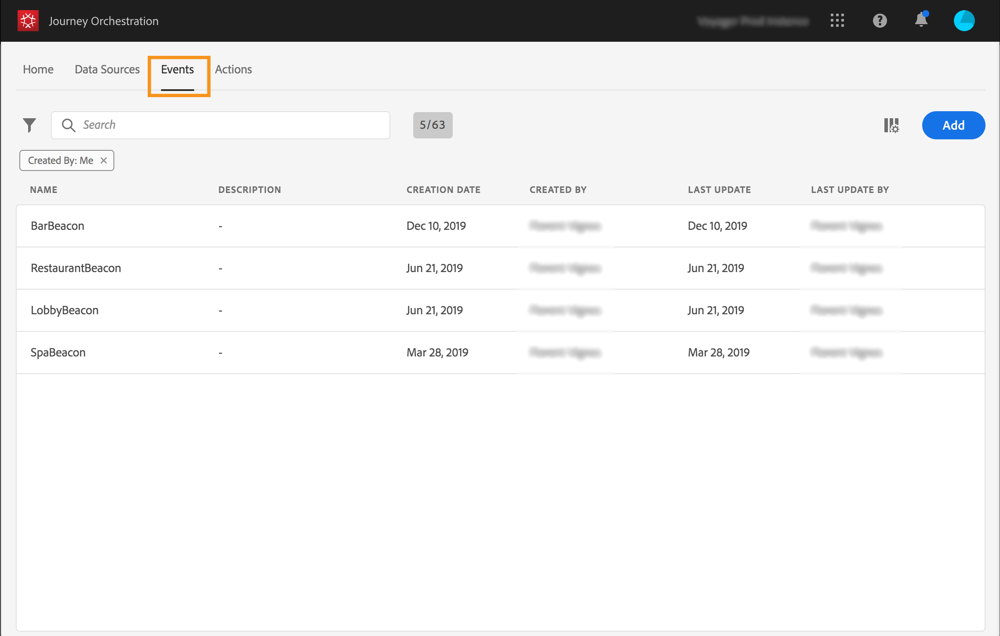
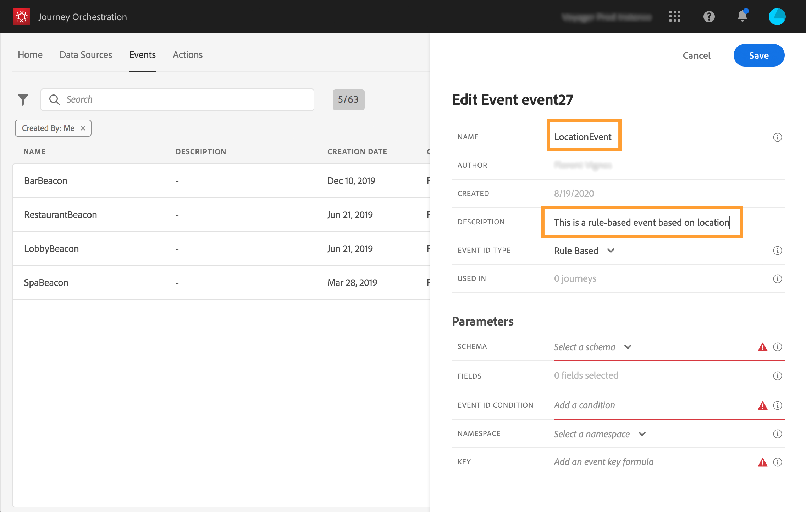
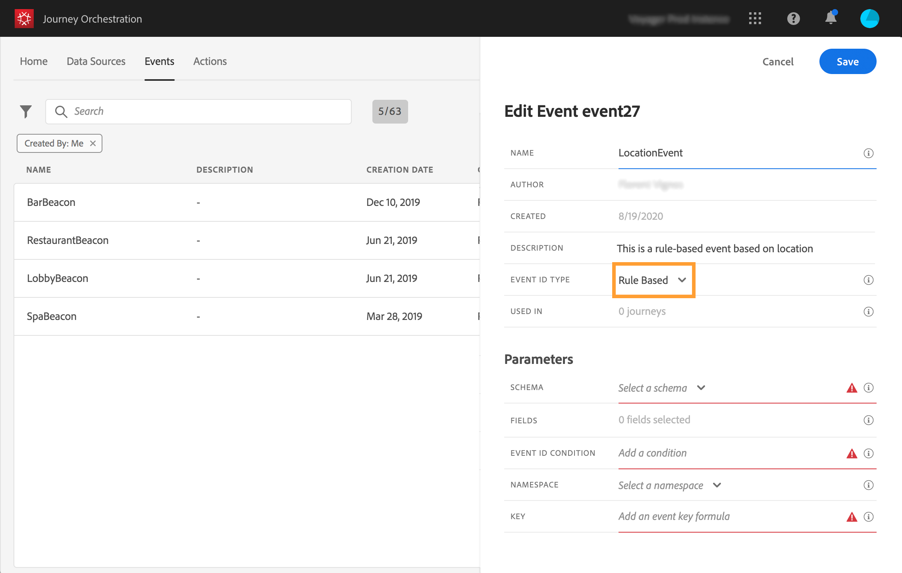
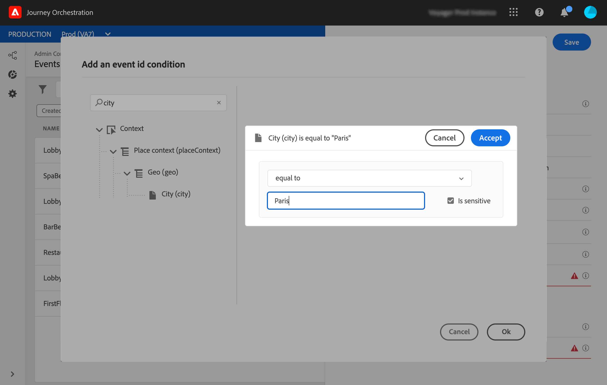
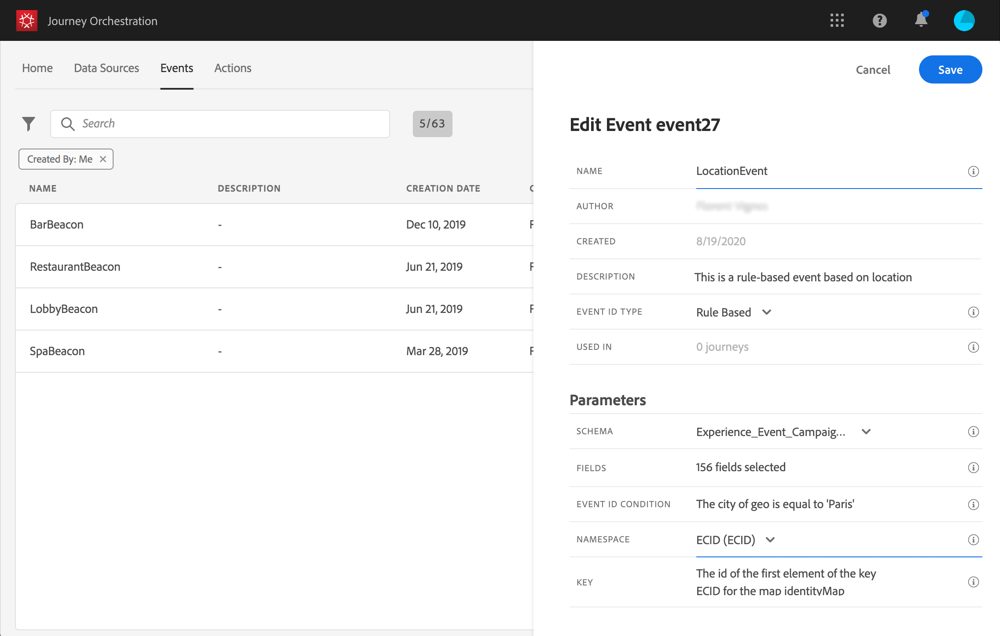

# Creación de un nuevo evento {#section_tbk_5qt_pgb}

>[!CAUTION]
>
>¿**Busca Adobe Journey Optimizer**? Haga clic [aquí](https://experienceleague.adobe.com/es/docs/journey-optimizer/using/ajo-home){target="_blank"} para obtener la documentación de Journey Optimizer.
>
>
>_Esta documentación hace referencia a materiales de Journey Orchestration heredados que han sido reemplazados por Journey Optimizer. Póngase en contacto con su equipo de cuentas si tiene alguna pregunta sobre el acceso a Journey Orchestration o Journey Optimizer._

Estos son los pasos principales para configurar un nuevo evento:

1. En el menú superior, haga clic en la pestaña **[!UICONTROL Events]**. Se muestra la lista de eventos. Consulte [esta página](../about/user-interface.md) para obtener más información sobre la interfaz.

   

1. Haga clic en **[!UICONTROL Add]** para crear un nuevo evento. El panel de configuración de evento se abre en el lado derecho de la pantalla. Escriba un nombre para el evento. También puede añadir una descripción.

   

   >[!NOTE]
   >
   >No utilice espacios ni caracteres especiales. No utilice más de 30 caracteres.

1. En el campo **[!UICONTROL Event ID type]**, seleccione el tipo de evento que desee utilizar.

   

   * Eventos basados **en reglas**: este tipo de evento no genera ningún eventID. En el campo **Condición de ID de evento**, simplemente defina una regla que el sistema utilizará para identificar los eventos relevantes que almacenarán en déclencheur sus recorridos. Esta regla se puede basar en cualquier campo disponible en la carga útil de evento, por ejemplo, la ubicación del perfil o el número de elementos agregados al carro de compras del perfil.

   * **Eventos generados por el sistema**: este tipo requiere un eventID. Este campo eventID se genera automáticamente al crear el evento y se agrega a la previsualización de carga útil. El sistema que impulsa el evento no debe generar un ID, debe pasar el que está disponible en la previsualización de carga útil. Consulte [esta sección](../event/previewing-the-payload.md).

   >[!NOTE]
   >
   >Obtenga más información sobre los tipos de eventos en [esta sección](../event/about-events.md).
1. El número de recorridos que utiliza este evento se muestra en el campo **[!UICONTROL Used in]**. Puede hacer clic en el icono **[!UICONTROL View journeys]** para mostrar la lista de los recorridos con este evento.
1. Defina los campos esquema y carga útil: aquí es donde selecciona la información de evento (generalmente denominada carga útil) que [!DNL Journey Orchestration] espera recibir. Podrá utilizar esta información en su recorrido. Consulte [esta página](../event/defining-the-payload-fields.md).
   >[!NOTE]
   >
   >Al seleccionar el tipo **[!UICONTROL System Generated]**, solo están disponibles los esquemas que tienen la mezcla de tipo eventID. Al seleccionar el tipo **[!UICONTROL Rule Based]**, están disponibles todos los esquemas de Experience Event.

1. Para los eventos basados en reglas, haga clic dentro del campo **[!UICONTROL Event ID condition]**. Con el editor de expresiones simple, defina la condición que el sistema utilizará para identificar los eventos que almacenarán en déclencheur el recorrido.
   

   En nuestro ejemplo, escribimos una condición basada en la ciudad del perfil. Esto significa que, cada vez que el sistema reciba un evento que coincida con esta condición (campo **[!UICONTROL City]** y valor **[!UICONTROL Paris]**), lo pasará a Journey Orchestration.

   >[!NOTE]
   >
   >El editor de expresiones avanzadas no está disponible al definir **[!UICONTROL Event ID condition]**. En el editor de expresiones simple, no todos los operadores están disponibles, sino que dependen del tipo de datos. Por ejemplo, para un tipo de cadena de campo, puede utilizar &quot;contiene&quot; o &quot;es igual a&quot;.

1. Añada un espacio de nombres. Este paso es opcional, pero se recomienda, ya que la adición de un espacio de nombres le permite aprovechar la información almacenada en el servicio de Perfil del cliente en tiempo real. Define el tipo de clave que tiene el evento. Consulte [esta página](../event/selecting-the-namespace.md).
1. Defina la clave: elija un campo de los campos de carga útil o defina una fórmula para identificar a la persona asociada al evento. Esta clave se configura automáticamente (pero aún puede editarse) si selecciona un Espacio de nombres. De hecho, [!DNL Journey Orchestration] selecciona la clave que debe corresponder al espacio de nombres (por ejemplo, si selecciona un espacio de nombres de correo electrónico, se seleccionará la clave de correo electrónico). Consulte [esta página](../event/defining-the-event-key.md).
1. Haga clic en **[!UICONTROL Save]**.

   

   El evento está ahora configurado y listo para añadirse a un recorrido. Se requieren pasos de configuración adicionales para recibir eventos. Consulte [esta página](../event/additional-steps-to-send-events-to-journey-orchestration.md).
