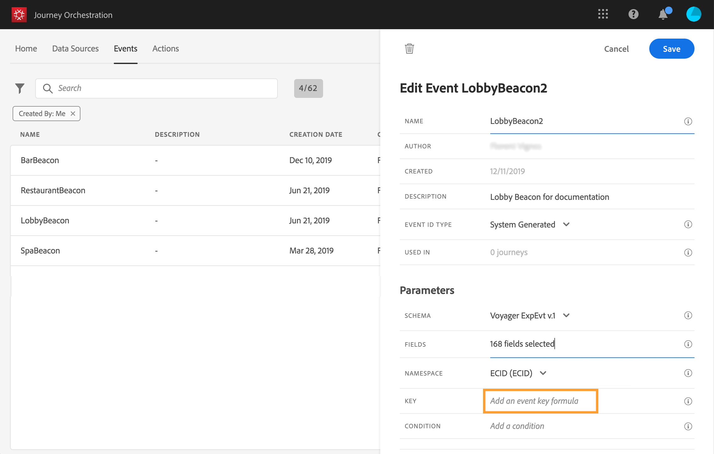

# Definición de la clave del evento {#concept_ond_hqt_52b}

La clave es el campo o la combinación de campos que forma parte de los datos de carga útil del evento y que permite al sistema identificar a la persona asociada al evento. La clave puede ser, por ejemplo, el ID de Experience Cloud, un ID de CRM o una dirección de correo electrónico.

Si planea aprovechar los datos almacenados en la base de datos del perfil del cliente en tiempo real, debe seleccionar, como clave de evento, información que haya definido como la identidad de un perfil en el [Servicio de perfil del cliente en tiempo real](https://docs.adobe.com/content/help/es-ES/experience-platform/profile/home.html).

Permitirá que el sistema realice la reconciliación entre el evento y el perfil del individuo. Si selecciona un esquema que tiene una identidad principal, los campos **[!UICONTROL Key]** y **[!UICONTROL Namespace]** se rellenan previamente. Si no hay ninguna identidad definida, seleccione _identityMap > id_ como clave principal. A continuación, debe seleccionar un área de nombres y la clave se rellenará previamente (debajo del campo **[!UICONTROL Namespace]**) mediante _identityMap > id_.

Al seleccionar campos, los campos de identidad principales se etiquetan.

Si necesita utilizar una clave diferente, como un ID de CRM o una dirección de correo electrónico, debe agregarla manualmente:

1. Haga clic dentro del campo **[!UICONTROL Key]** o en el icono de lápiz.

   

1. Seleccione el campo elegido como clave en la lista de campos de carga útil. También puede cambiar al editor de expresiones avanzadas para crear claves más complejas (por ejemplo, una concatenación de dos campos de los eventos). Consulte a continuación, en esta sección.

   

Cuando se recibe el evento, el valor de la clave permite que el sistema identifique a la persona asociada al evento. Asociada a un área de nombres (consulte [esta página](../event/selecting-the-namespace.md)), la clave se puede utilizar para realizar consultas en Adobe Experience Platform. Consulte [esta página](../building-journeys/about-orchestration-activities.md).
La clave también se utiliza para comprobar que una persona está en un recorrido. De hecho, una persona no puede estar en dos lugares diferentes en el mismo recorrido. Como resultado, el sistema no permite que la misma clave, por ejemplo la clave CRMID=3224, esté en diferentes lugares en el mismo recorrido.

También tiene acceso a las funciones de expresión avanzadas (**[!UICONTROL Advanced mode]**) si desea realizar manipulaciones adicionales. Estas funciones permiten manipular los valores utilizados para realizar consultas específicas, como cambiar formatos, realizar concatenaciones de campos, teniendo en cuenta solo una parte de un campo (por ejemplo, los 10 primeros caracteres). Consulte [esta página](../expression/expressionadvanced.md).
