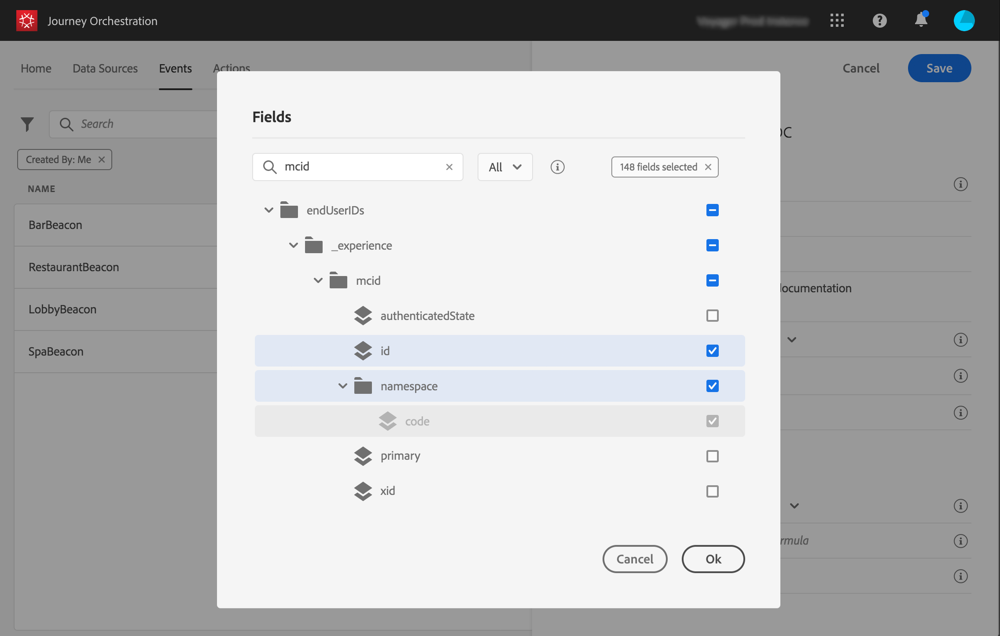
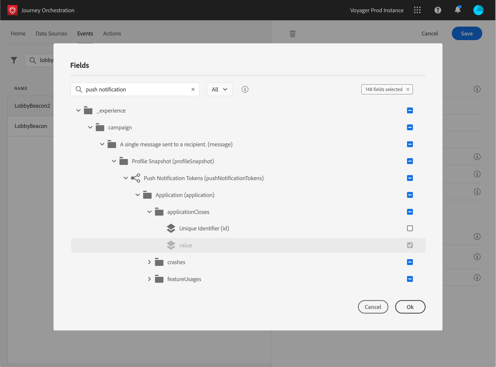

# Definición de los campos de carga útil {#concept_yrw_3qt_52b}

La definición de carga útil permite elegir la información que el sistema espera recibir del evento en el recorrido y la clave para identificar qué persona está asociada al evento. La carga útil se basa en la definición del campo XDM del Experience Cloud. Para obtener más información sobre XDM, consulte [esta página](https://experienceleague.adobe.com/docs/experience-platform/xdm/home.html?lang=es).

1. Seleccione un esquema XDM de la lista y haga clic en el **[!UICONTROL Payload]** o en el **[!UICONTROL Edit]** icono.

   

   Se muestran todos los campos definidos en el esquema . La lista de campos varía de un esquema a otro. Puede buscar un campo específico o utilizar los filtros para mostrar todos los nodos y campos o solo los campos seleccionados. Según la definición del esquema, algunos campos pueden ser obligatorios y estar preseleccionados. No puede desseleccionarlos. Todos los campos obligatorios para que el Journey Orchestration reciba el evento correctamente están seleccionados de forma predeterminada.

   >[!NOTE]
   >
   >Asegúrese de haber añadido la mezcla &quot;orquestación&quot; al esquema XDM. Esto garantizará que el esquema contenga toda la información necesaria para trabajar con [!DNL Journey Orchestration].

   

1. Seleccione los campos que espera recibir del evento. Estos son los campos que el usuario empresarial aprovechará en el recorrido. También deben incluir la clave que se utilizará para identificar a la persona asociada al evento (consulte [esta página](../event/defining-the-event-key.md)).

   

   >[!NOTE]
   >
   >Para los eventos generados por el sistema, la variable **[!UICONTROL eventID]** se añade automáticamente en la lista de campos seleccionados para que [!DNL Journey Orchestration] puede identificar el evento. El sistema que impulsa el evento no debe generar un ID, debe utilizar el disponible en la previsualización de carga útil. Consulte [esta página](../event/previewing-the-payload.md).

1. Cuando haya terminado de seleccionar los campos necesarios, haga clic en **[!UICONTROL Save]** o presione **[!UICONTROL Enter]**.

   

   El número de campos seleccionados aparece en el **[!UICONTROL Payload]** campo .

   
