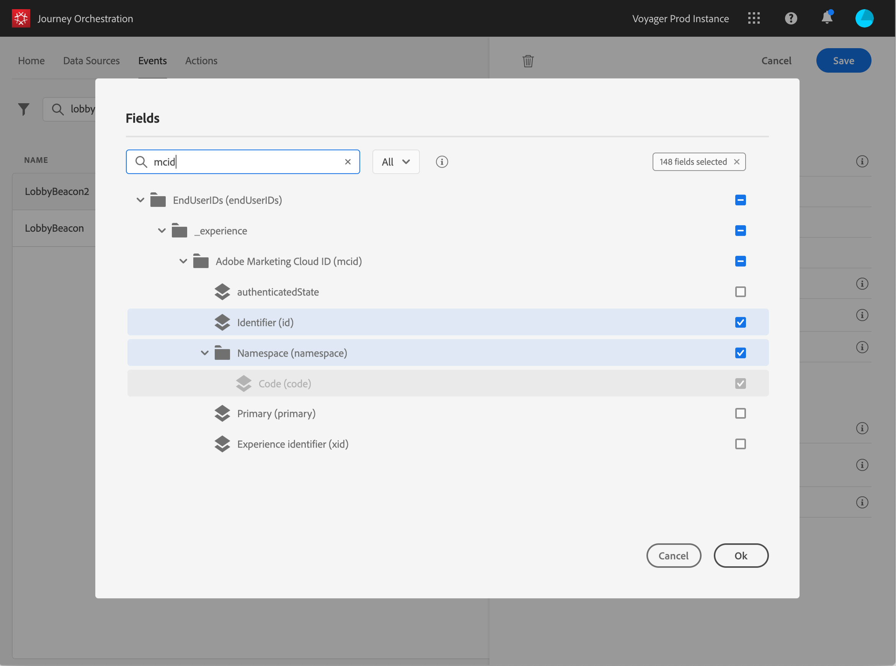

# Definición de los campos de carga útil {#concept_yrw_3qt_52b}

La definición de carga útil permite elegir la información que el sistema espera recibir del evento en el viaje y la clave para identificar qué persona está asociada al evento. La carga útil se basa en la definición del campo XDM de Experience Cloud. For more information on XDM, refer to this [page](https://www.adobe.io/apis/cloudplatform/dataservices/xdm.html).

1. Seleccione un esquema XDM de la lista y haga clic en el **[!UICONTROL Payload]**campo o en el**[!UICONTROL Edit]** icono.

   

   Se muestran todos los campos definidos en el esquema. La lista de campos varía de un esquema a otro. Puede buscar un campo específico o utilizar los filtros para mostrar todos los nodos y campos o solo los campos seleccionados. Según la definición del esquema, algunos campos pueden ser obligatorios y estar preseleccionados. No se pueden anular las selecciones.

   >[!NOTE]
   >
   >Asegúrese de que ha agregado la combinación &quot;orquestación&quot; al esquema XDM. Esto garantizará que su esquema contenga toda la información necesaria para trabajar con la orquestación de viajes.

   

1. Seleccione los campos que espera recibir del evento. Estos son los campos que el usuario comercial aprovechará en el viaje. También deben incluir la clave que se utilizará para identificar a la persona asociada al evento (consulte ).

   

   >[!NOTE]
   >
   >El **[!UICONTROL eventID]**campo se agrega automáticamente a la lista de campos seleccionados para que la orquestación de viajes pueda identificar el evento. El sistema que impulsa el evento no debe generar un ID, debe utilizar el disponible en la vista previa de la carga útil. Consulte.

1. Cuando haya terminado de seleccionar los campos necesarios, haga clic en **[!UICONTROL Save]**o presione**[!UICONTROL Enter]**.

   

   El número de campos seleccionados aparece en el **[!UICONTROL Payload]**campo.

   
