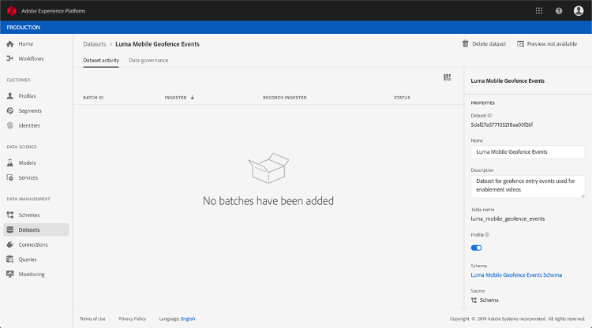

# Esquemas de ExperienceEvent para [!DNL Journey Orchestration] Eventos

[!DNL Journey Orchestration] Los eventos son Eventos de experiencias XDM que se envían a Adobe Experience Platform mediante la introducción de flujo.

Como tal, un requisito previo importante para la configuración de eventos [!DNL Journey Orchestration] es que esté familiarizado con el Modelo de datos de experiencia (o XDM) de Adobe Experience Platform y con cómo componer esquemas de Evento de experiencias XDM, así como con la transmisión de datos con formato XDM a Adobe Experience Platform.

## Requisitos de esquema para [!DNL Journey Orchestration] Eventos

El primer paso en la configuración de un evento para [!DNL Journey Orchestration] es asegurarse de que tiene un esquema XDM definido para representar el evento y un conjunto de datos creado para registrar instancias del evento en el Adobe Experience Platform. Tener un conjunto de datos para sus eventos no es estrictamente necesario, pero enviar los eventos a un conjunto de datos específico le permitirá mantener el historial de eventos de los usuarios para futuras referencias y análisis, por lo que siempre es una buena idea. Si todavía no tiene un esquema y un conjunto de datos adecuados para su evento, ambas tareas se pueden realizar en la interfaz web de Adobe Experience Platform.

Cualquier esquema XDM que se utilice para [!DNL Journey Orchestration] eventos debe cumplir los siguientes requisitos:

* El esquema debe ser de la clase ExperienceEvent XDM.

   

* Para eventos generados por el sistema, el esquema debe incluir la combinación eventID de orquestación. [!DNL Journey Orchestration] utiliza este campo para identificar los eventos utilizados en los viajes.

   

* Declare un campo de identidad para identificar el sujeto del evento. Si no se especifica ninguna identidad, se puede utilizar un mapa de identidad. No se recomienda.

   

* Si desea que estos datos estén disponibles para la búsqueda más adelante en un viaje, marque el esquema y el conjunto de datos para el perfil.

   

   

* No dude en incluir campos de datos para capturar cualquier otro dato de contexto que desee incluir con el evento, como la información sobre el usuario, el dispositivo desde el que se generó el evento, la ubicación o cualquier otra circunstancia significativa relacionada con el evento.

   

   