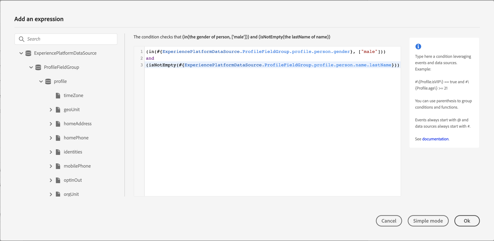

# Acerca del editor de expresiones avanzadas {#concept_uyj_trt_52b}

El editor de expresiones avanzadas permite crear expresiones avanzadas en varias pantallas de la interfaz; por ejemplo, al definir una condición de fuente de datos.
También está disponible cada vez que necesite definir parámetros de acción que requieran manipulaciones de datos específicas. Puede aprovechar los datos procedentes de los eventos o la información adicional recuperada del origen de datos. En un viaje, la lista mostrada de los campos de evento es contextual y varía según los eventos agregados en el recorrido.

El editor de expresiones avanzadas oferta un conjunto de funciones y operadores integrados que le permiten manipular valores, y definir una expresión que se ajuste específicamente a sus necesidades. El editor de expresiones avanzadas también permite definir los valores del parámetro de fuente de datos externo, y manipular los campos y colecciones de mapas, como los eventos de experiencia.

_Interfaz avanzada del editor de expresiones_

El editor de expresiones avanzadas se puede utilizar para lo siguiente:

* crear [condiciones avanzadas ](../building-journeys/condition-activity.md#about_condition) en fuentes de datos e información de evento
* definir [actividades de espera personalizadas](../building-journeys/wait-activity.md#custom)
* definir asignación de parámetros de acción

Cuando sea posible, puede cambiar entre los dos modos con el botón **[!UICONTROL Advanced mode]**/**[!UICONTROL Simple mode]**. El modo simple se describe [aquí](../building-journeys/condition-activity.md#about_condition).

>[!NOTE]
>
>Las condiciones se pueden definir en el editor de expresiones simples o avanzadas. Siempre devuelven un tipo booleano.
>
>Los parámetros de acción se pueden definir seleccionando campos o mediante el editor de expresiones avanzadas. Devuelven un tipo de datos específico según su expresión.

## Acceso al editor de expresiones avanzadas {#section_fdz_4nj_cjb}

Puede acceder al editor de expresiones avanzadas de diferentes maneras:

* Al crear una condición de fuente de datos, puede acceder al editor avanzado haciendo clic en **[!UICONTROL Advanced mode]**.

   

* Al crear un temporizador personalizado, se mostrará directamente el editor avanzado.
* Cuando asigne un parámetro de acción, haga clic en **[!UICONTROL Advanced mode]**.

## Descubrimiento de la interfaz{#section_otq_tnj_cjb}

Esta pantalla le permite escribir manualmente su expresión.

En la parte izquierda de la pantalla se muestran los campos y las funciones disponibles:

* **[!UICONTROL Events]**: elija uno de los campos recibidos del evento de entrada. La lista mostrada de los campos de evento es contextual y varía según los eventos agregados en el recorrido. [Obtenga más información](../event/about-events.md)
* **[!UICONTROL Segments]**: si ha colocado un  **[!UICONTROL Segment qualification]** evento, elija el segmento que desee utilizar en su expresión. [Obtenga más información](../segment/using-a-segment.md)
* **[!UICONTROL Data Sources]**: elija entre la lista de campos disponibles en los grupos de campos de las fuentes de datos. [Obtenga más información](../datasource/about-data-sources.md)
* **[!UICONTROL Journey properties]**: esta sección reagrupa los campos técnicos relacionados con el recorrido de un perfil determinado. [Obtenga más información](../expression/journey-properties.md)
* **[!UICONTROL Functions]**: elija entre una lista de funciones integradas que permitan realizar filtros complejos. Las funciones están organizadas por categorías. [Obtenga más información](../expression/functions.md)

Un mecanismo de finalización automática muestra sugerencias contextuales.

Un mecanismo de validación de sintaxis comprueba la integridad del código. Los errores se muestran en la parte superior del editor.

**Necesidad de parámetros al crear condiciones con el editor de expresiones avanzadas**

Si selecciona un campo de una fuente de datos externa que requiere que se llame a un parámetro (consulte [esta página](../datasource/external-data-sources.md). Por ejemplo, en una fuente de datos relacionada con el tiempo, un parámetro utilizado frecuentemente será &quot;city&quot; (ciudad). Como resultado, debe seleccionar dónde desea obtener este parámetro de ciudad. Las funciones también se pueden aplicar a parámetros para realizar cambios de formato o concatenaciones.

Para casos de uso más complejos, si desea incluir los parámetros del origen de datos en la expresión principal, puede definir sus valores con la palabra clave &quot;params&quot;. Consulte [esta página](../expression/field-references.md).
