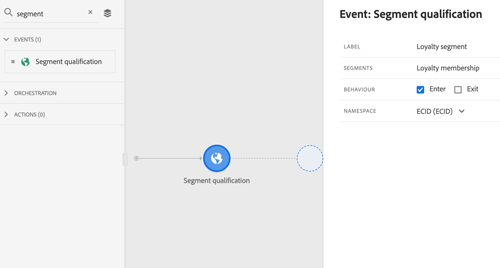

# Notas de la versión {#release-notes}

Esta página lista todas las nuevas funciones y mejoras de Journey Orchestration. Para ver las funciones de Experience Platform, consulte las siguientes [Notas de la versión](https://experienceleague.adobe.com/docs/experience-platform/release-notes/latest.html?lang=es).

>[!NOTE]
>
>Para las funciones publicadas en 2022 y 2023, los vínculos dirigen a la documentación de Adobe Journey Optimizer.

## Versión de agosto de 2023 {#aug-rn-2023}

### Mejoras {#aug-2023-improvements}

* Ahora puede utilizar las respuestas de llamadas de API en acciones personalizadas y organizar su recorrido en función de estas respuestas. Actualmente, esta función está disponible como una versión beta privada. Consulte la [documentación](https://experienceleague.adobe.com/docs/journey-optimizer/using/configuration/configure-journeys/action-journeys/action-response.html) de Journey Optimizer.

## Versión de abril de 2023 {#apr-rn-2023}

### Mejoras {#april-2023-improvements}

* Se ha mejorado el diseño del panel de configuración, que aparece en acciones, fuentes de datos, eventos y recorridos.
* Ahora puede definir parámetros de consulta estáticos o dinámicos en sus acciones personalizadas. Consulte la [documentación](https://experienceleague.adobe.com/docs/journey-optimizer/using/configuration/configure-journeys/action-journeys/about-custom-action-configuration.html?lang=es#url-configuration) de Journey Optimizer.
* Nuevos mecanismos de protección para administrar el crecimiento de las experiencias que ofrecen los recorridos:
   * Le recomendamos que mantenga el número de nodos limitado a 50 o menos para mantener sus recorridos funcionando, fácil de leer, realizar un control de calidad y solucionar problemas. El número de actividades se muestra en la sección superior izquierda del lienzo del recorrido. Consulte la [documentación](https://experienceleague.adobe.com/docs/journey-optimizer/using/get-started/guardrails.html?lang=es#journeys-guardrails-journeys) de Journey Optimizer
   * A medida que desarrolle e inicie recorridos, le notificaremos cuando se aproxime al hito de 100 recorridos activos a la vez. Si sus planes requieren más de 100 recorridos a la vez, cree una entrada para recibir asistencia después de ver la notificación y le ayudaremos. Consulte la [documentación](https://experienceleague.adobe.com/docs/journey-optimizer/using/get-started/guardrails.html?lang=es#journeys-guardrails-journeys) de Journey Optimizer

## Lanzamiento de marzo de 2023 {#mar-2023}

### Mejoras {#mar-2023-improvements}

* La nueva **API de limitación** le permite establecer un límite en la cantidad de eventos enviados por segundo, lo que evita picos de tráfico abrumadores en sus sistemas externos o API. Cuando se alcanza el límite establecido, todas las llamadas a la API subsiguientes se ponen en cola y se procesan lo antes posible en el orden en que se recibieron. Tenga en cuenta que esta función solo admite una configuración de limitación en todas las zonas protegidas. [Más información](../api/throttling.md)
* El lienzo de recorrido se ha mejorado para que la experiencia del usuario sea más sencilla y mejorada. Al final de cada ruta en el lienzo, se han eliminado los marcadores vacíos. Ahora puede simplemente agregar sus actividades arrastrándolas al final de una ruta.
* En el lienzo del recorrido, la etiqueta de **Fin** ya no se configura automáticamente con el nombre de la actividad anterior. Los usuarios pueden agregar manualmente una etiqueta personalizada si es necesario.
* El tiempo de espera predeterminado y la duración del error en las propiedades del recorrido han cambiado de 5 a 30 segundos. Consulte la [documentación](https://experienceleague.adobe.com/docs/journey-optimizer/using/configuration/configure-journeys/external-systems/external-systems.html?lang=es#timeout) de Journey Optimizer.
* Se ha añadido un mecanismo de protección al modo de prueba para escuchar solo los eventos enviados a través de la interfaz. Los eventos enviados a través de una herramienta externa no se tienen en cuenta. Consulte la [documentación](https://experienceleague.adobe.com/docs/journey-optimizer/using/orchestrate-journeys/create-journey/testing-the-journey.html?lang=es) de Journey Optimizer.

## Lanzamiento de febrero de 2023 {#feb-2023}

### Mejoras {#feb-2023-improvements}

* El campo **Período de espera de reentrada** se ha añadido a las propiedades del recorrido. Este campo permite definir el tiempo de espera antes de permitir que un perfil vuelva a entrar en el recorrido en recorridos unitarios (empezando por un evento o una calificación de segmentos). Esto evita que los recorridos se activen varias veces por error para el mismo evento. De forma predeterminada, el campo se establece en 5 minutos. Consulte la [documentación](https://experienceleague.adobe.com/docs/journey-optimizer/using/orchestrate-journeys/create-journey/journey-gs.html?lang=es#entrance) de Journey Optimizer.
* Se han realizado mejoras para las **fechas de inicio y finalización del recorrido**. Si no ha especificado una fecha de inicio, se añadirá ahora automáticamente en el momento de la publicación. Esto permite que los perfiles salgan automáticamente cuando se alcanza la fecha. Consulte la [documentación](https://experienceleague.adobe.com/docs/journey-optimizer/using/orchestrate-journeys/create-journey/journey-gs.html?lang=es#dates) de Journey Optimizer.

## Lanzamiento de enero de 2023 {#jan-2023-release}

### Mejoras {#jan-2023-improvements}

* Al añadir **Clasificación de segmentos** en un recorrido, el área de nombres ahora se rellena previamente, de forma predeterminada, con la última utilizada. Consulte la [documentación](https://experienceleague.adobe.com/docs/journey-optimizer/using/orchestrate-journeys/about-journey-building/segment-qualification-events.html?lang=es#about-segment-qualification) de Journey Optimizer.
* En el lienzo del recorrido, hay un nuevo botón disponible en la barra de herramientas que le permite descargar una captura de pantalla del recorrido.

## Versión de septiembre de 2022{#sept-2022-release}

### Nuevas funciones{#sept-2022-features}

<table>
<thead>
<tr>
<th><strong>Gobernanza de datos y privacidad</strong> </th>
</tr>
</thead>
<tbody>
<tr>
<td>

Con su marco de trabajo de gobernanza de etiquetado y aplicación del uso de datos (Data Usage Labeling and Enforcement, DULE), Journey Orchestration puede aprovechar ahora las políticas de gobernanza de Adobe Experience Platform para evitar que los campos confidenciales se exporten a sistemas de terceros mediante acciones personalizadas. Si el sistema identifica un campo restringido en los parámetros de acción personalizados, se muestra un error que le impide publicar el recorrido.

El uso de etiquetado y aplicación del uso de datos (Data Usage Labeling and Enforcement, DULE) está actualmente restringido a los clientes seleccionados y se implementará en todos los entornos en una versión futura.

Para obtener más información, consulte la <a href="https://experienceleague.adobe.com/docs/journey-optimizer/using/privacy/action-privacy.html?lang=es">documentación de Journey Optimizer</a>.
</td>
</tr>
</tbody>
</table>

### Mejoras{#sept-2022-improvements}

* Se ha añadido un nuevo mecanismo de protección a los recorridos unitarios (comenzando por un evento o una calificación de segmento) para evitar que los recorridos se activen varias veces por error para el mismo evento. La reentrada del perfil se bloqueará temporalmente de forma predeterminada durante 5 minutos. Consulte la [documentación](https://experienceleague.adobe.com/docs/journey-optimizer/using/get-started/quick-start.html?lang=es#events-g) de Journey Optimizer.

### Otros cambios{#sept-2022-other}

* Para mejorar el rendimiento, los grupos de campos de eventos de experiencia ya no se pueden utilizar en recorridos que comiencen por una actividad de calificación de segmentos. Este cambio solo se aplica a los nuevos recorridos. Los existentes mantendrán el comportamiento actual. Consulte la [documentación](https://experienceleague.adobe.com/docs/journey-optimizer/using/get-started/guardrails.html?lang=es#expression-editor) de Journey Optimizer.

### Mejoras

* **Finalización de un recorrido**: en el lienzo del recorrido, la actividad **Fin** se ha eliminado de la paleta. Las etiquetas finales ahora se añaden de forma predeterminada al final de cada ruta y no se pueden eliminar. Esta mejora permite informar mejor sobre dónde abandonó un cliente el recorrido, sin que se requiera ninguna acción por parte del profesional del recorrido. Consulte la [documentación](https://experienceleague.adobe.com/docs/journey-optimizer/using/orchestrate-journeys/manage-journey/end-journey.html?lang=es) de Journey Optimizer.

* La opción **Zona horaria del perfil** ahora está desactivada de forma predeterminada en las propiedades del recorrido. [Más información](https://experienceleague.adobe.com/docs/journey-optimizer/using/orchestrate-journeys/manage-journey/timezone-management..html?lang=es#timezone-from-profiles).

## Lanzamiento de mayo de 2022 {#may-2022-release}

### Mejoras

* **Editor de expresiones**: la función [límite](../functions/functionlimit.md) para permitirle limitar el número de elementos de una lista. La función [ordenar](../functions/functionsort.md) ahora permite ordenar un objeto de lista. La compatibilidad de listObject también se ha agregado a las funciones [disctinct](../functions/functiondistinct.md) y [distinctWithNull](../functions/functiondistinctwithnull.md).

## Lanzamiento de marzo de 2022 {#feb-2022-release}

### Mejoras

* Para evitar tener campos innecesarios en el esquema de perfil unificado, el esquema de Evento de paso de recorrido ya no está habilitado para perfiles de forma predeterminada. Si es necesario, puede activarlo. [Más información](../building-journeys/sharing-overview.md)
* Journey Optimizer ahora envía a Adobe Experience Platform nuevos eventos relacionados con los trabajos de exportación. Se han añadido ejemplos de consultas a la documentación. [Más información](../building-journeys/query-examples.md)

## Lanzamiento de febrero de 2022 {#february-2022-release}

### Mejoras

* Para optimizar el rendimiento, todos los recorridos en modo de prueba que no se hayan activado durante una semana volverán al estado Borrador. [Más información](../building-journeys/testing-the-journey.md#important_notes)

## Lanzamiento de enero de 2022 {#january-2022-release}

### Mejoras

* Los eventos de paso de Journey Orchestration ahora se pueden vincular a otros conjuntos de datos en [Customer Journey Analytics de Adobe](https://experienceleague.adobe.com/docs/analytics-platform/using/cja-overview/cja-overview.html?lang=es). El campo **profileID**, en el esquema integrado de Evento de paso de recorrido, ahora se define como un campo de identidad. [Más información](../building-journeys/sharing-overview.md#integration-cja)
* La regla de límite para las acciones de Adobe Campaign Standard se ha cambiado a 4000 llamadas cada cinco minutos. [Más información](../action/working-with-adobe-campaign.md)

## Versión de octubre de 2021 {#october-2021-release}

### Mejoras

* **Editor de expresiones**: como usuario avanzado, ahora puede usar funciones para trabajar con mapas. [Más información](../expression/field-references.md)
* **Accesibilidad**: se han implementado mejoras de accesibilidad. Journey Orchestration ahora es totalmente compatible en términos de accesibilidad.
* **Colecciones**: ahora se admiten matrices de objetos que contienen subobjetos. [Más información](../usecase/collections.md)
* **Monitorización**: se han mejorado los eventos de paso para los recorridos en directo y el modo de prueba. Se han añadido [nuevos campos](../building-journeys/sharing-field-list.md#serviceevents) en relación con los trabajos de exportación de perfiles. Para mejorar la experiencia del usuario, los campos de eventos de paso ahora están organizados en distintas categorías en el esquema de Evento de paso de Recorrido para Journey Orchestration. Todos los campos de eventos de paso anteriores siguen disponibles en la categoría [stepEvents](../building-journeys/sharing-legacy-fields.md).

## Versión de septiembre de 2021 {#september-2021-release}

<table>
<thead>
<tr>
<th><strong>Paso de listas de datos dinámicamente mediante acciones personalizadas</strong> </th>
</tr>
</thead>
<tbody>
<tr>
<td>

Ahora puede pasar colecciones o una lista de datos en los parámetros de acción personalizados que se rellenarán dinámicamente durante la ejecución. Se admiten dos tipos de colecciones: simples y de objetos. Las acciones personalizadas creadas anteriormente seguirán funcionando. 

Para obtener más información, consulte la <a href="../usecase/collections.md">documentación detallada</a>. 

Las funciones de filtro e intersección se han añadido a la lista de funciones disponibles en el editor de expresiones avanzadas. Esto ofrece más posibilidades para filtrar y comparar colecciones.

Consulte la documentación de las funciones <a href="../functions/functionfilter.md">filtro</a> e <a href="../functions/functionintersect.md">intersección</a>.

</td>
</tr>
</tbody>
</table>

### Mejoras

* Los esquemas y conjuntos de datos generados por el sistema que se han creado durante el aprovisionamiento para eventos de paso ahora están en modo de solo lectura, lo que protege contra cualquier modificación involuntaria de esquemas críticos. [Más información](../building-journeys/sharing-overview.md)
* Etiquete claramente la actividad **Espera** con una etiqueta que se mostrará en el lienzo. La etiqueta también se utiliza en los registros de modo de informes y prueba para identificar claramente lo que está haciendo. [Más información](../building-journeys/using-the-journey-designer.md)
* Busque sus eventos y acciones más rápido filtrando los elementos de las categorías **Eventos** y **Acción** usando la búsqueda. Las actividades de orquestación ya no se filtran. [Más información](../building-journeys/using-the-journey-designer.md)
* Al definir una condición de ID de evento basado en reglas, el operador “contains” ya está disponible para tipos de cadena de campos. [Más información](../event/about-creating.md)

## Versión de agosto de 2021 {#august-2021-release}

### Mejoras

**Recorridos**

* **Encabezados dinámicos**: ahora puede pasar datos dinámicos en parámetros de encabezado HTTP. Estos parámetros los pueden utilizar los sistemas de integración que reciben las llamadas HTTP de acción del recorrido, por ejemplo, la marca de tiempo o el ID de seguimiento. [Más información](../action/url-configuration.md)
* **Rutas de URL dinámicas**: ahora puede configurar rutas de URL dinámicas para acciones personalizadas. [Más información](../action/url-configuration.md)

## Versión de julio de 2021 {#july-2021-release}

<table>
<thead>
<tr>
<th><strong>Aprovechamiento de las relaciones de esquema</strong> </th>
</tr>
</thead>
<tbody>
<tr>
<td>

Adobe Experience Platform le permite definir relaciones entre esquemas para utilizar un conjunto de datos como una tabla de búsqueda para otro. Ahora, Journey Orchestration puede aprovechar los datos procedentes de un esquema vinculado.

Estos campos están disponibles en la configuración de eventos unitarios, las condiciones de recorrido y la personalización de acciones personalizadas.

Para obtener más información, consulte la <a href="../event/experience-event-schema.md#leverage_schema_relationships">documentación detallada</a>.

</td>
</tr>
</tbody>
</table>

### Mejoras

* El campo **Duración de la caché** se ha eliminado del panel de configuración de la fuente de datos. [Más información](../datasource/about-data-sources.md)

## Lanzamiento de junio de 2021 {#june-2021-release}

<table>
<thead>
<tr>
<th><strong> Integración de Adobe Campaign Classic</strong> </th>
</tr>
</thead>
<tbody>
<tr>
<td>

La integración con Adobe Campaign Classic ahora es GA. Le permite enviar correos electrónicos, notificaciones push y SMS mediante las funciones de mensajería transaccional de la versión 7 u 8 de Adobe Campaign.

La conexión entre las instancias de Journey Orchestration y Campaign se configura por Adobe en el momento del aprovisionamiento.

Para obtener más información, consulte la <a href="../action/acc-action.md">documentación detallada</a>.

</td>
</tr>
</tbody>
</table>

### Mejoras

* Para las fuentes de datos externas, ahora se define automáticamente una regla de límite de 15 llamadas por segundo. [Más información](../about/external-systems.md#capping)
* Los editores de expresiones simples y avanzados ahora admiten el formato de fecha XDM.
* En la pantalla de la lista de recorridos, se ha añadido el filtro de tipo de recorrido. Ahora puede filtrar por tipo de recorrido: **[!UICONTROL Unitary event]** o **[!UICONTROL Segment qualification]**. [Más información](../about/user-interface.md#section_lgm_hpz_pgb)
* En el caso de los recorridos activos, la pantalla de propiedades de recorrido ahora muestra la fecha de publicación y el nombre del usuario que publicó el recorrido. Esta información también está disponible cuando copia los detalles técnicos del recorrido. [Más información](../building-journeys/changing-properties.md#section_lgm_hpz_pgb)

## Lanzamiento de abril de 2021 {#april-2021-release}

### Mejoras

* En la pantalla de **Configuración de eventos** del modo de prueba, ahora se muestra un menú desplegable para los campos que esperan una enumeración. Simplemente, seleccione uno de los valores disponibles. Esto evitará errores al activar el evento si se define un valor incorrecto. [Más información](../building-journeys/testing-the-journey.md#firing_events)

## Lanzamiento de marzo de 2021 {#march-2021-release}

### Mejoras

* Se ha añadido un nuevo estado a recorridos. Cuando un recorrido termina o se cierra manualmente, su estado cambia de **Cerrado** a **Finalizado** 30 días después de su cierre. Esto le permitirá identificar los recorridos inactivos con mayor facilidad, al tiempo que se asegura de que todos los individuos que aún están presentes tengan tiempo para finalizar el recorrido. [Más información](../building-journeys/journey.md#ending_a_journey)
* En los paneles de la actividad derecha de recorridos borrador, los campos de solo lectura ahora están ocultos de forma predeterminada. Esta simplificación de la interfaz le ayudará a configurar sus actividades con mayor facilidad. Para mostrarlos, haga clic en el icono **Mostrar campos de solo lectura**, disponible en la esquina superior izquierda del panel de configuración de actividad. [Más información](../building-journeys/using-the-journey-designer.md#configuration_pane)
* En el modo de prueba, en la pantalla **Configuración de eventos** de campo **Clave** utilizado para definir el ID del perfil de prueba se ha cambiado el nombre **Identificador de perfil** para una mejor experiencia de usuario. [Más información](../building-journeys/testing-the-journey.md).
* En los eventos de reacción, la duración del tiempo de espera ahora solo se puede establecer entre 40 y 30 días. Al probar un recorrido que utiliza un evento de reacción, el modo de prueba **[!UICONTROL Wait time]** del valor predeterminado y mínimo ahora es de 40 segundos. [Más información](../building-journeys/reaction-events.md).

## Lanzamiento de febrero de 2021 {#february-2021-release}

<table>
<thead>
<tr>
<th><strong>Actualizar actividad de perfil</strong> </th>
</tr>
</thead>
<tbody>
<tr>
<td>

Esta nueva actividad de acción le permite actualizar un perfil de Adobe Experience Platform existente con información proveniente del evento, una fuente de datos o con un valor específico.

Para obtener más información, consulte la <a href="../building-journeys/update-profiles.md">documentación detallada</a>.

</td>
</tr>
</tbody>
</table>

### Otras mejoras

* Ahora, al configurar un evento, solo los campos obligatorios para la validación XDM están preseleccionados de forma predeterminada. Estos campos no se pueden anular.
* En la paleta recorrido, se ha añadido un nuevo filtro. Solo permite mostrar los últimos cinco eventos y acciones utilizados, además de los predeterminados. Esto es específico de cada usuario. De forma predeterminada, se muestran todos los elementos. [Más información](../building-journeys/using-the-journey-designer.md#palette)
* Al iniciar un nuevo recorrido, ahora se ocultan los elementos que no se pueden soltar en el lienzo como primer paso. Esto se refiere a todas las acciones, la actividad de la condición, la espera y la reacción.
* En la parte izquierda del editor de expresiones avanzadas, las funciones ahora se reagrupan en una sección **Funciones** al final de la lista.

## Lanzamiento de enero de 2021 {#january-2021-release}

Al seleccionar un esquema en la configuración de evento, solo se seleccionan los campos obligatorios para que Journey Orchestration reciba el evento correctamente. [Más información](../event/defining-the-payload-fields.md)

Los atributos de las propiedades de recorrido ahora están disponibles en el editor de expresiones simple. [Más información](../expression/journey-properties.md)

Se han agregado dos nuevos atributos de propiedades de recorrido (sandboxName y organizationId). [Más información](../expression/journey-properties.md)

Para alinearse con los SLA de Adobe Campaign Standard, ahora se define automáticamente una regla de límite de 13 llamadas por segundo para las acciones de Adobe Campaign Standard en cuanto se configura la integración de Adobe Campaign Standard. [Más información](../action/working-with-adobe-campaign.md)

La duración del tiempo de espera del evento ahora se especifica con mayor claridad en la ruta de tiempo de espera. [Más información](../building-journeys/event-activities.md#listening-to-events-during-a-specific-time)

Las funciones de [getListItem](../functions/functiongetlistitem.md) y [división](../functions/functionsplit.md) se han añadido a la lista de funciones disponibles en el editor de expresiones avanzadas. Esto ofrecerá más posibilidades en los casos de uso de cálculo de cadenas.

## Versión de noviembre de 2020 {#november-release}

<table>
<thead>
<tr>
<th><strong>Saltar de un recorrido a otro</strong> </th>
</tr>
</thead>
<tbody>
<tr>
<td>

Una nueva actividad de acción permite insertar particulares de un recorrido a otro. La actividad de acción <strong>Saltar</strong> le permite hacer lo siguiente:

<ul>
<li>simplificar el diseño de recorridos muy complejos dividiéndolos en varios </li>
<li>generar recorridos basados en patrones de recorrido comunes y reutilizables</li>
</ul>

Para obtener más información, consulte la <a href="../building-journeys/jump.md">documentación detallada</a> y el <a href="https://experienceleague.adobe.com/docs/journey-orchestration-learn/tutorials/building-a-journey/jumping-to-another-journey.html?lang=es">videotutorial</a>.

</td>
</tr>
</tbody>
</table>

<table>
<thead>
<tr>
<th><strong>Uso de propiedades de recorrido en el editor de expresiones</strong> </th>
</tr>
</thead>
<tbody>
<tr>
<td>

En el editor de expresiones avanzadas, se ha añadido una nueva categoría en la lista de campos y funciones. Esta es la información recuperada por el sistema de los recorridos activos, como el ID de recorrido o los errores específicos encontrados. Esto le dará más posibilidades para crear sus recorridos. Por ejemplo, puede avisar a sistemas de terceros en caso de errores encontrados en una condición o una acción.

Para obtener más información, consulte la <a href="../expression/journey-properties.md">documentación detallada</a>.

</td>
</tr>
</tbody>
</table>

<table>
<thead>
<tr>
<th><strong>Eventos basados en reglas (beta)</strong> </th>
</tr>
</thead>
<tbody>
<tr>
<td>

Ahora hay disponible un nuevo método para configurar los eventos más fácilmente, sin usar un eventID: los eventos basados en reglas evalúan si el evento debe activarse de acuerdo con una condición. Puede seguir utilizando el método existente, ahora denominado “generado por el sistema”. Esta función, que se ha probado entre un conjunto limitado de clientes a través del programa Alpha, ahora está disponible en versión Beta para todos los clientes.

</td>
</tr>
</tbody>
</table>

### Otras mejoras

Se han añadido limitaciones al crear nuevas versiones de un recorrido. Estas limitaciones evitan cambios demasiado drásticos en el recorrido para mantener cierta coherencia entre las versiones. [Más información](../about/limitations.md#journey-versions-limitations)

La actividad **Clasificación del segmento** ya no se puede usar en un recorrido que incluya actividades de mensajes de Campaign Standard. Esta restricción protege la integridad de las instancias de Adobe Campaign Standard. De hecho, el uso de la calificación de segmentos puede llevar a picos diarios de envío de mensajes que sobrecargarían la mensajería transaccional del Campaign Standard. [Más información](../about/limitations.md#segment-qualification)

## Versión de octubre de 2020 {#october-release}

<table>
<thead>
<tr>
<th><strong>Tiempo de espera del evento</strong> </th>
</tr>
</thead>
<tbody>
<tr>
<td>

Ahora puede configurar un tiempo de espera para un evento a fin de que un recorrido escuche un evento solo durante un tiempo determinado. Ya no es necesario añadir una actividad de Espera en paralelo a la ruta del evento para conseguirlo.

Para obtener más información, consulte la <a href="../building-journeys/event-activities.md#listening-to-events-during-a-specific-time">documentación detallada</a>.

</td>
</tr>
</tbody>
</table>

### Otras mejoras

* Cuando publica una nueva versión de un recorrido, la versión anterior finaliza automáticamente y cambia al estado Cerrado. [Más información](../building-journeys/journey-versions.md)

## Versión de septiembre de 2020 {#september-release}

### Actualizaciones de GA{#september-ga-update}

<table>
<thead>
<tr>
<th><strong>Mejoras en la actividad de condición</strong> </th>
</tr>
</thead>
<tbody>
<tr>
<td>

Al agregar condiciones al recorrido, ahora puede definir una etiqueta. Si utiliza varias condiciones en un recorrido, esto le permite identificarlas con mayor facilidad.

Para obtener más información, consulte la <a href="../building-journeys/condition-activity.md#about_condition">documentación detallada</a>.

</td>
</tr>
</tbody>
</table>

### Actualizaciones Alpha{#september-alpha-update}

<table>
<thead>
<tr>
<th><strong>Leer mejoras en las actividades de segmentos</strong> </th>
</tr>
</thead>
<tbody>
<tr>
<td>

Se han realizado las siguientes mejoras en la actividad del <strong>Segmento de lectura</strong>:

<ul>
<li>
Los recorridos basados en segmentos ahora muestran, encima del lienzo, un recordatorio del tipo de programación del recorrido. Puede hacer clic en este recordatorio para acceder al menú de configuración de programación.

</li>
<li>
Se ha mejorado la granularidad de los registros del modo de prueba para mostrar el estado del progreso de exportación del segmento.

</li>
</ul>
</td>
</tr>
</tbody>
</table>

## Versión de agosto de 2020 {#august-release}

### Actualizaciones de GA{#august-ga-update}

La carga de los eventos de calificación de segmentos ahora contiene la siguiente información de contexto que puede utilizar en condiciones y acciones: el comportamiento (entrada y salida), la marca de tiempo de la cualificación y la ID de segmento. [Más información](../building-journeys/segment-qualification-events.md)

### Actualizaciones Alpha{#august-alpha-update}

<table>
<thead>
<tr>
<th><strong>Actividad del activador de segmentos</strong> </th>
</tr>
</thead>
<tbody>
<tr>
<td>

Se han realizado las siguientes mejoras en la actividad del activador de segmentos:

<ul>
<li>
El nombre de la actividad se cambió a "Leer segmento". 

</li>
<li>
La configuración del Planificador de recorrido se ha eliminado de las propiedades de la actividad. Ahora es accesible directamente desde las propiedades del recorrido, en una sección dedicada que se muestra si se ha colocado una actividad Leer segmento en el lienzo. 

</li>
<li>
Ahora puede probar el recorrido en un perfil unitario y rastrear su progreso de recorrido utilizando el flujo visual.

</li>
</ul>
</td>
</tr>
</tbody>
</table>

<table>
<thead>
<tr>
<th><strong>Eventos basados en reglas</strong> </th>
</tr>
</thead>
<tbody>
<tr>
<td>

Se han realizado las siguientes mejoras en los eventos basados en reglas:

<ul>
<li>
Ahora puede aprovechar todos los datos de evento de comportamiento de Adobe Analytics que ya está capturando y transmitiendo a la plataforma para activar los recorridos y automatizar las experiencias para sus clientes. <a href="../event/about-analytics.md">Más información</a>

</li>
<li>
Al activar un evento basado en reglas en el modo de prueba, ahora puede realizar la vista directa de la condición de ID de evento. Además, se añade la información sobre herramientas junto a cada campo que forma parte de la evaluación de reglas. <a href="../building-journeys/testing-the-journey.md#test-rule-based">Más información</a>

</li>
<li>
La pantalla de definición de evento basado en reglas se reorganizó para mejorar la experiencia. <a href="../event/about-creating.md">Más información</a>

</li>
</ul>
</td>
</tr>
</tbody>
</table>

## Versión Alpha: julio de 2020 {#alpha-release---july-2020}

El programa Alpha ofrece características que actualmente están siendo probadas entre un grupo limitado de clientes. Esto nos permite mejorar nuestro producto en base a los comentarios recibidos. Estas características no están disponibles para todos los clientes Journey Orchestration.

<table>
<thead>
<tr>
<th><strong>Interfaz de usuario mejorada</strong> </th>
</tr>
</thead>
<tbody>
<tr>
<td>

Se ha mejorado la navegación dentro de los menús del Journey Orchestration para proporcionar una interfaz coherente con Adobe Experience Platform:

<ul>
<li>
Los menús se mueven desde la parte superior hacia la izquierda de la interfaz. 

</li>
<li>
Agrupación de funcionalidades administrativas en un solo panel.

</li>
</ul>
</td>
</tr>
</tbody>
</table>

<table>
<thead>
<tr>
<th><strong>Actividad del activador de segmentos</strong> </th>
</tr>
</thead>
<tbody>
<tr>
<td>

La Actividad del activador de segmentos le permite hacer que todos los individuos que pertenecen a un segmento de Adobe Experience Platform participen en un recorrido. La entrada en un recorrido puede realizarse una vez o de forma regular. 

</td>
</tr>
</tbody>
</table>

<table>
<thead>
<tr>
<th><strong>Eventos basados en reglas</strong> </th>
</tr>
</thead>
<tbody>
<tr>
<td>

Hemos simplificado la forma de configurar el Evento de Experience. Presentamos un nuevo método que no requiere el uso de un ID de evento. Al configurar el evento en Journey Orchestration, ahora puede definir un evento basado en reglas. <a href="../event/about-events.md">Más información</a>

</td>
</tr>
</tbody>
</table>

## Versión del segundo trimestre, junio de 2020 {#q2-release---june-2020}

<table>
<thead>
<tr>
<th><strong>Mejoras en la integración de Adobe Experience Platform</strong> </th>
</tr>
</thead>
<tbody>
<tr>
<td>

Se han realizado las siguientes mejoras en la integración de Adobe Experience Platform:

<ul>
<li>
Una nueva actividad permite escuchar las entradas y salidas de segmentos de Adobe Experience Platform para hacer que las personas entren o avancen en un recorrido. <a href="../building-journeys/segment-qualification-events.md">Más información</a>

</li>
<li>
Los segmentos de Adobe Experience Platform ahora se pueden crear y editar sin salir de la interfaz de Journey Orchestration, gracias a la nueva pestaña <strong>Segmentos</strong>. <a href="../segment/about-segments.md">Más información</a>

</li>
<li>
En el editor de expresiones simple, los segmentos de Adobe Experience Platform ahora se muestran directamente en el árbol de navegación para permitir una configuración sencilla de condiciones como "¿Pertenece esta persona al segmento A?". <a href="../segment/using-a-segment.md">Más información</a>

</li>
<li>
Ahora Journey Orchestration pasa automáticamente a Adobe Experience Platform los pasos que se ejecutan en los recorridos. Esto incluye los posibles errores encontrados. Esta información se puede utilizar para lograr sistemas de informes y solucionar problemas mediante la ejecución de consultas en los eventos del paso del recorrido para un recorrido determinado o para todos ellos. <a href="../building-journeys/sharing-overview.md">Más información</a>

</li>
<li>
Ahora, Journey Orchestration puede conectarse a las zonas protegidas de la Adobe Experience Platform de producción y sin producción. Tenga en cuenta que las zonas protegidas son una función beta. <a href="../about/access-management.md#sandboxes">Más información</a>

</li>
</ul>
</td>
</tr>
</tbody>
</table>

<table>
<thead>
<tr>
<th><strong>Mejoras del modo de prueba y diseñador de recorridos</strong> </th>
</tr>
</thead>
<tbody>
<tr>
<td>

Se han realizado las siguientes mejoras en el diseñador de recorridos y en el modo de prueba:

<ul>
<li>
Ahora puede copiar actividades de pegado de un recorrido a otro seleccionando una o N actividades de recorrido. <a href="../building-journeys/using-the-journey-designer.md#copy-paste">Más información</a>

</li>
<li>
Después de activar un evento para hacer que un perfil de prueba entre en un recorrido, ahora puede ver su progreso a lo largo de este gracias a un flujo visual de color. En caso de error en el recorrido, también se muestran los detalles de los errores. <a href="../building-journeys/testing-the-journey.md#firing_events">Más información</a>

</li>
<li>El estado del recorrido <strong>terminado</strong> se ha cambiado a <strong>Cerrado (sin entrada)</strong> para reflejar mejor lo que significa este estado.</li>
</ul>
</td>
</tr>
</tbody>
</table>

**Otras mejoras**

Para evitar el envío de demasiadas llamadas API a sistemas de terceros, estamos introduciendo una nueva API pública para configurar reglas de &quot;límite&quot;. Las reglas de límite permiten la definición de un número máximo de llamadas a un extremo de API por milisegundos. [Más información](../api/capping.md)

Control de acceso ahora permite una mayor granularidad en la administración de acceso de los usuarios. Disponibilidad desde: 30 de junio de 2020. [Más información](../about/access-management.md#create-product-profile)

Journey Orchestration ahora está disponible en APAC (centro de datos australiano). Disponibilidad desde: 30 de junio de 2020

La interfaz de Journey Orchestration está disponible en japonés.

## Versión del primer trimestre, marzo de 2020 {#q1-release---march-2020}

<table>
<thead>
<tr>
<th><strong>Mejoras del modo de prueba</strong> </th>
</tr>
</thead>
<tbody>
<tr>
<td>

Se han realizado las siguientes mejoras en el modo de prueba:

<ul>
<li>Cuando un recorrido utiliza varios eventos, ahora puede activarlos individualmente desde una lista desplegable, en la pantalla del modo de prueba <strong>Evento de configuración</strong>. <a href="../building-journeys/testing-the-journey.md#firing_events">Más información</a>
</li>
<li>
Cuando se utilizan una o varias actividades de <strong>espera</strong> en un recorrido, ahora puede definir el tiempo que cada una de estas actividades durará en el modo de prueba. El tiempo predeterminado es 10 segundos. Puede cambiar esto usando el parámetro <strong>Tiempo de espera en prueba</strong>, en la esquina inferior izquierda. <a href="../building-journeys/testing-the-journey.md">Más información</a>

</li>
<li>En los <strong>registros de prueba</strong>, en caso de error al llamar a un sistema de terceros (fuente de datos o acción), ahora se muestran el código de error y la respuesta de error. <a href="../building-journeys/testing-the-journey.md#viewing_logs">Más información</a>
</li>
</ul>
</td>
</tr>
</tbody>
</table>

<table>
<thead>
<tr>
<th><strong>Administración centralizada de huso horario</strong> </th>
</tr>
</thead>
<tbody>
<tr> 
<td>

La administración de zonas horarias ahora está centralizada en el panel de propiedades del recorrido. Se han añadido dos parámetros en las propiedades del recorrido:

<ul>
<li>La lista desplegable <strong>Zona horaria</strong> permite seleccionar una zona horaria específica. De forma predeterminada, se utiliza la zona horaria del explorador. </li>
<li>La casilla <strong>Zona horaria del perfil</strong> le permite utilizar la zona horaria del perfil de Adobe Experience Platform de la persona que entra en el recorrido si está disponible. Si no es así, se utiliza la zona horaria definida en la lista desplegable. Esta función no es compatible con los recorridos que utilizan eventos que no tienen área de nombres.</li>
</ul>

Para obtener más información, consulte las secciones <a href="../building-journeys/changing-properties.md#timezone">Cambio de las propiedades</a> y <a href="../building-journeys/timezone-management.md">Administración de zonas horarias</a> .

</td>
</tr>
</tbody>
</table>

<table>
<thead>
<tr>
<th><strong>Mejoras en el diseñador de recorridos</strong> </th>
</tr>
</thead>
<tbody>
<tr> 
<td>

Se ha mejorado la <strong>paleta</strong> de recorrido, situada en la parte izquierda del diseñador de recorridos:

<ul>
<li>Un nuevo icono, junto a la barra de <strong>búsqueda</strong>, permite ocultar o mostrar elementos no disponibles en la paleta como eventos que utilizan un área de nombres diferente a la utilizada en el recorrido. De forma predeterminada, los elementos no disponibles están ocultos.</li>
<li>Al utilizar el campo <strong>Buscar</strong>, ahora se muestra el número de resultados de cada categoría de actividad de lienzo.</li>
<li>Se ha mejorado la navegación entre las distintas categorías de actividad.</li>
</ul>

En el diseñador de recorridos, ahora puede comprobar que está accediendo a la última versión del recorrido. Esta información se muestra junto al número de versión.

En el <strong>lienzo</strong> del recorrido, cuando se desconectan dos actividades, ahora se muestra un mensaje de advertencia.

Para obtener más información, consulte la <a href="../building-journeys/using-the-journey-designer.md">documentación detallada</a>.

</td>
</tr>
</tbody>
</table>

<table>
<thead>
<tr>
<th><strong>Ayuda contextual</strong> </th>
</tr>
</thead>
<tbody>
<tr>
<td>

Ahora hay disponible una ayuda contextual en las distintas pantallas de lista de Journey Orchestration (recorridos, eventos, acciones y fuentes de datos). Esto le permite realizar una vista rápida de la funcionalidad actual y acceder a los artículos y vídeos relacionados.

Para mostrar la ayuda contextual, haga clic en el icono , en la esquina superior derecha de la pantalla. 

</td>
</tr>
</tbody>
</table>

**Otras mejoras**

* Además de EE. UU., Journey Orchestration ya está disponible en **EMEA**. La aplicación y la documentación están disponibles en francés y alemán.

* Experience League está ahora integrada en el producto. Esto simplifica el acceso al contenido relacionado y le ayuda a sacar el máximo provecho de Experience Cloud. El acceso directo a la documentación de Journey Orchestration está disponible en la parte inferior de la pestaña Ayuda. Además, puede hacer clic en Ayuda > Comentarios para informar sobre problemas o compartir sus ideas con Adobe.

* El método abreviado de teclado **C** , que le permite crear un nuevo elemento, ya está disponible en todas las pantallas de lista: recorridos, fuentes de datos, acciones y eventos. [Más información](../about/user-interface.md#section_ksq_zr1_ffb)

* Ahora puede **eliminar** los recorridos detenidos. Los informes asociados a estos recorridos eliminados no estarán disponibles.

* Al navegar por los **campos de Adobe Experience Platform** (en formato XDM), ahora verá el nombre en pantalla además del nombre de campo. Esta información se recupera de la definición de esquema del modelo de datos de Experience. Cuando está disponible, aparece el nombre para mostrar alternativo. Esta descripción sencilla, especialmente útil en el caso de los campos eVar, permite identificar los campos con mayor facilidad. [Más información](../about/user-interface.md#friendly-names-display)

## Versión de GA: diciembre de 2019 {#ga-release---december-2019}

Journey Orchestration ahora se conoce como GA.

Cree casos de uso de orquestación en tiempo real aprovechando los datos contextuales almacenados en eventos o fuentes de datos.

Journey Orchestration permite la orquestación en tiempo real basada en datos contextuales de eventos, información de Adobe Experience Platform o datos de servicios API de terceros. La aplicación determina en los flujos de varios pasos llamados recorridos las siguientes mejores acciones específicas del consumidor, en función de su perfil y comportamiento. Esto incluye tanto el momento óptimo como el tipo de acción, como enviar al consumidor una notificación push a través de las funciones de mensajería transaccional de Adobe Campaign Standard (requiere Adobe Campaign Standard) o la notificación de un sistema de terceros. Estas decisiones se toman en base a reglas y puntuaciones de Sensei.

Obtenga más información sobre Journey Orchestration.

Recursos adicionales:

* [Tutoriales](https://experienceleague.adobe.com/docs/platform-learn/tutorials/journey-orchestration/introduction.html?lang=es)
* [Comunidad](https://www.adobe.com/go/journeyorchestrationcommunity)
