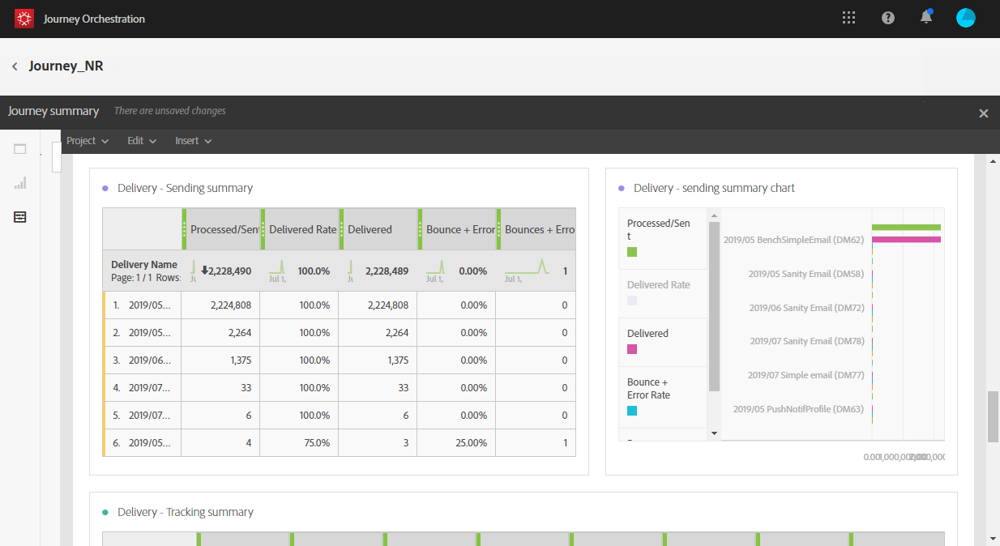

# Acerca de los informes de recorrido {#concept_rfj_wpt_52b}

>[!NOTE]
>
>Los datos de envío y el componente Segmentos solo se rellenarán si tiene Adobe Campaign Standard.

Esta sección le mostrará cómo acceder y utilizar los informes para medir la eficacia de sus viajes.

## Interfaz de informes {#reporting-interface}

La barra de herramientas superior permite, por ejemplo, modificar, guardar o imprimir el informe.

Utilice la **[!UICONTROL Project]** ficha para:

* **[!UICONTROL Open]**:: abre un informe o una plantilla creados anteriormente.
* **[!UICONTROL Save As]**:: duplicados para poder modificarlas.
* **[!UICONTROL Refresh project]**:: actualiza el informe en base a nuevos datos y a cambios en los filtros.
* **[!UICONTROL Download CSV]**:: exporta los informes a un archivo CSV.
* **[!UICONTROL Print]**:: imprime el informe.

La **[!UICONTROL Edit]** ficha le permite:

* **[!UICONTROL Undo]**:: cancela la última acción del panel.
* **[!UICONTROL Redo]**:: cancela la última **[!UICONTROL Undo]** acción del panel.
* **[!UICONTROL Clear all]**:: elimina todos los paneles del panel.

La **[!UICONTROL Insert]** tabla permite personalizar los informes agregando gráficos y tablas al panel:

* **[!UICONTROL New Blank Panel]**:: agrega un nuevo panel en blanco al panel.
* **[!UICONTROL New Freeform]**:: agrega una nueva tabla improvisada al panel.
* **[!UICONTROL New Line]**:: agrega un nuevo gráfico de líneas al panel.
* **[!UICONTROL New Bar]**:: agrega un nuevo gráfico de barras al panel.

Las fichas de la izquierda le permiten generar el informe y filtrar los datos según sea necesario.

Estas fichas le permiten acceder a los siguientes elementos:

* **[!UICONTROL Panels]**:: agregue un panel en blanco o una forma libre al informe para filtrar los datos en inicio. For more on this, refer to the [Adding panels](../reporting/creating-your-journey-reports.md#adding-panels) section
* **[!UICONTROL Visualizations]**:: arrastre y suelte una selección de elementos de visualización para dar al informe una dimensión gráfica. For more on this, refer to the [Adding visualizations](../reporting/creating-your-journey-reports.md#adding-visualizations) section.
* **[!UICONTROL Components]**:: personalice los informes con diferentes dimensiones, métricas, segmentos y períodos de tiempo. For more on this, refer to the [Adding components](../reporting/creating-your-journey-reports.md#adding-components) section.

## Plantilla de resumen de viajes {#ootb-template}

Los informes se dividen en dos categorías: una plantilla lista para usar e informes personalizados.
La plantilla lista para usar, **[!UICONTROL Journey summary]** le proporciona una vista clara de los datos de seguimiento más importantes.

Cada tabla está representada por números de resumen y gráficos. Puede cambiar la forma en que se muestran los detalles en sus respectivas configuraciones de visualización.

Los siguientes KPI están disponibles en la parte superior del informe:

* **[!UICONTROL Journey - Entered]**:: número total de personas que alcanzaron el evento de entrada del viaje.
* **[!UICONTROL Journey - Completion rate]**:: el número total de personas que llegaron al final del viaje (o en el caso de una persona que no cumplía ninguna condición) en comparación con el número total de personas que entraron en el viaje.
* **[!UICONTROL Journey - Current]**:: número total de personas que se encuentran en el viaje.
* **[!UICONTROL Journey - Failed rate]**:: número total de viajes que no se ejecutaron correctamente en comparación con el número de viajes de ejecución.
* **[!UICONTROL Delivery - Messages sent]**:: número total de mensajes enviados.
* **[!UICONTROL Delivery rate]**:: número total de mensajes enviados correctamente en comparación con los mensajes enviados.
* **[!UICONTROL Delivery - Bounce rate]**:: número total de mensajes devueltos en comparación con los mensajes enviados.
* **[!UICONTROL Delivery - Unsubscribed rate]**:: número total de cancelaciones de suscripción por destinatario en comparación con los mensajes enviados.
* **[!UICONTROL Delivery - Open rate]**:: número total de mensajes abiertos en comparación con el número de mensajes entregados.
* **[!UICONTROL Delivery - Click rate]**:: número total de clics en un envío en comparación con el número de mensajes enviados.

La visualización del flujo del viaje le permite ver la ruta de sus perfiles objetivo paso a paso a través de su viaje. Esto solo está disponible cuando se segmenta un viaje. Se genera automáticamente y no se puede modificar.

La **[!UICONTROL Journey summary]** tabla contiene los datos disponibles para el viaje, como:

* **[!UICONTROL Entered]**:: número total de personas que alcanzaron el evento de entrada del viaje.
* **[!UICONTROL Completion rate]**:: el número total de personas que alcanzaron el control de flujo final del viaje, en comparación con el número total de personas que entraron en el viaje.
* **[!UICONTROL Current]**:: número total de personas que se encuentran en el viaje.
* **[!UICONTROL Failed]**:: número total de viajes que no se ejecutaron correctamente.
* **[!UICONTROL Failed rate]**:: número total de viajes que no se ejecutaron correctamente en comparación con el número de viajes de ejecución.

La **[!UICONTROL Top events]** tabla muestra los eventos con mayor éxito y las acciones **[!UICONTROL Top action]** con mayor éxito en sus viajes.

La **[!UICONTROL Delivery - Sending summary]** tabla contiene los datos disponibles para los envíos del viaje, como:

* **[!UICONTROL Processed/sent]**:: número total de mensajes enviados.
* **[!UICONTROL Delivered rate]**:: número total de mensajes enviados correctamente en comparación con los mensajes enviados.
* **[!UICONTROL Delivered]**:: número de mensajes enviados correctamente, en relación con el número total de mensajes enviados.
* **[!UICONTROL Bounce + error rate]**:: número total de mensajes devueltos en comparación con los mensajes enviados.
* **[!UICONTROL Bounces + errors]**:: total de errores acumulados durante el envío y el procesamiento de devolución automático en relación con el número total de mensajes enviados.

La **[!UICONTROL Delivery - Tracking summary]** tabla contiene los datos disponibles para realizar el seguimiento del éxito de los envíos de los viajes, como:

* **[!UICONTROL Open Rate]**:: porcentaje de mensajes abiertos.
* **[!UICONTROL Open]**:: número de veces que se abrió un mensaje en un envío.
* **[!UICONTROL Click trough rate]**:: número total de clics en un envío en comparación con el número de mensajes enviados.
* **[!UICONTROL Click]**:: cantidad de veces que se hizo clic en un contenido en un envío.
* **[!UICONTROL Unsubscribe rate]**:: porcentaje de anulaciones de suscripciones por destinatario en comparación con los mensajes enviados.
* **[!UICONTROL Unsubscribed]**:: número total de cancelaciones de suscripción por destinatario en comparación con los mensajes enviados.
