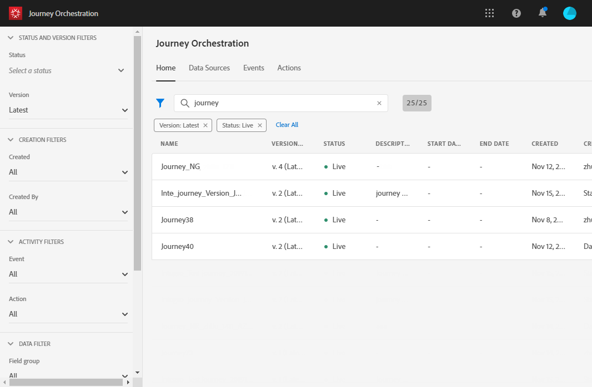

# Creación de informes de recorrido {#concept_rfj_wpt_52b}

## Acceso y creación de informes {#accessing-reports}

>[!NOTE]
>
>Después de eliminar un recorrido, todos los informes asociados ya no estarán disponibles.

En esta sección se muestra cómo crear o utilizar informes predeterminados. Combine paneles, componentes y visualizaciones para realizar un mejor seguimiento del éxito de sus recorridos.

Para acceder a los informes de sus recorridos y realizar un seguimiento del éxito de sus envíos:

1. En el menú superior, haga clic en la pestaña **[!UICONTROL Home]**.

1. Seleccione el recorrido sobre el que desea crear el informe.

   Tenga en cuenta que también puede acceder a los informes haciendo clic en **Informe** mientras pasa el ratón por encima de un recorrido en la lista de recorridos.

   

1. Haga clic en el icono **[!UICONTROL Report]** en la parte superior derecha de la pantalla.

   

1. El informe predeterminado **[!UICONTROL Journey summary]** aparece en pantalla. Para acceder a los informes personalizados, haga clic en el botón **[!UICONTROL Close]**.

   

1. Haga clic en **[!UICONTROL Create new project]** para crear su informe desde cero.

   

1. En la ficha **[!UICONTROL Panels]**, arrastre y suelte tantos paneles o tablas de forma libre como sea necesario. Para obtener más información, consulte esta [sección](#adding-panels).

   

1. A continuación, puede empezar a filtrar los datos arrastrando y soltando dimensiones y métricas de la pestaña **[!UICONTROL Components]** a la tabla de forma libre. Para obtener más información, consulte esta [sección](#adding-components).

   

1. Para tener una vista más clara de los datos, puede agregar visualizaciones desde la pestaña **[!UICONTROL Visualizations]**. Para obtener más información, consulte esta [sección](#adding-visualizations).

## Adición de paneles{#adding-panels}

### Añadir un panel en blanco {#adding-a-blank-panel}

Para iniciar el informe, puede agregar un conjunto de paneles a un informe predeterminado o personalizado. Cada panel contiene diferentes conjuntos de datos y está compuesto por tablas de forma libre y visualizaciones.

Este panel le permite crear los informes que necesite. Puede agregar tantos paneles como desee en los informes para filtrar los datos con diferentes periodos de tiempo.

1. Haga clic en el icono **[!UICONTROL Panels]**. También puede agregar un panel si hace clic en **[!UICONTROL Insert tab]** y selecciona **[!UICONTROL New Blank Panel]**.

   

1. Arrastre y suelte **[!UICONTROL Blank Panel]** en su panel.

   

Ahora puede agregar una tabla de forma libre al panel para comenzar a segmentar los datos.

### Adición de una tabla de forma libre {#adding-a-freeform-table}

Las tablas improvisadas le permiten crear una tabla para analizar los datos mediante las distintas métricas y dimensiones disponibles en la tabla **[!UICONTROL Component]**.

Es posible cambiar el tamaño de cada tabla y visualización, y estas se pueden mover para personalizar mejor el informe.

1. Haga clic en el icono **[!UICONTROL Panels]**.

   

1. Arrastre y suelte el elemento **[!UICONTROL Freeform]** en su panel.

   También puede agregar una tabla si hace clic en la ficha **[!UICONTROL Insert]** y selecciona **[!UICONTROL New Freeform]** o si hace clic en **[!UICONTROL Add a freeform table]** en un panel vacío.

   

1. Arrastre y suelte elementos de la ficha **[!UICONTROL Components]** en las columnas y filas para generar la tabla.

   

1. Haga clic en el icono **[!UICONTROL Settings]** para cambiar la forma en que se muestran los datos en las columnas.

   

   **[!UICONTROL Column settings]** está compuesto por:

   * **[!UICONTROL Number]**: permite mostrar u ocultar números de resumen en la columna.
   * **[!UICONTROL Percent]**: permite mostrar u ocultar porcentajes en la columna.
   * **[!UICONTROL Interpret zero as no value]**: permite mostrar u ocultar cuando el valor es igual a cero.
   * **[!UICONTROL Background]**: permite mostrar u ocultar la barra de progreso horizontal en las celdas.
   * **[!UICONTROL Include retries]**: permite incluir reintentos en el resultado. Esto solo está disponible para **[!UICONTROL Sent]** y **[!UICONTROL Bounces + Errors]**.

1. Seleccione una o varias filas y haga clic en el icono **[!UICONTROL Visualize]**. Se agrega una visualización para reflejar las filas seleccionadas.

   

Ahora puede añadir tantos componentes como necesite y también añadir visualizaciones para proporcionar representaciones gráficas de los datos.

## Adición de componentes{#adding-components}

Los componentes ayudan a personalizar los informes con diferentes dimensiones, métricas y períodos de tiempo.

1. Haga clic en la ficha **[!UICONTROL Components]** para acceder a la lista de componentes.

   

1. Cada categoría presentada en la ficha **[!UICONTROL Components]** muestra los cinco elementos más utilizados; haga clic en el nombre de una categoría para acceder a su lista completa de componentes.

   La tabla de componentes se divide en tres categorías:

   * **[!UICONTROL Dimensions]**: obtenga detalles del registro de envíos, como el explorador o el dominio del destinatario, o el éxito de una entrega.
   * **[!UICONTROL Metrics]**: obtenga detalles sobre el estado de un mensaje. Por ejemplo, si un mensaje se entregó y el usuario lo abrió.
   * **[!UICONTROL Time]**: establezca un período de tiempo para la tabla.

1. Arrastre y suelte los componentes en un panel para filtrar los datos.

Puede arrastrar y soltar tantos componentes como sea necesario y compararlos entre sí.

## Adición de visualizaciones{#adding-visualizations}

La pestaña **[!UICONTROL Visualizations]** le permite arrastrar y soltar elementos de visualización, como área, anillo y gráfico. Las visualizaciones le proporcionan representaciones gráficas de los datos.

1. En la pestaña **[!UICONTROL Visualizations]**, arrastre y suelte un elemento de visualización en un panel.

   

1. Después de agregar una visualización al panel, los informes detectarán automáticamente los datos de la tabla de forma libre. Seleccione la configuración de la visualización.
1. Si tiene más de una tabla de forma libre, elija el origen de datos disponible para agregar en el gráfico en la ventana **[!UICONTROL Data Source Settings]**. Esta ventana también está disponible si hace clic en el punto de color situado junto al título de la visualización.

   

1. Haga clic en el botón de configuración **[!UICONTROL Visualization]** para cambiar directamente el tipo de gráfico o lo que se muestra en él, como:

   * **[!UICONTROL Percentages]**: muestra los valores en forma de porcentaje.
   * **[!UICONTROL Anchor Y Axis at Zero]**: fuerza el eje Y a ser cero incluso si los valores están por encima de cero.
   * **[!UICONTROL Legend visible]**: permite ocultar la leyenda.
   * **[!UICONTROL Normalization]**: fuerza la coincidencia de los valores.
   * **[!UICONTROL Display Dual Axis]**: agrega otro eje al gráfico.
   * **[!UICONTROL Limit Max Items]**: limita el número de gráficos mostrados.
   * **[!UICONTROL Threshold]**: permite establecer un umbral en el gráfico. Aparece como una línea de puntos negra.

   

Esta visualización le permite tener una vista más clara de los datos en los informes.
