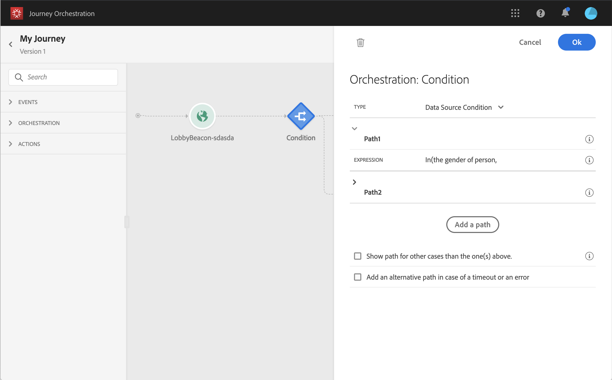

# Uso de segmentos en condiciones {#using-a-segment}

>[!CAUTION]
>
>¿**Busca Adobe Journey Optimizer**? Haga clic [aquí](https://experienceleague.adobe.com/es/docs/journey-optimizer/using/ajo-home){target="_blank"} para obtener la documentación de Journey Optimizer.
>
>
>_Esta documentación hace referencia a materiales de Journey Orchestration heredados que han sido reemplazados por Journey Optimizer. Póngase en contacto con su equipo de cuentas si tiene alguna pregunta sobre el acceso a Journey Orchestration o Journey Optimizer._

En esta sección se explica cómo utilizar un segmento en una condición de recorrido. Para aprender a utilizar un evento **[!UICONTROL Segment qualification]** en el recorrido, consulte esta [sección](../building-journeys/segment-qualification-events.md).

Para utilizar un segmento en una condición de recorrido, siga estos pasos:

1. Abra un recorrido, suelte una actividad **[!UICONTROL Condition]** y elija la **condición de Source de datos**.
   

1. Haga clic en **[!UICONTROL Add a path]** para cada ruta adicional necesaria. Para cada ruta, haga clic en el campo **[!UICONTROL Expression]**.

   

1. En el lado izquierdo, despliegue el nodo **[!UICONTROL Segments]**. Arrastre y suelte el segmento que desee utilizar para la condición. De forma predeterminada, la condición del segmento es verdadera.

   

   >[!NOTE]
   >
   >Solo las personas con los estados de participación en los segmentos **Realized** y **Existing** se considerarán como miembros del segmento. Para obtener más información sobre cómo evaluar un segmento, consulte la [documentación del servicio de segmentación](https://experienceleague.adobe.com/docs/experience-platform/segmentation/tutorials/evaluate-a-segment.html?lang=en#interpret-segment-results).

Para obtener más información sobre las condiciones de recorrido y cómo usar el editor de expresiones simple, consulte [Actividad de la condición](../building-journeys/condition-activity.md#about_condition).
