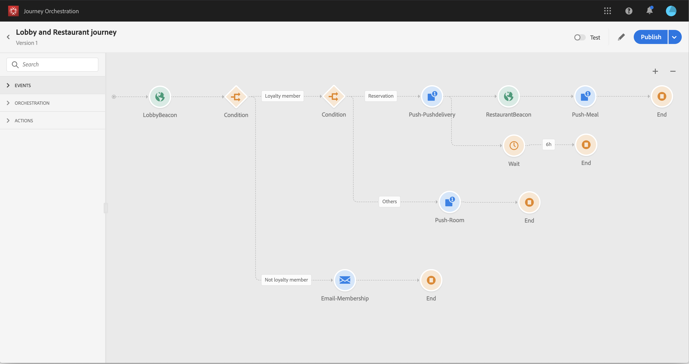

# Acerca del caso de uso avanzado{#concept_vzy_ncy_w2b}

>[!CAUTION]
>
>**Busca Adobe Journey Optimizer**? Haga clic [aquí](https://experienceleague.adobe.com/es/docs/journey-optimizer/using/ajo-home){target="_blank"} para obtener la documentación de Journey Optimizer.
>
>
>_Esta documentación hace referencia a materiales Journey Orchestration heredados que han sido reemplazados por Journey Optimizer. Póngase en contacto con el equipo de su cuenta si tiene preguntas sobre su acceso a Journey Orchestration o Journey Optimizer._

## Objetivo {#purpose}

Veamos el ejemplo de una marca hotelera llamada Marlton. En sus hoteles, han colocado dispositivos de señalización cerca de todas las áreas estratégicas: vestíbulo, pisos, restaurante, gimnasio, piscina, etc.

>[!NOTE]
>
>En este caso de uso, utilizamos Adobe Campaign Standard para enviar mensajes.

En este caso de uso, veremos cómo enviar mensajes personalizados en tiempo real a los clientes cuando se acerquen a una señalización específica.

En primer lugar, queremos enviar un mensaje tan pronto como una persona entre en un hotel de Marlton. Queremos enviar un mensaje solo si la persona no ha recibido ninguna comunicación nuestra dentro de las últimas 24 horas.

Luego comprobamos dos condiciones:

* Si esta persona no es un miembro socio, le enviamos un correo electrónico para que se una a la oferta de membresía socio.
* Si esta persona ya es un miembro socio, comprobamos si tiene una reserva de habitación:
   * Si no lo hace, les enviamos una notificación push con las tarifas de las habitaciones.
   * Si lo hace, les enviamos una notificación push de bienvenida. Y si entra en el restaurante dentro de las próximas 6 horas, les enviamos una notificación push con un descuento en una comida.

Para este caso de uso, necesitaremos crear dos eventos (vea [esta página](../usecase/configuring-the-events.md)):

* El evento de señalización del vestíbulo que se insertará en el sistema cuando un cliente entre en el hotel.
* El evento de señalización de restaurante que se insertará cuando un cliente entre en el restaurante.

Tendremos que configurar una conexión a dos orígenes de datos (vea [esta página](../usecase/configuring-the-data-sources.md)):

* La fuente de datos integrada de Adobe Experience Platform para recuperar la información de nuestras dos condiciones (pertenencia por fidelidad y fecha de último contacto), así como la información de personalización del mensaje.
* El sistema de reserva del hotel, para recuperar la información del estado de reserva.

## Requisitos previos {#prerequisites}

Para nuestro caso de uso, hemos diseñado tres plantillas de mensajería transaccional de Adobe Campaign Standard. Estamos utilizando plantillas de mensajería transaccional de eventos. Consulte [esta página](https://experienceleague.adobe.com/docs/campaign-standard/using/communication-channels/transactional-messaging/getting-started-with-transactional-msg.html?lang=es).

Adobe Campaign Standard está configurado para enviar correos electrónicos y notificaciones push.

El Experience Cloud ID se utiliza como clave para identificar al cliente en el sistema de reservas de hoteles.

Los eventos se envían desde el teléfono móvil de los clientes cuando se detectan cerca de una baliza. Debe diseñar una aplicación móvil para enviar eventos desde el teléfono móvil del cliente al SDK móvil.

El campo Miembro socio es un campo personalizado y se añadió en XDM para el ID de organización específico.
