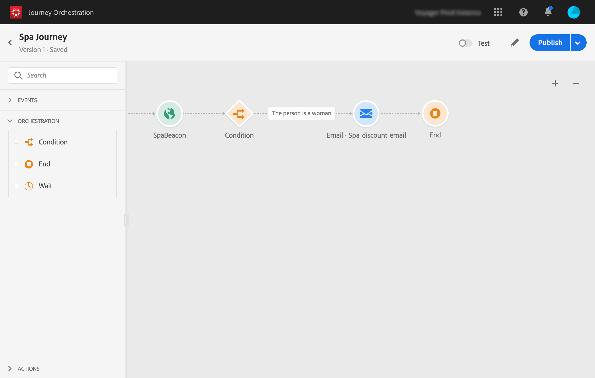

# Acerca del caso de uso simple{#concept_grh_vby_w2b}

## Objetivo {#purpose}

Veamos el ejemplo de una marca de hotel llamada Marlton. En sus hoteles, han colocado dispositivos de señalización cerca de todas las áreas estratégicas: vestíbulo, pisos, restaurante, gimnasio, piscina, etc.

En este caso de uso, veremos cómo enviar un mensaje personalizado en tiempo real a una persona que camina junto a una señalización situada cerca del spa.

Queremos enviar un mensaje solo si la persona es mujer. El mensaje debe recibirse en segundos.

## Requisitos previos {#prerequisites}

Para nuestro caso de uso, hemos diseñado una plantilla de mensajería transaccional de correo electrónico en Adobe Campaign Standard. Estamos utilizando una plantilla de mensajería transaccional de eventos. Consulte [esta página](https://experienceleague.adobe.com/docs/campaign-standard/using/communication-channels/transactional-messaging/getting-started-with-transactional-msg.html).

Adobe Campaign Standard está configurado para enviar correos electrónicos.

Los eventos se envían desde el teléfono móvil de los clientes cuando se detectan cerca de una señalización. Debe diseñar una aplicación móvil para enviar eventos desde el teléfono móvil del cliente al SDK móvil.
