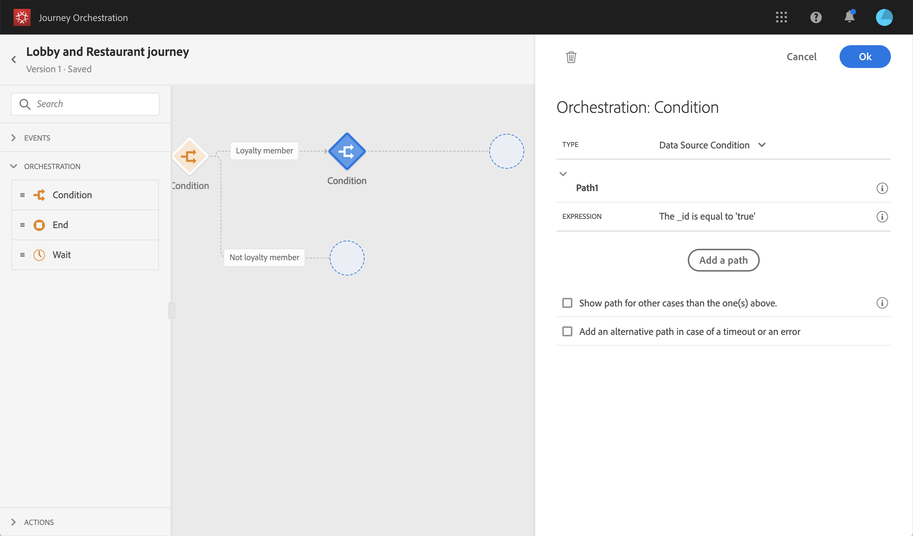

# Construcción del recorrido {#concept_owm_kdy_w2b}

El **usuario empresarial** ahora puede compilar el recorrido. El recorrido incluirá las siguientes actividades:

* dos actividades **[!UICONTROL Event]** : &quot;LobbyBeacon&quot; y &quot;RestaurantBeacon&quot;
* dos **[!UICONTROL Condition]** actividades
* tres actividades **[!UICONTROL Push]** y una actividad **[!UICONTROL Email]** (con Adobe Campaign Standard)
* una actividad **[!UICONTROL Wait]**
* cuatro **[!UICONTROL End]** actividades

>[!NOTE]
>
>Las actividades **[!UICONTROL Push]** y **[!UICONTROL Email]** solo están disponibles en la paleta si tiene Adobe Campaign Standard.

Para obtener información adicional sobre cómo crear un recorrido, consulte [esta página](../building-journeys/journey.md).

## Primeros pasos{#section_ntb_ws1_ffb}

1. En el menú superior, haga clic en la pestaña **[!UICONTROL Home]** y **[!UICONTROL Create]** para crear un nuevo recorrido.

   

1. Edite las propiedades del recorrido en el panel de configuración que se muestra en el lado derecho. Añada un nombre y configúrelo para que dure un mes, del 1 al 31 de diciembre.

   

1. Para diseñar el recorrido, arrastre y suelte el evento &quot;LobbyBeacon&quot; de la paleta al lienzo. También puede hacer doble clic en el evento de la paleta para agregarlo al lienzo.

   

1. Ahora vamos a agregar una condición para verificar que la persona no haya sido contactada en las últimas 24 horas y verificar si es un miembro socio. Arrastre y suelte una actividad de condición en el recorrido.

   

1. Elija el tipo **[!UICONTROL Data Source Condition]** y haga clic en el campo **[!UICONTROL Expression]** . También puede definir una etiqueta de condición que aparecerá en la flecha del lienzo. En nuestro ejemplo, reemplazamos &quot;Condición 1&quot; por &quot;Miembro socio&quot;.

   

1. Haga clic en **[!UICONTROL Advanced mode]** y defina la siguiente condición en función de los campos &quot;marca de tiempo&quot; y &quot;directMarketing.send.value&quot; procedentes de la fuente de datos de Adobe Experience Platform. La sintaxis de la expresión es:

   ```
   count(#{ExperiencePlatformDataSource.MarltonExperience.experienceevent.all(
       currentDataPackField.directMarketing.sends.value > 0 and
       currentDataPackField.timestamp > nowWithDelta(-1, "days")).timestamp}) == 0
   and
       #{ExperiencePlatformDataSource.MarltonProfiles.Profile._customer.marlton.loyaltyMember}
   ```

   

1. Haga clic en el botón **[!UICONTROL Add a path]** y cree una segunda ruta para los clientes a los que no hayan sido contactados en las últimas 24 horas y que no son miembros socio. Asigne a la ruta el nombre &quot;No es miembro socio&quot;. La sintaxis de la expresión es:

   ```
   count(#{ExperiencePlatformDataSource.MarltonExperience.experienceevent.all(
       currentDataPackField.directMarketing.sends.value > 0 and
       currentDataPackField.timestamp > nowWithDelta(-1, "days").timestamp}) == 0
   and not
       #{ExperiencePlatformDataSource.MarltonProfiles.Profile._customer.marlton.loyaltyMember}
   ```

   >[!NOTE]
   >
   >En la segunda parte de la expresión, el &quot;Perfil&quot; es opcional.

1. Necesitamos seleccionar un área de nombres. Un área de nombres está preseleccionada en función de las propiedades de esquema. Puede mantener la preseleccionada. Para obtener más información sobre áreas de nombres, consulte [esta página](../event/selecting-the-namespace.md).

En nuestro caso de uso, solo queremos reaccionar a esas dos condiciones, así que no marcamos la casilla **[!UICONTROL Show path for other cases than the one(s) above]**.

Después de la condición se crean dos rutas:

* _Clientes que no hayan sido contactados en las últimas 24 horas y que son miembros socio._
* _Clientes que no hayan sido contactados en las últimas 24 horas y que no son miembros socio._


## Primera ruta: el cliente es un miembro socio {#section_otb_ws1_ffb}

1. En la primera ruta, vamos a añadir una condición para comprobar si tiene una reserva. Arrastre y suelte una actividad de condición en el recorrido.

   

1. Elija el tipo **[!UICONTROL Data Source Condition]** y defina la condición en función de la información del estado de reserva recuperada del sistema de reservas:

   ```
   #{MarltonReservation.MarltonFieldGroup.reservation} == true
   ```

   

1. Cuando se selecciona un campo de una fuente de datos externa, la parte derecha de la pantalla muestra la lista de parámetros que se definieron al configurar la fuente de datos externa (consulte [esta página](../usecase/configuring-the-data-sources.md)). Haga clic en el nombre del parámetro y defina el valor de la clave del sistema reservas, la ID de Experience Cloud, en nuestro ejemplo:

   ```
   @{LobbyBeacon.endUserIDs._experience.mcid.id}
   ```

   

1. Como también queremos reaccionar ante los clientes que no tienen reserva, tenemos que marcar la casilla **[!UICONTROL Show path for other cases than the one(s) above]**.

   

   Se crean dos rutas:

   * _Clientes que han reservado una habitación_
   * _Clientes que no han reservado una habitación._

   

1. En la primera ruta (habitación reservada), suelte una actividad **[!UICONTROL Push]** , seleccione la aplicación móvil y la plantilla &quot;bienvenida&quot;.

   

1. Defina los campos **[!UICONTROL Target]** requeridos por el sistema para enviar la notificación push.

   * **[!UICONTROL Push platform]**: seleccione la plataforma: **[!UICONTROL Apple Push Notification Server]** (Apple) o **[!UICONTROL Firebase Cloud Messaging]** (Android).
   * **[!UICONTROL Registration token]**: añada la siguiente expresión (según el evento configurado) mediante el modo avanzado:

      ```
      @{LobbyBeacon._experience.campaign.message.profileSnapshot.pushNotificationTokens.first().token}
      ```

1. Defina los campos de personalización de la notificación push. En nuestro ejemplo: nombre y apellido.

1. Añada el evento &quot;RestaurantBeacon&quot;.

   

1. Añada una nueva actividad **[!UICONTROL Push]** , seleccione la plantilla &quot;Descuento en la comida&quot; y defina los campos **[!UICONTROL Address]** y **[!UICONTROL Personalization]** . Añada una actividad **[!UICONTROL End]**. 

   

1. Queremos enviar una notificación push de descuento en la comida solo si la persona entra al restaurante dentro de las 6 horas siguientes después de la notificación push de bienvenida. Para hacerlo, necesitamos usar una actividad de espera. Coloque el cursor en la actividad push de bienvenida y haga clic en el símbolo &quot;+&quot;. En la nueva ruta, añada una actividad de espera y defina una duración de 6 horas. Se escoge la primera actividad elegible. Si el evento del restaurante se recibe menos de 6 horas después de la notificación push de bienvenida, se envía la actividad push. Si no se recibe ningún evento en las próximas 6 horas, se elige la espera. Coloque una actividad **[!UICONTROL End]** después de la actividad de espera.

   

1. En la segunda ruta que sigue la condición de reserva (sin habitación reservada), añada una actividad **[!UICONTROL Push]** y seleccione la plantilla &quot;Tarifas de habitación&quot;. Añada una actividad **[!UICONTROL End]**. 

   

## Segunda ruta: el cliente no es un miembro socio{#section_ptb_ws1_ffb}

1. En la segunda ruta que sigue a la primera condición (el cliente no es un miembro socio), añada una actividad **[!UICONTROL Email]** y seleccione la plantilla &quot;Membresía de socios&quot;.

   

1. En el campo **[!UICONTROL Address]** , seleccione la dirección de correo electrónico de la fuente de datos.

   

1. Defina los campos de personalización de nombre y apellido de la fuente de datos.

   

1. Añada una actividad **[!UICONTROL End]**. 

Haga clic en la opción **[!UICONTROL Test]** y pruebe el recorrido. Si hay algún error, desactive el modo de prueba, modifique el recorrido y pruebe de nuevo. Para obtener más información sobre el modo de prueba, consulte [esta página](../building-journeys/testing-the-journey.md).


Cuando la prueba sea concluyente, puede publicar el recorrido del menú desplegable superior derecho.


