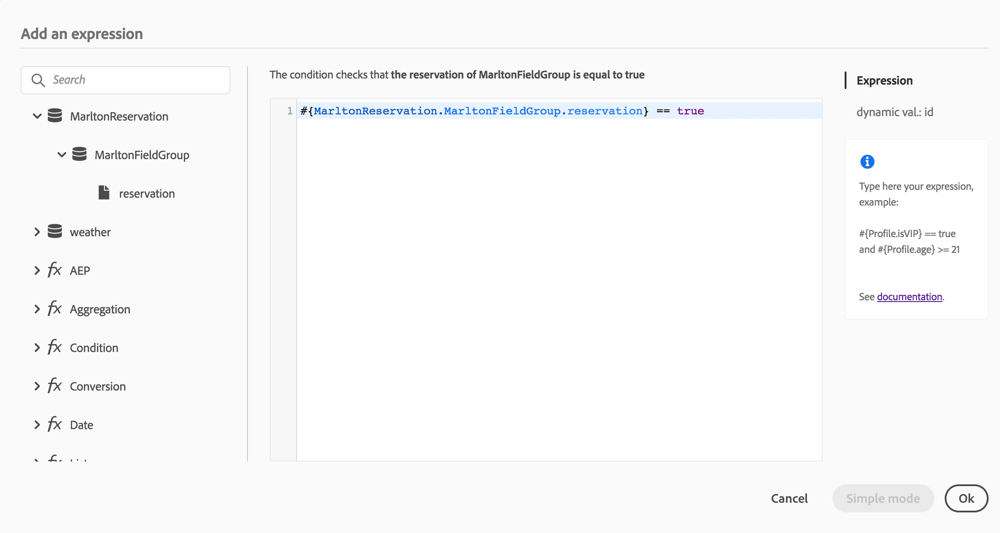

# Construcción del recorrido {#concept_owm_kdy_w2b}

El usuario **** empresarial ahora puede construir el viaje. Nuestro viaje incluirá las siguientes actividades:

* dos **[!UICONTROL Event]** actividades: &quot;LobbyBeacon&quot; y &quot;RestaurantBeacon&quot;
* dos **[!UICONTROL Condition]** actividades
* tres **[!UICONTROL Push]** actividades y una **[!UICONTROL Email]** actividad (con Adobe Campaign Standard)
* una actividad **[!UICONTROL Wait]**
* cuatro **[!UICONTROL End]** actividades

>[!NOTE]
>
>Las actividades **[!UICONTROL Push]** y **[!UICONTROL Email]** solo están disponibles en la paleta si tiene Adobes Campaign Standard.

Para obtener información adicional sobre cómo construir un viaje, consulte [](../building-journeys/journey.md).

## Primeros pasos{#section_ntb_ws1_ffb}

1. En el menú superior, haga clic en la **[!UICONTROL Home]** ficha y **[!UICONTROL Create]** cree un nuevo viaje.

   

1. Edite las propiedades del viaje en el panel de configuración que se muestra en el lado derecho. Añada un nombre y configúrelo para que dure un mes, del 1 al 31 de diciembre.

   

1. Para diseñar el viaje, arrastre y suelte el evento &quot;LobbyBeacon&quot; de la paleta al lienzo. También puede hacer clic con el botón doble en el evento de la paleta para agregarlo al lienzo.

   

1. Ahora vamos a agregar una condición para verificar que la persona no ha sido contactada en las últimas 24 horas y verificar si es un miembro leal. Arrastre y suelte una actividad de condición en el viaje.

   

1. Elija el **[!UICONTROL Data Source Condition]** tipo y haga clic en el **[!UICONTROL Expression]** campo. También puede definir una etiqueta de condición que aparecerá en la flecha, en el lienzo. En nuestro ejemplo, reemplazamos &quot;Condición 1&quot; por &quot;Miembro de lealtad&quot;.

   

1. Haga clic en **[!UICONTROL Advanced mode]** y defina la siguiente condición en función de los campos &quot;timestamp&quot; y &quot;directMarketing.send.value&quot; procedentes del origen de datos de Adobe Experience Platform. La sintaxis de la expresión es:

   ```
   count(#{ExperiencePlatformDataSource.MarltonExperience.experienceevent.all(
       currentDataPackField.directMarketing.sends.value > 0 and
       currentDataPackField.timestamp > nowWithDelta(-1, "days")).timestamp}) == 0
   and
       #{ExperiencePlatformDataSource.MarltonProfiles.Profile._customer.marlton.loyaltyMember}
   ```

   

1. Haga clic en el **[!UICONTROL Add a path]** botón y cree una segunda ruta para los clientes a los que no se ha contactado en las últimas 24 horas y que no son miembros leales. Asigne a la ruta el nombre &quot;No es miembro de lealtad&quot;. La sintaxis de la expresión es:

   ```
   count(#{ExperiencePlatformDataSource.MarltonExperience.experienceevent.all(
       currentDataPackField.directMarketing.sends.value > 0 and
       currentDataPackField.timestamp > nowWithDelta(-1, "days").timestamp}) == 0
   and not
       #{ExperiencePlatformDataSource.MarltonProfiles.Profile._customer.marlton.loyaltyMember}
   ```

   >[!NOTE]
   >
   >En la segunda parte de la expresión, el &quot;Perfil&quot; es opcional.

1. Necesitamos seleccionar una Área de nombres. Una Área de nombres está preseleccionada en función de las propiedades de esquema. Puede mantener el preseleccionado. Para obtener más información sobre Áreas de nombres, consulte [](../event/selecting-the-namespace.md).

En nuestro caso de uso, solo queremos reaccionar a esas dos condiciones, así que no marcamos la casilla **[!UICONTROL Show path for other cases than the one(s) above]**.

Después de la condición se crean dos rutas:

* _Clientes que no han sido contactados en las últimas 24 horas y que son miembros leales._
* _Clientes que no han sido contactados en las últimas 24 horas y que no son miembros leales._


## Primera ruta: el cliente es un miembro de fidelidad {#section_otb_ws1_ffb}

1. En el primer camino, vamos a agregar una condición para comprobar si tiene una reserva. Arrastre y suelte una actividad de condición en el viaje.

   

1. Elija el **[!UICONTROL Data Source Condition]** tipo y defina la condición en función de la información de estado de reserva recuperada del sistema de reservas:

   ```
   #{MarltonReservation.MarltonFieldGroup.reservation} == true
   ```

   

1. Cuando se selecciona un campo de un origen de datos externo, la parte derecha de la pantalla muestra la lista de parámetros que se definieron al configurar el origen de datos externo (consulte [](../usecase/configuring-the-data-sources.md)). Haga clic en el nombre del parámetro y defina el valor de la clave del sistema de reservación, la ID del Experience Cloud, en nuestro ejemplo:

   ```
   @{LobbyBeacon.endUserIDs._experience.mcid.id}
   ```

   

1. Como también queremos reaccionar a los clientes que no tienen reserva, tenemos que marcar la casilla **[!UICONTROL Show path for other cases than the one(s) above]**.

   

   Se crean dos rutas:

   * _Clientes que han reservado una habitación_
   * _Clientes que no han reservado una habitación._

   

1. En la primera ruta (habitación reservada), suelte una **[!UICONTROL Push]** actividad, seleccione la aplicación móvil y la plantilla de &quot;bienvenida&quot;.

   

1. Defina los **[!UICONTROL Target]** campos requeridos por el sistema para enviar la notificación push.

   * **[!UICONTROL Push platform]**:: seleccione la plataforma: **[!UICONTROL Apple Push Notification Server]** (Apple) o **[!UICONTROL Firebase Cloud Messaging]** (Android).
   * **[!UICONTROL Registration token]**:: agregue la siguiente expresión (según el evento configurado) mediante el modo avanzado:

      ```
      @{LobbyBeacon._experience.campaign.message.profileSnapshot.pushNotificationTokens.first().token}
      ```

1. Defina los campos de personalización de notificación Push. En nuestro ejemplo: nombre y apellidos.

1. Añada un evento &quot;RestaurantBeacon&quot;.

   

1. Añada una nueva **[!UICONTROL Push]** actividad, seleccione la plantilla &quot;Descuento de la comida&quot; y defina los campos **[!UICONTROL Address]** y **[!UICONTROL Personalization]** . Añada una **[!UICONTROL End]** actividad.

   

1. Queremos enviar una notificación push de descuento por comida sólo si la persona entra al restaurante dentro de las siguientes 6 horas después de la notificación de bienvenida. Para hacerlo, necesitamos usar una actividad de espera. Coloque el cursor en la actividad push de bienvenida y haga clic en el símbolo &quot;+&quot;. En la nueva ruta, agregue una actividad de espera y defina una duración de 6 horas. Se elegirá la primera actividad elegible. Si el evento del restaurante se recibe menos de 6 horas después de la notificación de bienvenida, se envía la actividad push. Si no se recibe ningún evento en las próximas 6 horas, se elige la espera. Coloque una **[!UICONTROL End]** actividad después de la actividad de espera.

   

1. En la segunda ruta que sigue la condición de reserva (sin habitación reservada), agregue una **[!UICONTROL Push]** actividad y seleccione la plantilla &quot;Tarifas de habitación&quot;. Añada una **[!UICONTROL End]** actividad.

   

## Segunda ruta: el cliente no es un miembro de fidelidad{#section_ptb_ws1_ffb}

1. En la segunda ruta que sigue a la primera condición (el cliente no es miembro de lealtad), agregue una **[!UICONTROL Email]** actividad y seleccione la plantilla &quot;Membresía de lealtad&quot;.

   

1. En el **[!UICONTROL Address]** campo, seleccione la dirección de correo electrónico del origen de datos.

   

1. Defina los campos de personalización de nombre y apellidos del origen de datos.

   

1. Añada una **[!UICONTROL End]** actividad.

Haga clic en la **[!UICONTROL Test]** opción y pruebe el viaje. Si hay algún error, desactive el modo de prueba, modifique el viaje y pruébelo de nuevo. For more information on the test mode, refer to [](../building-journeys/testing-the-journey.md).


Cuando la prueba sea concluyente, puede publicar el viaje desde el menú desplegable superior derecho.


