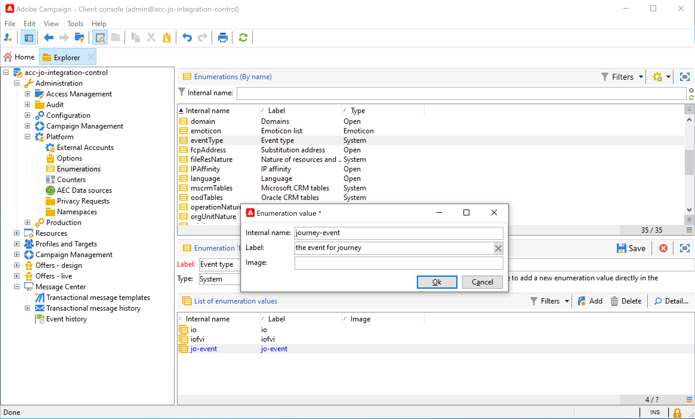
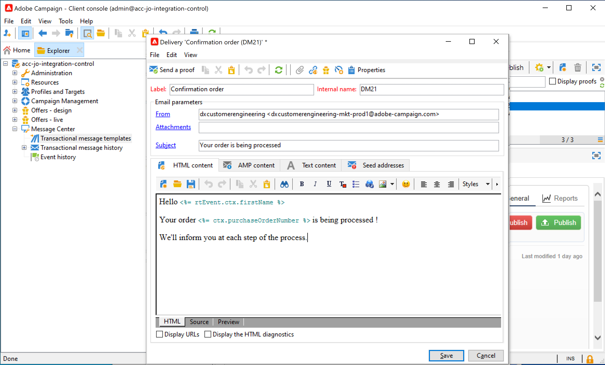
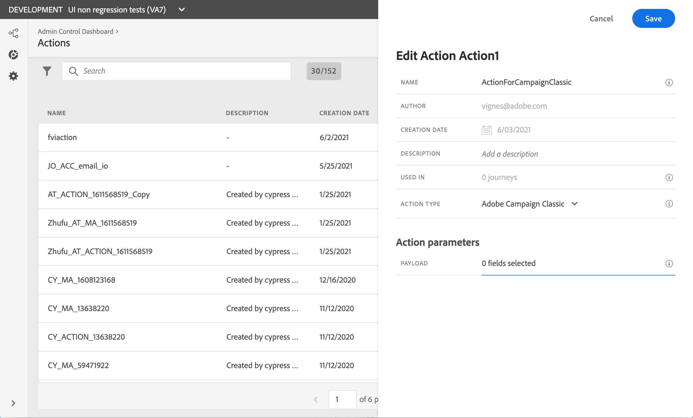
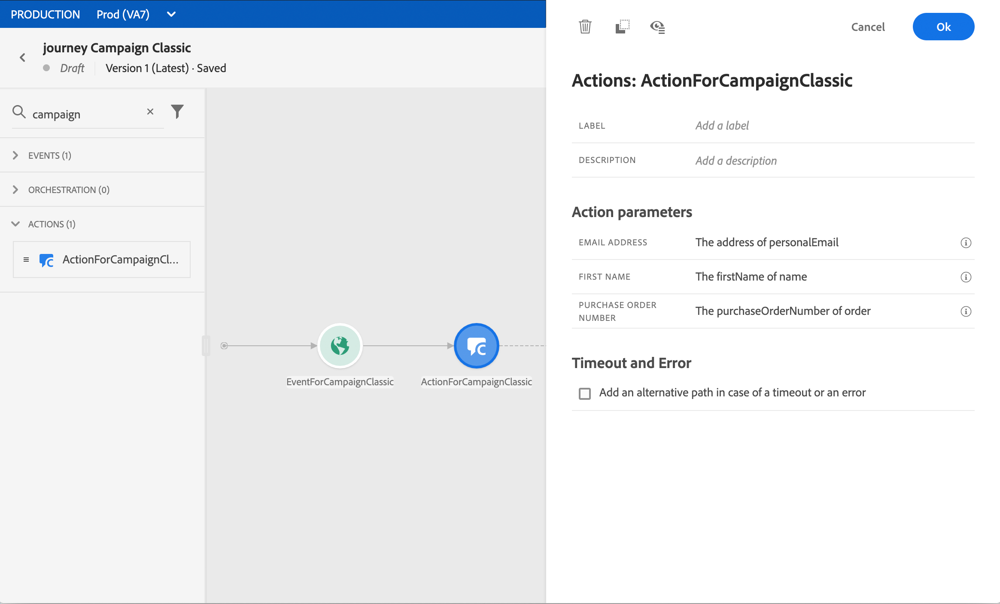

# Envío de un mensaje mediante el Campaign Classic {#campaign-classic-use-case}

Este caso de uso presenta todos los pasos necesarios para enviar un correo electrónico mediante la integración de Adobe Campaign Classic.

Primero crearemos una plantilla de correo electrónico transaccional en Campaign Classic. Luego, en Journey Orchestration, crearemos la acción y diseñaremos el recorrido.

Para obtener más información sobre la integración del Campaign Classic, consulte estas páginas:

* [Creación de una acción del Campaign Classic](../action/acc-action.md)
* [Uso de la acción en un recorrido](../building-journeys/using-adobe-campaign-classic.md).

**Adobe Campaign Classic**

La instancia de Campaign Classic debe aprovisionarse para esta integración. La función Mensajería transaccional debe configurarse.

1. Inicie sesión en la instancia de control de Campaign Classic.

1. En **Administration** > **Platform** > **Enumerations**, seleccione la enumeración **Event type** (eventType). Cree un nuevo tipo de evento (&quot;recorrido-evento&quot;, en nuestro ejemplo). Deberá utilizar el nombre interno del tipo de evento al escribir el archivo JSON.

   

1. Desconecte y vuelva a conectar con la instancia para que la creación sea efectiva.

1. En **Message Center** > **Transactional message templates**, cree una nueva plantilla de correo electrónico basada en el tipo de evento creado anteriormente.

   

1. Diseñe la plantilla. En este ejemplo, se utiliza la personalización en el nombre del perfil y el número de pedido. El nombre se encuentra en la fuente de datos de Adobe Experience Platform y el número de pedido es un campo del evento de Journey Orchestration. Asegúrese de utilizar los nombres de campo correctos en Campaign Classic.

   

1. Publique la plantilla transaccional.

   

1. Ahora debe escribir la carga útil JSON correspondiente a la plantilla.

```
{
     "channel": "email",
     "eventType": "journey-event",
     "email": "Email address",
     "ctx": {
          "firstName": "First name", "purchaseOrderNumber": "Purchase order number"
     }
}
```

    * Para el canal, debe escribir &quot;correo electrónico&quot;.
    * Para eventType, utilice el nombre interno del tipo de evento creado anteriormente.
    * La dirección de correo electrónico es una variable, por lo que puede escribir cualquier etiqueta.
    * En ctx, los campos de personalización también son variables.

**Journey Orchestration**

1. En primer lugar, debe crear un evento. Asegúrese de incluir &quot;purchaseOrderNumber&quot;.

   

1. A continuación, debe crear, en Journey Orchestration, una acción correspondiente a la plantilla de Campaign Classic. En la lista desplegable **Action type**, seleccione **Adobe Campaign Classic**.

   

1. Haga clic en **Payload field** y pegue el JSON creado anteriormente.

   

1. Para la dirección de correo electrónico y dos campos de personalización, cambie **Constant** a **Variable**.

   

1. Ahora cree un nuevo recorrido y comience con el evento creado anteriormente.

   

1. Añada la acción y asigne cada campo al campo correcto en el Journey Orchestration .

   

1. Agregue una actividad **End** y pruebe el recorrido.

   

1. Ahora puede publicar su recorrido.
