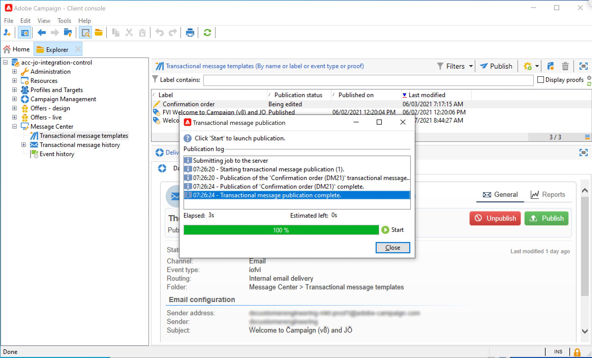

# Envío de un mensaje mediante Campaign v7/v8 {#campaign-classic-use-case}

Este caso de uso presenta todos los pasos necesarios para enviar un correo electrónico mediante la integración con Adobe Campaign Classic v7 y Adobe Campaign v8.

Primero crearemos una plantilla de correo electrónico transaccional en Campaign. Luego, en Journey Orchestration, crearemos el evento, la acción y el diseño del recorrido.

Para obtener más información sobre la integración de Campaign, consulte estas páginas:

* [Creación de una acción de campaña](../action/acc-action.md)
* [Uso de la acción en un recorrido](../building-journeys/using-adobe-campaign-classic.md).

**Adobe Campaign**

La instancia de Campaign debe aprovisionarse para esta integración. La función Mensajería transaccional debe configurarse.

1. Inicie sesión en la instancia de control de Campaign.

1. En **Administración** > **Plataforma** > **Enumeraciones**, seleccione **Tipo de evento** enumeración (eventType). Cree un nuevo tipo de evento (&quot;recorrido-evento&quot;, en nuestro ejemplo). Deberá utilizar el nombre interno del tipo de evento al escribir el archivo JSON más adelante.

   

1. Desconecte y vuelva a conectar con la instancia para que la creación sea efectiva.

1. En **Centro de mensajes** > **Plantillas de mensajes transaccionales**, cree una nueva plantilla de correo electrónico basada en el tipo de evento creado anteriormente.

   

1. Diseñe la plantilla. En este ejemplo, se utiliza la personalización en el nombre del perfil y el número de pedido. El nombre se encuentra en la fuente de datos de Adobe Experience Platform y el número de pedido es un campo del evento de Journey Orchestration. Asegúrese de utilizar los nombres de campo correctos en Campaign.

   

1. Publique la plantilla transaccional.

   

1. Ahora debe escribir la carga útil JSON correspondiente a la plantilla.

```
{
     "channel": "email",
     "eventType": "journey-event",
     "email": "Email address",
     "ctx": {
          "firstName": "First name", "purchaseOrderNumber": "Purchase order number"
     }
}
```

* Para el canal, debe escribir &quot;correo electrónico&quot;.
* Para eventType, utilice el nombre interno del tipo de evento creado anteriormente.
* La dirección de correo electrónico será una variable, por lo que puede escribir cualquier etiqueta.
* En ctx, los campos de personalización también son variables.

**Journey Orchestration**

1. En primer lugar, debe crear un evento. Asegúrese de incluir el campo &quot;purchaseOrderNumber&quot;.

   

1. A continuación, debe crear, en Journey Orchestration, una acción correspondiente a la plantilla de campaña. En el **Tipo de acción** desplegable, seleccione **Adobe Campaign Classic**.

   

1. Haga clic en el **Campo de carga útil** y pegue el JSON creado anteriormente.

   

1. Para la dirección de correo electrónico y los dos campos de personalización, cambie **Constante** a **Variable**.

   

1. Ahora cree un nuevo recorrido y comience con el evento creado anteriormente.

   

1. Añada la acción y asigne cada campo al campo correcto en el Journey Orchestration .

   

1. Agregue un **Fin** y pruebe el recorrido.

   

1. Ahora puede publicar su recorrido.
