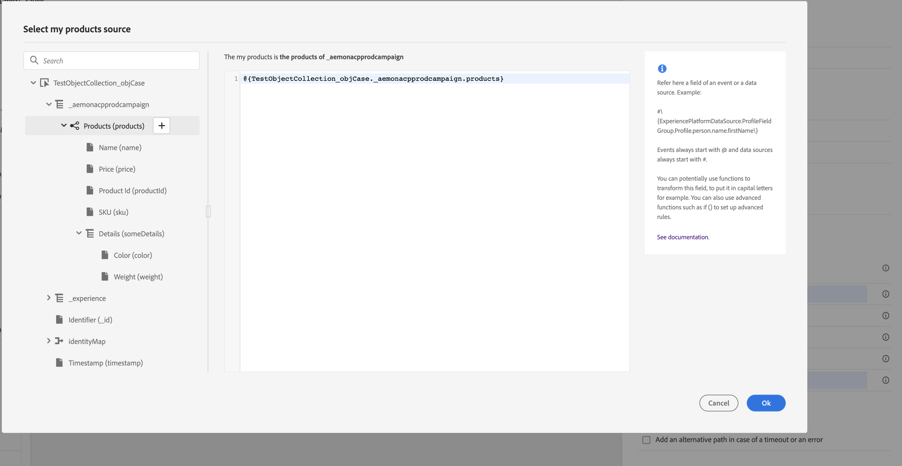
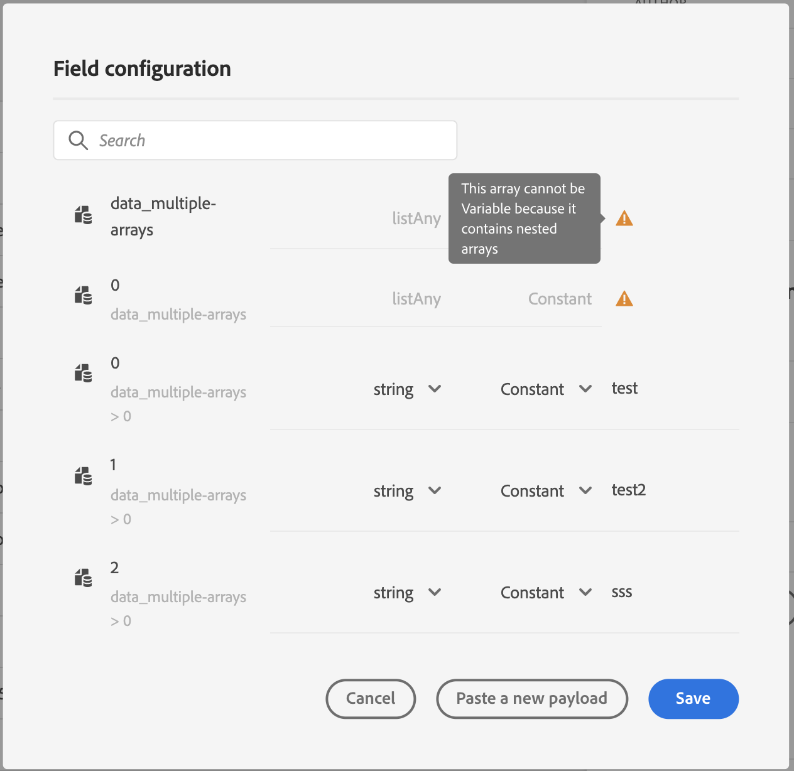

# Paso de colecciones de forma dinámica mediante acciones personalizadas{#passing-collection}


>[!CAUTION]
>
>**Busca Adobe Journey Optimizer**? Haga clic [aquí](https://experienceleague.adobe.com/es/docs/journey-optimizer/using/ajo-home){target="_blank"} para obtener la documentación de Journey Optimizer.
>
>
>_Esta documentación hace referencia a materiales Journey Orchestration heredados que han sido reemplazados por Journey Optimizer. Póngase en contacto con el equipo de su cuenta si tiene preguntas sobre su acceso a Journey Orchestration o Journey Optimizer._


Puede pasar una colección en parámetros de acción personalizados que se rellenarán dinámicamente durante la ejecución. Se admiten dos tipos de colecciones:

* colecciones simples: matrices de tipos de datos simples, por ejemplo, con un listString:

  ```
  {
   "deviceTypes": [
       "android",
       "ios"
   ]
  }
  ```

* colecciones de objetos: una matriz de objetos JSON, por ejemplo:

  ```
  {
  "products":[
     {
        "id":"productA",
        "name":"A",
        "price":20.1
     },
     {
        "id":"productB",
        "name":"B",
        "price":10.0
     },
     {
        "id":"productC",
        "name":"C",
        "price":5.99
     }
   ]
  }
  ```

## Limitaciones {#limitations}

* En este momento no se admiten matrices anidadas de objetos dentro de una matriz de objetos. Por ejemplo:

  ```
  {
  "products":[
    {
       "id":"productA",
       "name":"A",
       "price":20,
       "locations": [{"name": "Paris"}, {"name": "London"}]
    },
   ]
  }
  ```

* Para probar colecciones con el modo de prueba, debe utilizar el modo de vista de código. El modo de vista de código no es compatible con eventos empresariales en este momento. Solo puede enviar una colección con un solo elemento.

## Procedimiento general {#general-procedure}

En esta sección, utilizaremos el siguiente ejemplo de carga útil JSON. Es una matriz de objetos con un campo que es una colección simple.

```
{
  "ctxt": {
    "products": [
      {
        "id": "productA",
        "name": "A",
        "price": 20.1,
        "color":"blue",
        "locations": [
          "Paris",
          "London"
        ]
      },
      {
        "id": "productB",
        "name": "B",
        "price": 10.99
      }
    ]
  }
}
```

Se puede ver que &quot;products&quot; es una matriz de dos objetos. Debe tener al menos un objeto.

1. Cree su acción personalizada. Consulte [esta página](../action/about-custom-action-configuration.md).

1. En la sección **[!UICONTROL Action parameters]**, pegue el ejemplo JSON. La estructura mostrada es estática: al pegar la carga útil, todos los campos se definen como constantes.

   

1. Si es necesario, ajuste los tipos de campo. Se admiten los siguientes tipos de campos para colecciones: listString, listInteger, listDecimal, listBoolean, listDateTime, listDateTimeOnly, listDateOnly, listObject

   >[!NOTE]
   >
   >El tipo de campo se infiere automáticamente según el ejemplo de carga útil.

1. Si desea pasar objetos de forma dinámica, debe establecerlos como variables. En este ejemplo establecemos &quot;products&quot; como variable. Todos los campos de objeto incluidos en el objeto se establecen en variables automáticamente.

   >[!NOTE]
   >
   >El primer objeto del ejemplo de carga útil se utiliza para definir los campos.

1. Para cada campo, defina la etiqueta que se mostrará en el lienzo de recorrido.

   

1. Cree el recorrido y añada la acción personalizada que ha creado. Consulte [esta página](../building-journeys/using-custom-actions.md).

1. En la sección **[!UICONTROL Action parameters]**, defina el parámetro de matriz (&quot;products&quot; en nuestro ejemplo) utilizando el editor de expresiones avanzadas.

   

1. Para cada uno de los siguientes campos de objeto, escriba el nombre del campo correspondiente del esquema XDM de origen. Si los nombres son idénticos, no es necesario. En nuestro ejemplo, solo necesitamos definir &quot;id de producto&quot; y &quot;color&quot;.

   

Para el campo de matriz, también puede utilizar el editor de expresiones avanzadas para realizar la manipulación de datos. En el ejemplo siguiente, utilizamos las funciones [filter](../functions/functionfilter.md) y [intersect](../functions/functionintersect.md):


## Casos particulares{#examples}

Para los tipos y matrices heterogéneos de matrices, la matriz se define con el tipo listAny. Solo puede asignar elementos individuales, pero no puede cambiar la matriz a variable.



Ejemplo de tipo heterogéneo:

```
{
    "data_mixed-types": [
        "test",
        "test2",
        null,
        0
    ]
}
```

Ejemplo de matriz de matrices:

```
{
    "data_multiple-arrays": [
        [
            "test",
            "test1",
            "test2"
        ]
    ]
}
```

**Temas relacionados**

[Uso de acciones personalizadas](../building-journeys/using-custom-actions.md)
