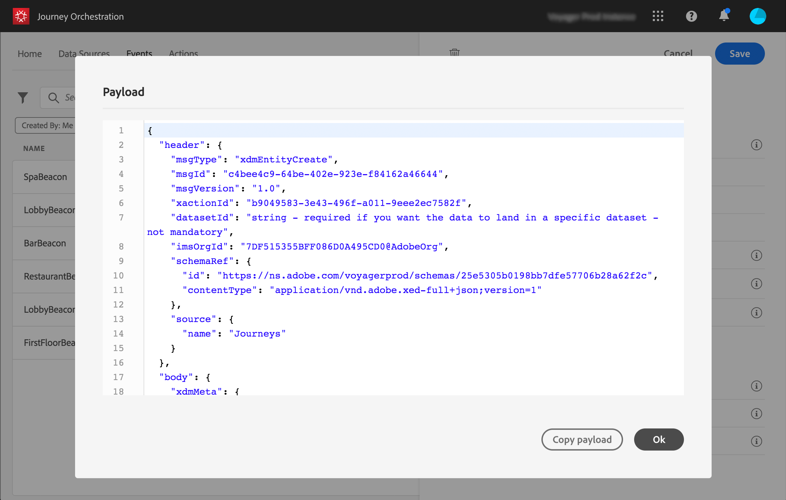

# Configuración del evento{#concept_y44_hcy_w2b}

>[!CAUTION]
>
>¿**Busca Adobe Journey Optimizer**? Haga clic [aquí](https://experienceleague.adobe.com/es/docs/journey-optimizer/using/ajo-home){target="_blank"} para obtener la documentación de Journey Optimizer.
>
>
>_Esta documentación hace referencia a materiales de Journey Orchestration heredados que han sido reemplazados por Journey Optimizer. Póngase en contacto con su equipo de cuentas si tiene alguna pregunta sobre el acceso a Journey Orchestration o Journey Optimizer._

En nuestro caso, tenemos que recibir un evento cada vez que una persona camina cerca de una baliza situada junto al spa. El **usuario técnico** debe configurar el evento que el sistema escuchará en nuestro recorrido.

Para obtener información adicional sobre la configuración de eventos, consulte [esta página](../event/about-events.md).

1. En el menú superior, haga clic en la ficha **[!UICONTROL Events]** y haga clic en **[!UICONTROL Add]** para crear un nuevo evento.

   

1. Introducimos el nombre sin espacios ni caracteres especiales: &quot;SpaBeacon&quot;.

   

1. Luego seleccionamos el esquema y definimos la carga útil esperada para este evento. Se seleccionan los campos necesarios del modelo normalizado de XDM. Necesitamos el Experience Cloud ID para identificar a la persona en la base de datos del perfil del cliente en tiempo real: _endUserIDs > experiencia > mcid > id_. Se genera automáticamente un ID para este evento. Este ID se almacena en el campo **[!UICONTROL eventID]** (_experiencia > campaña > orquestación > eventID_). El sistema que impulsa el evento no debe generar un ID, debe utilizar el que está disponible en la previsualización de carga útil. En nuestro caso de uso, este ID se utiliza para identificar la ubicación de la señalización. Cada vez que una persona camina cerca de la señalización de spa, se envía un evento que contiene este ID de evento específico. Esto permite al sistema saber qué señalización activó el envío de eventos.

   

   >[!NOTE]
   >
   >La lista de campos varía según el esquema. Según la definición del esquema, algunos campos pueden ser obligatorios y preseleccionados.

1. Necesitamos seleccionar un espacio de nombres. Un espacio de nombres está preseleccionado en función de las propiedades de esquema. Puede mantener la preseleccionada. Para obtener más información sobre áreas de nombres, vea [esta página](../event/selecting-the-namespace.md).

   

1. Una clave se preselecciona en función de las propiedades de esquema y el área de nombres seleccionada. Te lo puedes quedar.

   

1. Haga clic en **[!UICONTROL Save]**.

1. Haga clic en el icono **[!UICONTROL View Payload]** para previsualizar la carga útil que espera el sistema y compartirla con la persona responsable del envío del evento. Esta carga útil debe configurarse en el postback de la consola de administración de Mobile Services.

   

   El evento está listo para utilizarse en el recorrido. Ahora debe configurar la aplicación móvil para que pueda enviar la carga útil esperada al extremo de las API de ingesta de transmisión. Consulte [esta página](../event/additional-steps-to-send-events-to-journey-orchestration.md).
