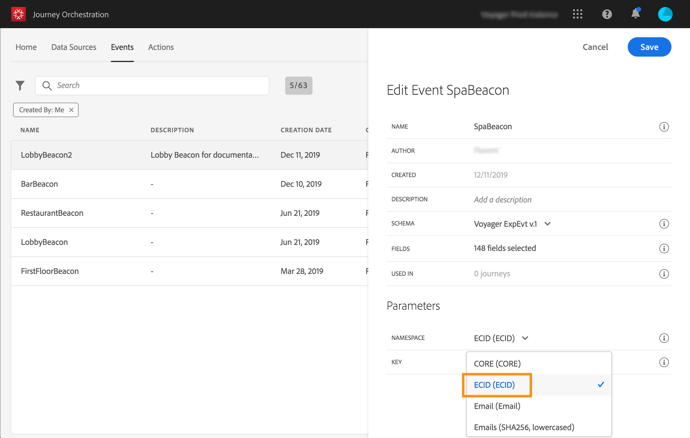

# Configuración del evento{#concept_y44_hcy_w2b}

En nuestro escenario, necesitamos recibir un evento cada vez que una persona camina cerca de una señalización situada al lado del spa. El usuario **** técnico necesita configurar el evento que el sistema escuchará en nuestro viaje.

Para obtener información adicional sobre la configuración de evento, consulte .

1. In the top menu, click the **[!UICONTROL Events]** tab and click **[!UICONTROL Add]** to create a new event.

   

1. Introducimos el nombre sin espacios ni caracteres especiales: &quot;SpaBeacon&quot;.

   

1. A continuación, seleccionamos el esquema y definimos la carga útil esperada para este evento. Seleccionamos los campos necesarios del modelo normalizado XDM. Necesitamos el ID de Experience Cloud para identificar a la persona en la base de datos de Perfil del cliente en tiempo real: _endUserIDs > experience > mcid > id_. Se genera automáticamente un ID para este evento. Este ID se almacena en el **[!UICONTROL eventID]** campo (_experiencia > campaña > orquestación > eventID_). El sistema que empuja el evento no debe generar un ID, debe utilizar el disponible en la previsualización de carga útil. En nuestro caso de uso, este ID se utiliza para identificar la ubicación de la señalización. Cada vez que una persona camina cerca de la señalización de spa, se envía un evento que contiene este ID de evento específico. Esto permite al sistema saber qué señalización activó el envío del evento.

   

   >[!NOTE]
   >
   >La lista de los campos varía de un esquema a otro. Según la definición de esquema, algunos campos pueden ser obligatorios y estar preseleccionados.

1. Necesitamos seleccionar un área de nombres. Un área de nombres está preseleccionada en función de las propiedades de esquema. Puede mantener la preseleccionada. Para obtener más información sobre áreas de nombres, consulte .

   

1. Se preselecciona una clave en función de las propiedades de esquema y la Área de nombres seleccionada. Puedes mantenerlo.

   

1. Haga clic **[!UICONTROL Save]**.

1. Haga clic en el **[!UICONTROL View Payload]** icono para previsualización de la carga útil esperada por el sistema y compartirla con la persona responsable del envío del evento. Esta carga útil deberá configurarse en el postback de la consola de administración de Mobile Services.

   

   El evento está listo para ser utilizado en su viaje. Ahora debe configurar la aplicación móvil para que pueda enviar la carga útil esperada al extremo de las API de inserción de flujo. Consulte .