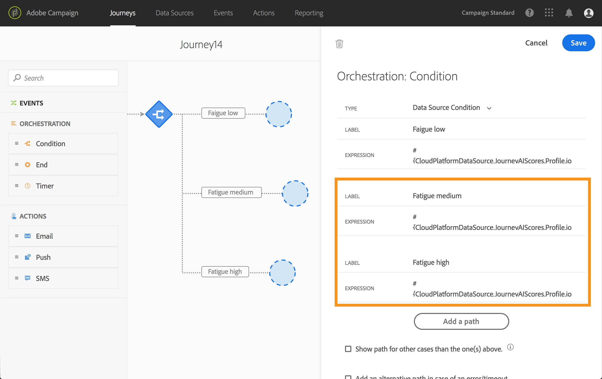
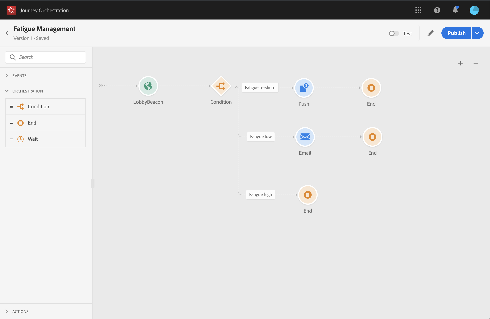

# Aprovechamiento de Journey AI {#concept_dsh_1ry_wfb}

Este caso de uso le mostrará cómo aprovechar los puntajes de fatiga para evitar que los clientes se interesen demasiado en sus viajes.

>[!NOTE]
>
>La capacidad de puntuación de fatiga predictiva solo está disponible para los clientes que utilizan la función de servicio de datos de Adobe Campaign Standard.

## Configuración del evento {#section_ptb_ws1_ffb}

Siga los pasos descritos en [](../event/about-events.md).

## Configuración de la fuente de datos {#section_o3n_4yy_wfb}

Realice los siguientes pasos para seleccionar los campos de puntuación de fatiga en el origen de datos integrado:

1. En el menú superior, haga clic en la **[!UICONTROL Data Sources]** ficha y seleccione el origen de datos del Experience Platform integrado.

   

1. Compruebe que los campos requeridos para el caso de uso están seleccionados.
1. Haga clic en **[!UICONTROL Add a New Field Group]**, seleccione el **[!UICONTROL Profiles]** modelo y agregue los campos **[!UICONTROL fatigueLevel]** y **[!UICONTROL fatigueScore]** (en _travesíaAI > emailScore > fatiga_).

   

1. Haga clic **[!UICONTROL Save]**.

## Construcción del recorrido {#section_uzm_pyy_wfb}

Para crear, validar y publicar el viaje, siga los pasos descritos en [](../building-journeys/journey.md).

En nuestro caso de uso, estamos aprovechando el **[!UICONTROL fatigueLevel]** campo. También puede utilizar el **[!UICONTROL fatigueScore]** campo.

Realice los siguientes pasos para aprovechar el nivel de fatiga del viaje:

1. Añada un evento y una condición en su viaje.

   

1. Elija el **[!UICONTROL Data Source Condition]** tipo y haga clic en el **[!UICONTROL Expression]** campo.

   

1. Con el editor de expresiones sencillo, busque el **[!UICONTROL fatigueLevel]** campo (_ExperiencePlatformDataSource > JourneyAIScores > Perfil > travelAI > emailScore > fatiga_), suéltelo a la derecha y cree la condición siguiente: &quot;fatigueLevel es igual a &quot;Low&quot;. Haga clic **[!UICONTROL Ok]**.

   

   La expresión avanzada es:

   ```
   #{ExperiencePlatformDataSource.JourneyAIScores.Profile.journeyAI.emailScore.fatigue.fatigueLevel} == "low"
   ```

1. En la condición, cree otras dos rutas para niveles de fatiga medios y altos.

   

1. Ahora puede agregar diferentes acciones para cada nivel de fatiga.

   
