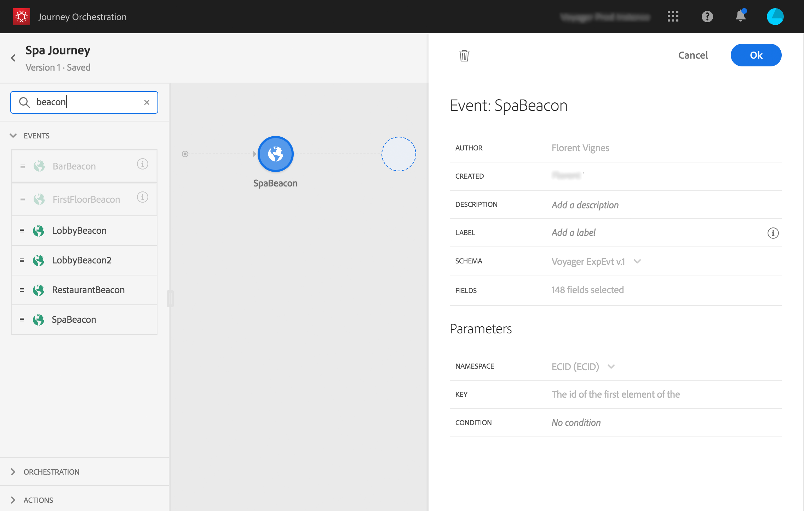
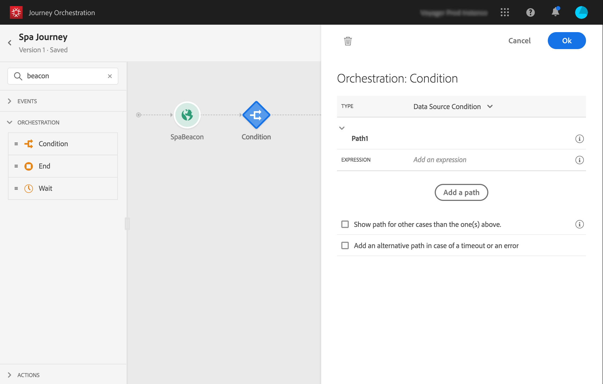

# Construcción del recorrido{#concept_eyw_mcy_w2b}

El **usuario empresarial** ahora puede compilar el recorrido. Nuestro recorrido solo incluirá una ruta con las siguientes actividades:

* el &quot;SpaBeacon&quot; **[!UICONTROL Event]**: cuando una persona camina cerca de la señalización del spa, el sistema recibirá un evento y el recorrido comenzará para esa persona.
* a **[!UICONTROL Condition]** actividad para comprobar que la persona es una mujer
* an **[!UICONTROL Email]** actividad (con Adobe Campaign Standard)
* una actividad **[!UICONTROL End]**

>[!NOTE]
>
>Las actividades **[!UICONTROL Push]** y **[!UICONTROL Email]** solo están disponibles en la paleta si tiene Adobe Campaign Standard.

Para obtener información adicional sobre cómo crear un recorrido, consulte [esta página](../building-journeys/journey.md).

1. En el menú superior, haga clic en la pestaña **[!UICONTROL Home]** y **[!UICONTROL Create]** para crear un nuevo recorrido.

   

1. Edite las propiedades del recorrido en el panel de configuración que se muestra en el lado derecho. Lo llamamos &quot;recorrido Spa&quot; y lo configuramos para que dure un mes, del 1 al 31 de diciembre.

   

1. Para diseñar el recorrido, arrastre y suelte el evento &quot;SpaBeacon&quot; de la paleta al lienzo. También puede hacer doble clic en el evento de la paleta para agregarlo al lienzo.

   

1. Ahora vamos a agregar una condición para verificar que la persona es una mujer. Arrastre y suelte una actividad de condición en el recorrido.

   

1. Elija el tipo **[!UICONTROL Data Source Condition]** y haga clic en el campo **[!UICONTROL Expression]** . También puede definir una etiqueta de condición que aparecerá en la flecha del lienzo.

   

1. Con el editor de expresiones simple, busque el campo gender (_persona > sexo_) y suéltela a la derecha para crear la siguiente condición: &quot;el sexo es igual a &quot;Femenino&quot;.

   

1. Suelte un **[!UICONTROL Email]** y seleccione la plantilla de mensajería transaccional &quot;Descuento de spa&quot;. Esta plantilla se diseñó con Adobe Campaign. Consulte [esta página](https://experienceleague.adobe.com/docs/campaign-standard/using/communication-channels/transactional-messaging/getting-started-with-transactional-msg.html?lang=es).

   

1. Haga clic dentro del **[!UICONTROL Email]** y seleccione la dirección de correo electrónico de la fuente de datos.

   

1. Del mismo modo, defina los campos de personalización de nombre y apellido del origen de datos.

   

1. Suelte un **[!UICONTROL End]** actividad.

   

1. Haga clic en el **[!UICONTROL Test]** alterne y pruebe el recorrido con perfiles de prueba. Si hay algún error, desactive el modo de prueba, modifique el recorrido y pruebe de nuevo. Para obtener más información sobre el modo de prueba, consulte [esta página](../building-journeys/testing-the-journey.md).

   

1. Cuando la prueba sea concluyente, puede publicar el recorrido del menú desplegable superior derecho.

   

La próxima vez que una mujer camine cerca de la señalización del spa, recibirá inmediatamente un correo electrónico personalizado de &quot;descuento en spa&quot;.
